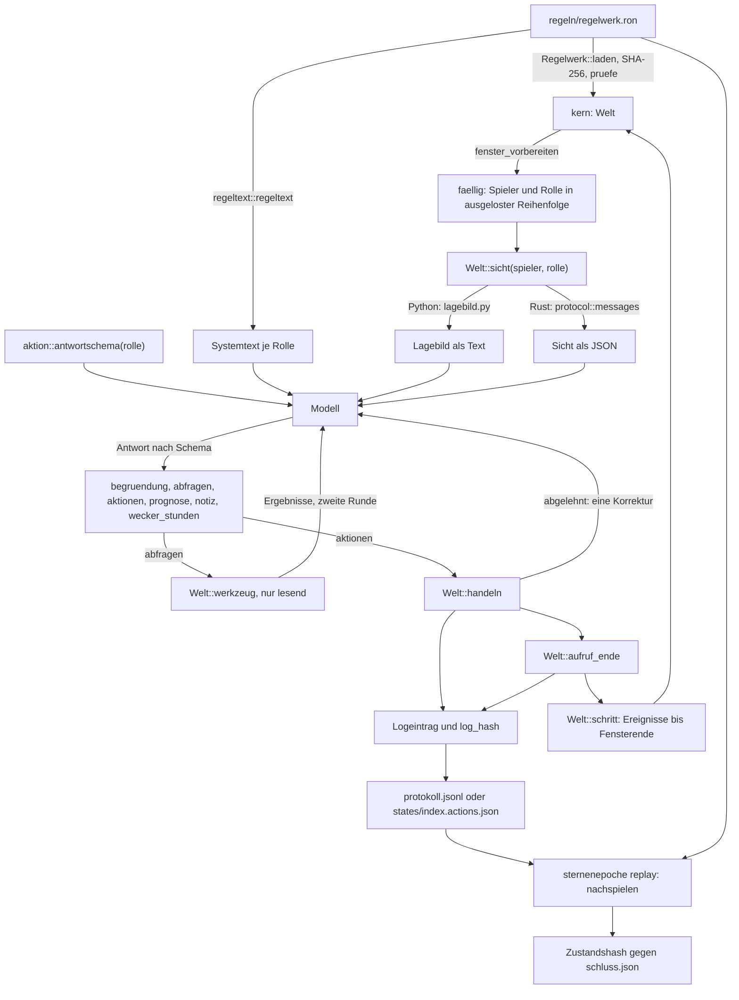

# Architektur

## Aktuelle Onlinearchitektur · 8. Oktober 2026

| Teil | Autorität und Aufgabe |
| --- | --- |
| `crates/kern` | Gemeinsame Wirtschaft, Kampf, Kolonisation, Aufklärung und Ausscheiden; alleinige Prüfung der Spielregeln |
| `crates/server` | Gemeinsame Welt, monotone Uhr, 30 Skriptbots, Konten, 20 reservierte Plätze mit zunächst drei Zugängen, Warteliste, Rollenfreigaben und atomare SQLite-Checkpoints |
| `web-client` | Derselbe Menschen-/Agentenclient vom Rust-Host und von Pages; bebilderte Spielansichten und räumlicher Sternenatlas, ausschließlich erlaubte Spielersicht |
| `web-client/admin` | Getrennte private Verwaltung am Loopback-Listener; Kontrolle, Einstellungen, Backups und vorbereitete Resets |
| GitHub Pages / Tailscale Funnel | Statische Veröffentlichung / öffentlicher TLS-Zugang zum PC-Host; keine Simulation in Pages |

Der Server verwendet `regeln/online-v1.ron` bzw. das im Checkpoint gespeicherte aktive Profil.
`/api/rules` enthält dessen Zahlen und Schema; `/api/view`, `/api/tool` und `/api/context` erzwingen
dieselbe Informationsgrenze. 3D-Sternpositionen und sichtbare Umläufe sind eine schematische Darstellung,
keine zusätzliche Quelle für Bewohner, Planetentypen, Ressourcen oder Flugzeiten.
Die aktuelle Speicherung umfasst die V8-Erweiterung für Krisen und dauerhafte Niederlagen.
API-Version 1, Regelprofil und Snapshot-Version bezeichnen verschiedene Verträge.

Die Onlineuhr wartet nicht auf Modelle. Befehle wirken nach serverseitiger Prüfung am aktuellen Zustand;
Rollenfreigaben verhindern gleichzeitige widersprüchliche Steuerung. Pause und Epochenende stoppen die
Weltzeit. Besiegte Reiche bleiben für diese Epoche inaktiv und ihre ursprünglichen Heimatwelten geschützt.
Browser und Server melden diese Zustände übereinstimmend. Ein Reset ersetzt die Welt und invalidiert
alte Sitzungen, Rollenfreigaben und Befehle; Konten und konfigurierbare Betriebsgrenzen bleiben erhalten.

Für Betrieb und konkrete Regelgrenzen gelten [ONLINE-KONZEPT.md](ONLINE-KONZEPT.md) und
[SERVER-BETRIEB.md](SERVER-BETRIEB.md). Die folgenden Abschnitte beschreiben den bisherigen lokalen
Lauf-/Laboraufbau. Seine eingefrorenen Modellfenster gelten ausschließlich für diese Betriebsarten.

Dieses Dokument beschreibt den Aufbau von Sternenepoche: welche Teile es gibt, wie die Zeit in der Welt
läuft, wie eine Modellentscheidung in die Welt gelangt, was ein Lauf auf die Platte schreibt und wo man
ansetzt, um das Spiel zu erweitern. Grundlage ist der Code vom 4. Oktober 2026. Zahlen stammen aus
`regeln/regelwerk.ron` oder dem Quelltext; Pfade sind relativ zum Projektordner.

## 1. Überblick

Sternenepoche ist eine geschlossene Welt, in der Zivilisationen eine Epoche lang um die höchste Punktzahl
konkurrieren. Das Regelwerk setzt die Epoche auf 365 Spieltage (`welt.epoche_tage`). `sternenepoche`, die
Brücke, der Python-Orchestrator und die Spieleroberfläche rechnen ohne andere Angabe mit 50 Spielern; der
Rust-Orchestrator erlaubt 1 bis 50. Jede Zivilisation wird von vier Rollen regiert: Stratege, Verwalter,
Feldherr und Diplomat. Jede Rolle ist ein eigener Modellaufruf mit eigenem Lagebild, eigenem Notizbuch,
eigenem Wecker und eigenen Aktionsrechten.

Das System besteht aus diesen Teilen:

- **Spielkern** (`crates/kern`): deterministische Rust-Bibliothek ohne Netz, Dateien oder Uhr; Weltzustand,
  Aktionen, Ereignisse, Lagebild, Regeltext und Antwortschema.
- **Regelwerk** (`regeln/regelwerk.ron`): alle Zahlen des Spiels als Daten, Quelle auch des Regeltexts.
- **Läufe und Brücke** (`crates/lauf`, Programm `sternenepoche`): Skriptbots, Balancemessung, Nachspielen und
  die Anbindung an den Python-Orchestrator über Standardein- und -ausgabe.
- **Orchestratoren**: `orchestrator/sternenepoche` (Python, über die Brücke) und `crates/agenten` (Programm
  `sternenepoche-agenten`, Kern direkt eingebunden, mit Journal aller Modellaufrufe).
- **Spieleroberfläche** (`crates/spieler`, Programm `sternenepoche-spieler`): egui-Anwendung, ein Mensch gegen
  Skriptbots.
- **Betrachter** (`betrachter/index.html`): stellt die Ausgaben eines Laufs dar.
- **Inhalte** (`content/`, `tools/content/`, `crates/inhalt`): Grafikkatalog, ComfyUI-Aufträge, prozedurale
  Planetenbilder, Grafikvorschau. Die Simulation hängt nicht davon ab.
- **Wissensbasis** (`crates/wissen`, Daten in `wissen/`): DuckDB-Index über Regeln, Quelltext, Katalog und
  Laufbelege, mit HTTP-API und MCP-Server.

Gemeinsamer Kern und modusspezifischer Takt:

1. **Ein Weg für Aktionen.** Modelle, Skriptbots und der menschliche Spieler ändern die Welt nur über
   `Welt::handeln` in `crates/kern/src/aktion.rs`. Modelle handeln in ihrer Rolle; Bots und der Spieler nutzen
   `Rolle::Alle`, die Töpfe und Rollenrechte umgeht (`crates/kern/src/typen.rs`).
2. **Informationsgrenze im Kern.** Was ein Spieler sieht, bestimmt `Welt::sicht` in
   `crates/kern/src/sicht.rs`: die eigene Lage, öffentliche Daten und das, was der Spieler selbst
   herausgefunden hat. Orchestratoren und Oberfläche formatieren diese Daten nur.
3. **Ein Weg für die Weltzeit.** Nur `Welt::schritt` rückt die Simulation vor. Lokale Lauf-/Laborfenster
   können während Modellentscheidungen eingefroren werden. Der Onlinehost wartet nicht auf Modelle;
   späte Antworten werden gegen seinen aktuellen Zustand geprüft.

Abhängigkeiten laut den `Cargo.toml` der Crates (Workspace in `Cargo.toml`):

| Crate | Programm | nutzt Crates | externe Bibliotheken |
|---|---|---|---|
| `crates/kern` | – | – | `serde`, `serde_json`, `ron`, `rand_chacha`, `rand_core`, `sha2`, `bincode` |
| `crates/lauf` | `sternenepoche` | `kern` | `serde`, `serde_json`, `bincode` |
| `crates/agenten` | `sternenepoche-agenten` | `kern` | `reqwest` (blockierend, rustls), `fs2`, `parquet`, `sha2` |
| `crates/inhalt` | `sternenepoche-inhalt` | `kern` | `serde_json`, `sha2` |
| `crates/spieler` | `sternenepoche-spieler` | `kern`, `lauf`, `inhalt` | `eframe`, `image`, `bincode` |
| `crates/wissen` | `sternenepoche-wissen` | `kern` | `libloading`, `tiny_http`, `base64`, `sha2` |

`lauf`, `agenten` und `spieler` bauen das Regelwerk mit `include_str!` ein. Nur `lauf` kann ein anderes laden:
auf der Kommandozeile mit `--regeln PFAD`, über die Brücke mit dem Feld `regeln`.

## 2. Komponenten

### 2.1 `crates/kern`

Die Bibliothek beschreibt sich selbst als „reine Bibliothek ohne Netz, Dateien oder Uhr“
(`crates/kern/src/lib.rs`). Sie exportiert `Regelwerk`, `Welt` und alle Grundtypen.

| Datei | Zweck | wichtige Typen und Funktionen |
|---|---|---|
| `typen.rs` | Zeit, Kennungen, Aufzählungen, Festkommarechnung | `SimZeit`, `SpielerId`, `PlanetId`, `FlottenId`, `MINUTE`, `STUNDE`, `TAG`, `M`, `FX`, `mal`, `pot`, `anteil`, `milli`, `Koord`, `zeittext`, `ganz` |
| `regeln.rs` | Regelwerk als Daten | `Regelwerk`, `Regelwerk::laden`, `pruefe`, `kosten_gebaeude`, `kosten_forschung`, `kosten_einheit`, `wert`, `lagergrenze`, `fenster`, `epochenende`, `AgentenRegel::frueheste_sekunden`, `MAX_FORSCHUNG` |
| `welt.rs` | Weltzustand, Erzeugung der Galaxie, Zufallsströme | `Welt`, `Planet`, `Spieler`, `Flotte`, `Ereignis`, `EreignisArt`, `Vertrag`, `Kampfbericht`, `Logeintrag`, `Tageswerte`, `Faellig`, `strom`, `mischen`, `Welt::neu`, `plane`, `wecke` |
| `sim.rs` | Simulationsschleife | `schritt`, `schritt_wenn_bereit`, `fenster_vorbereiten`, `hash`, `zu_bytes`, `aus_bytes`, `log_abholen`, `beendet` |
| `aktion.rs` | Aktionen, Rollenrechte, Antwortschema | `Aktion`, `Aktion::typ`, `Aktion::zustaendig`, `erlaubte_typen`, `Welt::handeln`, `Welt::aufruf_ende`, `antwortschema` |
| `sicht.rs` | Lagebild als Daten, lesende Werkzeuge | `Welt::sicht`, `Welt::werkzeug`, `bestand_jetzt` |
| `regeltext.rs` | Regeltext aus dem Regelwerk | `Abschnitt`, `abschnitte`, `aktionsbeispiel`, `regeltext`, `nachschlagen` |
| `wirtschaft.rs` | Raten, Stundentick, Tageswechsel, Bau, Fertigung, Forschung, Stufen, Töpfe | `abrechnen`, `raten_neu`, `tick`, `tageswechsel`, `bauen`, `fertigen`, `forschen`, `stufen_bedingungen`, `stufenaufstieg`, `topf_fuer`, `flottenwert` |
| `flotte.rs` | Flüge und Missionen: Kampf am Ziel, Plünderung, Blockade, Invasion, Spionage, Kolonisierung, Recycling, Abbau, Verbandsangriff | `flugplan`, `flotte_senden`, `verband_oeffnen`, `verband_beitreten`, `flotte_zurueckrufen`, `flotte_ankunft`, `gefecht`, `eroberung_pruefen` |
| `kampf.rs` | Kampf als Einzelsimulation je Einheit mit festem Zufallsstrom | `Gruppe`, `kampf`, `Kampfergebnis` |
| `diplomatie.rs` | Nachrichten, Verträge mit Kaution, Allianzen, Tribute, öffentliches Register | `nachricht`, `vertrag_anbieten`, `vertrag_annehmen`, `vertrag_kuendigen`, `bruch_pruefen`, `tribute_zahlen`, `schenken`, `allianz_gruenden` |
| `markt.rs` | Orderbuch je Gut in Credits, Lieferung durch neutrale Handelsflotte | `markt_order`, `markt_storno`, `marktlieferung`, `marktpreise` |
| `wertung.rs` | Punktwertung und Rang | `punkte_neu`, `rangliste` |
| `erweiterung.rs` | Raketensilo: Bau, Start und verzögerte Ankunft von Raketen | `raketen_bauen`, `raketen_fertig`, `raketen_starten`, `raketen_ankunft` |
| `umgebung.rs` | Mehrspieler-Umgebung mit `reset` und `step` | `Umgebung`, `GemeinsameAktion`, `SchrittErgebnis` |

Die Aufzählungen in `typen.rs` entstehen über das Makro `aufzaehlung!`; jede hat `ALLE`, `idx`, `name` und
`aus_name`, und der Name ist zugleich die JSON-Schreibweise. Es gibt 10 Güter, 28 Gebäude, 17 Forschungen,
18 Einheiten (die ersten 12 sind Schiffe, `SCHIFFE`), 4 Völker, 3 Zonen, 4 Töpfe, 10 Missionen und
4 Vertragsarten. Koordinaten werden als Text `Sektor:System:Position` geschrieben.

`Welt` (`welt.rs`) besteht aus schlichten Tabellen mit typisierten Kennungen: Systeme, Plätze, Planeten,
Spieler, Flotten (`BTreeMap`), Verträge, Register, Allianzen, Nachrichten, Marktorders, Handel,
Kampfberichte und Tageswerte, dazu die Ereignis-Warteschlange, die fälligen Rollen und die Hashkette des
Aktionsprotokolls. Mengen je Gut, Gebäude und Einheit liegen in festen Arrays, deren Index die Aufzählung ist.
Bestände laufen über Raten: Jeder Planet trägt je Gut eine Rate in Tausendsteln je Spielstunde und den
Zeitpunkt `stand`. `abrechnen` schreibt den Bestand bis jetzt fort (etwa in `raten_neu`, das der Stundentick
aufruft), `bestand_jetzt` rechnet ihn aus, ohne den Zustand zu ändern. Produktion endet an der Lagergrenze,
Bestände werden nie negativ.

`Welt::neu` erzeugt die Galaxie aus dem Startwert: laut Regelwerk 2 Sektoren mit je 60 Systemen und
12 Plätzen je System. Startsysteme liegen mindestens `start_abstand` Systeme auseinander und nie in einem
Nebel; kleine Runden bleiben in Sektor 1. Die Völker werden per Los möglichst gleichmäßig verteilt.
`Welt::werkzeug` beantwortet die lesenden Abfragen `kosten`, `flugzeit`, `kampfsimulator`, `regel` und
`galaxie`; die Funktion nimmt `&self` und kann den Zustand nicht verändern.

`umgebung.rs` ist eine Rust-Umgebung für Training mit festem Satz kontrollierter Spieler. Ein `step` muss
für jeden kontrollierten Spieler eine Liste enthalten (leer heißt nichts tun), handelt nur für fällige
Rollen, schließt alle fälligen Aufrufe ab und rückt dann mit `schritt_wenn_bereit` vor. Die Belohnung ist
die exakte Punktedifferenz. Nach dem Modulkommentar ist das keine Registrierung als Python-Gym-Umgebung.

### 2.2 `crates/lauf`

`crates/lauf/src/main.rs` ist das Programm `sternenepoche`, `crates/lauf/src/bots.rs` enthält die Skriptbots
(über `crates/lauf/src/lib.rs` auch für `crates/spieler` verfügbar).

| Befehl | Zweck | Optionen (Standard) |
|---|---|---|
| `epoche` | eine Epoche mit Skriptbots, Bericht je Bottyp und Volk, häufigste Ablehnungsgründe, Rangliste | `--startwert` (1), `--spieler` (50), `--tage`, `--typen`, `--pruefen`, `--spur SPIELER`, `--aus VERZEICHNIS`, `--regeln` |
| `balance` | mehrere Epochen parallel, Kennzahlen je Bottyp | `--laeufe` (8), `--spieler` (50), `--tage` (150), `--typen` |
| `balance --abnahme` | drei Aufstellungen und die Abnahmekriterien aus `COORDINATION.md` | `--laeufe` (12), `--spieler` (50), `--tage` (365) |
| `stufe5` | je Bottyp: wer Stufe V erreicht, wann, und woran die übrigen scheitern | `--laeufe` (12), `--spieler` (50), `--tage` (365), `--typen` |
| `replay VERZEICHNIS` | Protokoll eines Laufs nachspielen und Zustandshash prüfen; Regelwerk aus dem Laufordner | `--regeln` |
| `regeltext` | Regeltext für eine Rolle ausgeben | `--rolle`, `--regeln` |
| `doku` | `REGELWERK.md` und `REGELTEXT.md` aus dem Regelwerk erzeugen | `--aus` (docs), `--regeln` |
| `bruecke` | zeilenweises JSON für den Orchestrator (Abschnitt 5) | – |

`epoche --pruefen` fährt die Epoche ein zweites Mal und spielt sie aus dem Protokoll nach; beide
Zustandshashes müssen gleich sein. `--spur` druckt alle 15 Spieltage den Zustand eines Spielers. Ein `Lauf`
(Struktur in `main.rs`) bündelt die Welt mit den Bots der nicht von Modellen gesteuerten Spieler,
den Zeitpunkten der Stufenaufstiege, der ersten Kolonie, dem Startwert und der Liste der Modellspieler.
`Lauf::weiter` ruft `Welt::schritt` und lässt danach die Bots in der ausgelosten Reihenfolge ziehen, also
vor den Modellen desselben Fensters. `Lauf::speichern` schreibt das Ganze mit bincode.

Die Bottypen sind Ökonom, Räuber, Igel und Händler, dazu der Kontrolltyp Wehrlos (ein Ökonom, der sich nie
schützt). Bots handeln alle zwei Spielstunden, je Spieler versetzt, über dieselben Aktionen wie die Modelle,
mit `Rolle::Alle`. Über andere Spieler wissen sie nur, was öffentlich ist oder ihre eigenen Sonden berichtet
haben (`bots.rs`). `balance` fährt Epochen mit den Startwerten 1 bis `--laeufe`, je Prozessorkern eine.

### 2.3 `crates/agenten`

Der Rust-Orchestrator fährt dieselbe Engine ohne Python. Im Befehl `run` werden alle Spieler von Modellen
gesteuert, es gibt keine Bots. Die Live-Partie der Spieler-Oberfläche (Abschnitt 2.4) nutzt dieselbe Funktion
`window` für einzelne Reiche neben Mensch und Bots.

| Datei | Inhalt |
|---|---|
| `config.rs` | `Config` (startwert, spieler, tage, parallel, max_anfragen, anbieter, rollen) und `Provider`, Prüfung mit `validate` |
| `provider.rs` | `anfrage` (HTTP an OpenAI-kompatible Endpunkte), `koerper` (Anfragekörper), `Fehler::Eindeutig` und `Fehler::Unklar`, Attrappe `mock` |
| `protocol.rs` | `strict_json` (lehnt doppelte Schlüssel ab), `Decision::parse` (Schema, Limits, Rollenrechte), `messages` (Systemtext und Sicht) |
| `journal.rs` | `Journal`: Reservieren, Abschließen, Checkpoints, Schreibsperre |
| `export.rs` | Parquet-Ausgabe aus einem Journal |
| `lib.rs` | `window` (ein Entscheidungsfenster; liefert je Aufruf einen Bericht mit Anlass, Begründung, Notiz, Prognose, jeder Aktion samt Urteil des Kerns, Fehlern und Kosten aus `usage.cost`), `barrier`, `call_with_retries`, `run` |
| `main.rs` | Befehle `demo`, `run`, `validate`, `export` |

`validate` verlangt 1 bis 50 Spieler, 1 bis 365 Tage, `parallel` 1 bis 200, `max_anfragen` größer null und
genau die vier Rollen. Ein Anbieter ist `mock`, `local` oder `openrouter`; entfernte Endpunkte brauchen HTTPS
und `remote_erlaubt`, OpenRouter nur den offiziellen Endpunkt und `api_key_env`. `versuche` liegt zwischen
1 und 5 (Standard 2), `denken` ist `aus`, `niedrig`, `mittel` oder `hoch`. Netzaufrufe laufen nur mit
`--execute`; `demo` arbeitet mit einer Attrappe offline.

Die Systemnachricht baut `protocol::messages` aus Limits, `regeltext::regeltext` und `antwortschema`; die
Nutzernachricht ist die Sicht des Spielers als JSON (`Welt::sicht`), nicht der Lagebild-Text des
Python-Orchestrators. Spieler und Rolle eines Aufrufs stammen immer aus `faellig`, nie aus der Modellantwort.
Der Systemtext sagt ausdrücklich, dass die Aktionen einer Antwort mit Abfragen verfallen und wo Baukosten,
mögliche Forschung und Einheitenkosten in der Sicht stehen (`planeten[].baubar`, `forschung.moeglich`,
`einheiten_kosten`).

Zwei Fehlerregeln: Ein Aufruf, der endgültig scheiterte, bekommt keine Korrekturanfrage mehr (das Modell hätte
nichts zu korrigieren). Lehnt der Anbieter mit HTTP 401, 402 oder 403 ab (Schlüssel, Guthaben, Schlüssellimit),
zieht `call_with_retries` die Reservierung im Journal zurück und hält den Lauf an; der Anbieter hat die Anfrage
nicht verarbeitet, beim Fortsetzen wird sie neu gestellt (`Journal::cancel`).

### 2.4 `crates/spieler`

`crates/spieler/src/lib.rs` enthält die Sitzung, `crates/spieler/src/main.rs` die egui-Oberfläche. Eine
`Session` besitzt die Welt, die Kennung des Menschen, die Bots und optional KI-Reiche (`Ki`). Ohne KI-Reiche
sind alle Spieler als Nicht-Modell markiert, es gibt also keine fälligen Rollen. `view` liefert `Welt::sicht` des
Menschen, `query` ruft `Welt::werkzeug`, `act` ruft `Welt::handeln` mit `Rolle::Alle`, `step` ruft
`schritt_wenn_bereit` und lässt danach die Bots ziehen. `RealtimeClock` übersetzt Wanduhrzeit in Fenster: je
Bild zählen höchstens 0,25 Sekunden, der Beschleunigungsfaktor ist auf 86.400 begrenzt, je Bild laufen
höchstens 16 Fenster, nach einer Pause wird nichts nachgeholt. Spielformeln hängen davon nicht ab.

**Live-Partie mit KI-Reichen.** `Session::with_models` macht einige Reiche zu Modellreichen (je vier Rollen).
Ist eine ihrer Rollen fällig, startet `step` statt eines Zeitschritts ein Entscheidungsfenster auf einem
eigenen Thread: Er arbeitet auf einer Kopie der Welt und ruft `sternenepoche_agenten::window` mit der
Modellkonfiguration und einem eigenen Journal unter `laeufe/spieler-live-ZEIT/`. Die Weltuhr steht so lange
(`RealtimeClock` sammelt keine Zeit, solange `ki_denkt`). `ki_abholen` übernimmt das Ergebnis, schreibt die
Berichte nach `entscheidungen.jsonl` und führt Befehle des Menschen aus, die er währenddessen gegeben hat
(sie werden vorgemerkt, weil die Kopie sie sonst verlöre). Ein Budget hält die Partie vor dem nächsten
Fenster an, wenn die Kosten (`usage.cost`) es erreichen; ein gescheitertes Fenster lässt sich wiederholen
oder für die wartenden Rollen aussetzen. Fehlt die Umgebungsvariable des Schlüssels, scheitert schon der
Start mit einer klaren Meldung.

Ein Spielstand ist ein bincode-Datensatz. Version 2 enthält zusätzlich die KI-Reiche: Modellkonfiguration als
JSON-Text (sie nennt nur den Namen der Schlüsselvariable, nie den Schlüssel), Journalordner, Kosten, Budget.
Version 1 wird weiter gelesen. `save` überschreibt keine vorhandene Datei; `save_replace` ersetzt eine, indem
es den neuen Stand vollständig in `DATEI.neu` schreibt und dann darüber umbenennt (die Oberfläche ruft es nur
nach Rückfrage). Beide lehnen ab, solange Modelle entscheiden. `load` lehnt Dateien über 32 MiB, eine falsche
Version, einen abweichenden Hash, Modellspieler außerhalb der gespeicherten KI-Reiche, fremde fällige Rollen
und ungültige Verweise ab. Eine geladene Live-Partie schreibt in einen neuen Journalordner (`…-ab-ZEIT`): ein
älterer Stand passt nicht zu den Aufrufen, die nach ihm journalisiert wurden.

**Oberfläche.** `main.rs` hält den Zustand der Bedienung (`Player`), die Kopfleiste mit Uhr, die
Rohstoffleiste, die Navigation, Rückfragen und das Fenster am Ende der Epoche. Jeder Bereich ist eine Datei
unter `src/ansicht/` mit einem `impl Player`-Block:

| Datei | Inhalt |
|---|---|
| `mod.rs` | `Bildschirm`: die 16 Bereiche mit Name, Zeichen und Gruppe der Navigation |
| `stil.rs` | Farben, Thema, Karten, Kennzahl-Kacheln, Balken, Etiketten, Knöpfe mit Grund, deutsches Zahlen- und Zeitformat, `wartezeit` (wann Güter reichen), `ueber` (Tooltip für ganze Gruppen) |
| `namen.rs` | deutsche Anzeigenamen aller Schlüssel des Kerns, `woerter` macht Kerntexte lesbar, Gruppen von Gebäuden und Forschung |
| `hilfe.rs` | Satz und Erklärung je Bereich, Regeln im Wortlaut, „Was jetzt ansteht“ (`hinweise`), Willkommen |
| `befehl.rs` | jeder Befehl an den Kern als Funktion; Tests prüfen jeden gegen `kern::aktion::Aktion` und dass jede Aktion bedienbar ist |
| `uebersicht.rs`, `kolonie.rs`, `gebaeude.rs`, `forschung.rs`, `werft.rs`, `flotten.rs`, `galaxie.rs`, `markt.rs`, `diplomatie.rs`, `regierung.rs`, `berichte.rs` | die Bereiche des Spiels |

Die Oberfläche rechnet keine Spielregeln nach: Kosten, Erträge, Flugzeiten und Kampfprognosen kommen aus
`Welt::sicht` und `Welt::werkzeug`, Zahlen für Erklärungen aus dem Regelwerk (`Session::regeln`). Ein Test
legt jeden Bereich ohne Fenster aus, einmal am Anfang und einmal nach 7.000 Fenstern mit einem Skriptbot als
Autopilot; ein weiterer prüft, dass die Schrift jedes verwendete Zeichen enthält. `klicks_wie_ein_mensch` sucht
Knöpfe über ihren gezeichneten Text und klickt sie mit echten Maus-Ereignissen (Navigation, Bauauftrag, Sprung
aus „Was jetzt ansteht“). Auf großen Bildschirmen steht der Inhalt mittig; das Fenster öffnet maximiert (außer
mit `--screenshot`), weil Windows „maximiert“ beim noch unsichtbaren Fenster übergeht, in den ersten Bildern per
`ViewportCommand::Maximized`.

Optionen: `--seed N` (42), `--player N` (0), `--load DATEI` (speichert danach in dieselbe Datei),
`--smoke-test` (ein Spieltag mit 50 Spielern, ohne ein Programmfenster zu öffnen), `--screenshot DATEI.png`,
`--screen NAME`, `--vorlauf N` mit `--autopilot TYP` (N Fenster vorspielen, ein Skriptbot führt dabei das
Reich des Menschen); für Live-Partien `--ki KONFIG` oder `--attrappe`, `--ki-reiche N`, `--reiche N`,
`--budget USD` und `--smoke-test-ki`. Für Galerie und Planetenansicht nutzt die Oberfläche `inhalt::catalog`
und `inhalt::planet`. Bedienung: `docs/SPIELEN.md`, Live-Partien: `docs/LIVE-TEST.md`.

### 2.5 `crates/inhalt`

Werkzeuge für Inhalte; laut `crates/inhalt/src/lib.rs` hängt die Simulation nie von dieser Crate ab.

- `catalog.rs`: `Catalog` und `Asset` lesen `content/catalog.json`. `validate` verlangt ein Motiv für jedes
  Gut, jede Forschung, jedes Gebäude (neutral und je Volk), jede Einheit je Volk und ein Porträt je Volk;
  `headless_requires_assets` muss falsch sein. `rules_current` vergleicht den im Katalog vermerkten
  SHA-256 des Regelwerks mit der Datei. `sync_engine` ergänzt Gebäudemotive für die in der Funktion
  aufgeführten Gebäude und überträgt Freischaltbedingungen (`ab_stufe`, `braucht`, `labor`, `werft`) und
  Wirkungstexte aus dem Regelwerk in den Katalog; es schreibt `content/catalog.json` und `content/catalog.js`.
- `planet.rs`: CPU-Renderer für Planetenoberflächen (`surface_maps`) und Orbitalansichten (`render_orbit`).
  Die Bilder sind nach dem Modulkommentar rein kosmetisch.
- `production.rs`: lokale ComfyUI-Ausführung. `prepare` arbeitet ohne Netz; `execute_one` verlangt
  `--execute` und eine GPU-Freigabe in `content/production.json`. Ein unklarer POST sperrt die Wiederholung.

Befehle von `sternenepoche-inhalt`: `validate`, `sync-engine`, `prepare`, `export-planets`, `step`.

### 2.6 `crates/wissen` und `wissen/`

Die Wissensbasis spricht DuckDB 1.5.6 über deren C-Schnittstelle an (`db.rs`, Bibliothek aus
`wissen/native/duckdb-1.5.6/duckdb.dll` oder `STERNENEPOCHE_DUCKDB_LIB`), mit abgeschaltetem externem Zugriff
und ohne automatisch geladene Erweiterungen. Aufruf:
`sternenepoche-wissen build|mcp|serve|query [Datenbank] [Port|Operation] [JSON]`; ohne Datenbank gilt
`wissen/current.json`.

- `build`: baut in `wissen/snapshots/` eine neue Datenbank (Tabellen `meta`, `sources`, `entities`,
  `relations`, `parameters`, `costs`, `assets`, `images`, `issues`, `artifacts`) und veröffentlicht sie danach
  über `wissen/current.json`. Indexiert werden Quelltexte aus `crates`, `regeln`, `content`, `konfig`,
  `wissen/quellen`, `orchestrator`, `tools`, `docs` (Kategorie `documentation`), `betrachter` und einige Dateien im Projektordner, `wissen/knowledge.json` sowie
  Regelwerk und Katalog als Spielobjekte. Aus `laeufe/` kommen nur Markdown, CSV, `schluss.json`,
  `fortschritt.json` und `manifest.json`; Parquet- und bin-Dateien stehen nur als Artefakt mit Größe darin.
- `serve`: nur lesende HTTP-API, Standardport 8197, nur für `Host` `127.0.0.1:Port` oder `localhost:Port`.
  `GET /v1/<operation>?…` oder `POST /v1/query` mit genau `operation` und `args`.
- `mcp`: MCP-Server über zeilenweises JSON-RPC auf Standardein- und -ausgabe, mit Werkzeugen je Operation,
  Ressourcen (`sternenepoche://status`, `…/handoff`, `…/issues` und Vorlagen für Objekt, Quelle, Asset und
  Bild) und dem Prompt `opus_handoff`.
- `query`: eine Abfrage auf der Kommandozeile, Ergebnis als JSON.

Operationen: `status`, `search`, `entities`, `entity`, `source`, `assets`, `asset`, `relations`, `issues`,
`handoff` (`crates/wissen/src/index.rs`). Im Ordner `wissen/` liegen der Zeiger `current.json`, die
Datenbanken in `snapshots/`, die DuckDB-Bibliothek in `native/`, das ursprüngliche Konzept in
`quellen/spielkonzept-original.txt` und `knowledge.json` mit Einträgen wie Anforderungen, Entscheidungen und
Lücken.

### 2.7 `orchestrator/sternenepoche`

Das Python-Paket fährt eine Epoche mit Modellen und spricht die Engine nur über die Brücke an.

| Datei | Inhalt |
|---|---|
| `__main__.py` | Befehle `lauf KONFIG [--fortsetzen]`, `kosten KONFIG`, `pruefen KONFIG`, `zeigen VERZEICHNIS`, `etiketten VERZEICHNIS` |
| `zeigen.py` | Webserver für den Betrachter (nur 127.0.0.1): Lauf, Zwischenstand aus dem neuesten Schnappschuss, Entscheidungen in knapper Form |
| `konfig.py` | TOML-Konfiguration: `[lauf]`, `[grenzen]`, `[anbieter.NAME]`, `[rollen]`, `[vergleich]` |
| `bruecke.py` | `Bruecke`: Engine als Unterprozess, `ruf(cmd, **felder)` |
| `lauf.py` | `Lauf.fahre` (Hauptschleife) und `Lauf._fenster` (ein Entscheidungsfenster) |
| `lagebild.py` | macht aus der Sicht der Engine Text, je Rolle ein anderer Ausschnitt |
| `prompt.py` | Systemtext je Rolle, `text_hash`, Wortliste `VERBOTEN`, Nebenmessung `verdacht` |
| `backends.py` | `Backend` mit `OpenAIKompatibel`, `OpenRouter` und `Mock`, `Antwort`, `Kostenzaehler` |
| `kosten.py` | Modellliste von OpenRouter, Prüfung der Konfiguration, Kostenschätzung |
| `protokoll.py` | `Ausgabe` (alle Dateien eines Laufs), `lies_jsonl`, `auf_schnappschuss_kuerzen`, `etiketten` |

Standardwerte von `[lauf]`: `startwert` 1, `spieler` 50, `tage` 365, `ki` alle Spieler, `bottypen` die vier
Typen, `ausgabe` `laeufe/lauf`, `engine` `target/release/sternenepoche.exe`, `schnappschuss_tage` 5. Ein
Anbieter hat die Art `openrouter`, `openai` (vLLM, llama.cpp, Ollama) oder `mock`; `schema` ist
`json_schema`, `guided_json`, `json_object` oder `aus`. Mit `[vergleich]` steuert jedes genannte Modell seine
Reiche in allen vier Rollen. Der Systemtext ist für alle Agenten einer Rolle gleich; die Lage des einzelnen
Reichs steht in der Nutzernachricht (`prompt.py`).

Neben dem Paket liegen in `orchestrator/` ältere Module (`journal.py`, `providers.py`, `audit.py`) einer
eigenständigen Modellanbindung. Nach `orchestrator/README.md` schreiben sie ein Entscheidungsarchiv, kein
Engine-Replay.

### 2.8 `betrachter/index.html`

Eine einzelne HTML-Datei. Sie liest `schluss.json`, `tageswerte.jsonl`, `kampfberichte.jsonl` und
`register.jsonl`, über eine Dateiauswahl, über einen Webserver mit `?lauf=pfad/zum/lauf` oder über
`python -m sternenepoche zeigen LAUFORDNER`. Sie zeigt den Punkteverlauf je Reich, die Galaxie, die Rangliste,
die Kämpfe und das Vertragsregister. Über `zeigen` kommt zweierlei dazu: Ein laufender Lauf erscheint mit dem
Stand seines neuesten Tagesschnappschusses und aktualisiert sich alle 30 Sekunden, und der Abschnitt
„Entscheidungen der Modelle“ listet jeden Aufruf mit Befehlen, Urteil des Kerns, Kosten, Begründung, Notiz
und Prognose, filterbar nach Reich, Rolle und Ablehnungen. Texte aus Modellantworten werden maskiert
eingesetzt.

### 2.9 `content/` und `tools/content/`

`content/catalog.json` (und `catalog.js` für den Browser) beschreibt alle Motive mit Prompt, Größe, Seed und
Freischaltbedingung. `content/coverage.json` ordnet jede Aktion der Engine einer Ansicht zu.
`content/workflows/` enthält vorbereitete ComfyUI-Graphen, `content/production.json` die GPU-Freigabe,
`content/procedural/` und `content/procedural-rust/` prozedurale Planetenbilder, `content/player-preview/`
eine Grafikvorschau im Browser. Die Python-Skripte in `tools/content/` bauen Katalog und Abdeckung
(`build_catalog.py`, `content_spec.py`) und führen ComfyUI-Aufträge aus (`qwen_batch.py`); dazu kommen Tests
in Python und JavaScript. Einzelheiten stehen in `content/README.md`.

### 2.10 `regeln/regelwerk.ron`

Abschnitte: `welt`, `zonen`, `voelker`, `wirtschaft`, `stabilitaet`, `gebaeude`, `forschung`, `einheiten`,
`stufen`, `flug`, `kampf`, `diplomatie`, `markt`, `wertung`, `zusatz`, `agenten`. `Regelwerk::laden` liest die
Datei, berechnet ihren SHA-256 (über den Text mit LF-Zeilenenden), prüft sie mit `pruefe` und füllt
Tabellen vor. `pruefe` verlangt unter anderem einen Eintrag für jedes Gebäude, jede Forschung, jede Einheit,
jedes Volk und jede Zone, ein Wertungsgewicht für jedes Gut, genau vier Aufstiege, Startanteile der Töpfe mit
Summe 100 und eine kürzeste Flugzeit über der Fensterbreite. Die Datei ist kommentiert; Änderungen aus der
Balance stehen mit Datum und Grund darin, etwa vor `stufen`.

### 2.11 `konfig/`

| Datei | für | Inhalt |
|---|---|---|
| `probe.toml` | Python | Attrappe, kein Modell, drei Modellreiche und drei Bots, fünf Spieltage |
| `openrouter-probe.toml`, `openrouter-test.toml` | Python | ein Reich mit Modellen gegen Bots; ein Spieltag oder 90 Spieltage |
| `openrouter-klein.toml`, `openrouter.toml`, `hybrid.toml`, `lokal.toml`, `vergleich.toml` | Python | weitere Aufstellungen, siehe `README.md` |
| `rust-agenten-demo.json`, `rust-agenten-local.json`, `rust-agenten-openrouter.json` | Rust | `Config` für `sternenepoche-agenten` |

## 3. Zeitmodell und Ablauf eines Entscheidungsfensters

### 3.1 Weltuhr und Ereignis-Warteschlange

Die Weltzeit `Welt::zeit` zählt Spielsekunden seit Beginn der Epoche (`SimZeit`). Ein Entscheidungsfenster
ist `welt.fenster_sekunden` lang, im Regelwerk 900 Sekunden, also 15 Spielminuten (`Regelwerk::fenster`).
Ein Spieltag hat damit 96 Fenster. Die kürzeste Flugzeit (`flug.min_sekunden`, 1200) muss nach `pruefe` über
der Fensterbreite liegen.

Alles, was zu einem bestimmten Zeitpunkt geschieht, steht als `Ereignis` in einer Prioritätswarteschlange
(`BinaryHeap`). Der Schlüssel aus Zeit, Priorität und Laufnummer `seq` ist eindeutig, auch bei gleichem
Zeitstempel. `Welt::plane` vergibt die Priorität: 1 `BauFertig`, 2 `FertigungFertig` und `RaketenFertig`,
3 `FlotteRueckkehr`, 4 `OrbitEnde`, 5 `FlotteAnkunft` und `RaketenAnkunft`, 6 `Marktlieferung`,
7 `VertragEnde`, 8 `Tick` (stündlich), 9 `Tag` (täglich).

Der `Tick` (`wirtschaft.rs`, `tick`) rechnet je Planet Bevölkerung, Stabilität, Steuern und Raten neu, verteilt
das Einkommen nach den Anteilen der Doktrin auf die Töpfe, schreibt Forschung und Stufenfortschritt fort,
startet wartende Bauaufträge, prüft Eroberungen und rechnet die Punkte neu. Der `Tag` (`tageswechsel`) zieht
den Unterhalt für Schiffe und Kolonien ab, behandelt Schulden bis zur Desertion, kürzt Vorfälle und Meldungen
auf `agenten.chronik_tage`, zahlt Tribute und schreibt je Spieler eine Zeile `Tageswerte`.

### 3.2 Ein Schritt

`Welt::schritt` (`sim.rs`) rückt die Welt um ein Fenster vor:

1. Ziel ist `zeit + fenster`, höchstens das Epochenende (`epoche_tage` mal 86.400 Sekunden).
2. Alle Ereignisse mit Zeit bis einschließlich Ziel werden in der Reihenfolge der Warteschlange ausgeführt;
   vor jedem rückt die Uhr auf seine Zeit vor. Liegt die Stabilität eines Planeten unter
   `stabilitaet.unruhen_unter`, verschiebt sich dabei die Fertigstellung seines ersten Bauauftrags um die
   vergangene Zeit.
3. Die Uhr rückt auf das Ziel. Ist die Epoche damit beendet, werden die Punkte neu gerechnet.
4. `fenster_vorbereiten` bestimmt Reihenfolge und fällige Rollen des neuen Fensters.

`schritt` liefert `false`, wenn die Epoche schon beendet war. Aktionen wirken immer zur aktuellen Weltzeit,
also am Anfang des Fensters, bevor der nächste Schritt rechnet.

### 3.3 Fenster vorbereiten

`fenster_vorbereiten` lost zuerst die Reihenfolge aller Spieler für dieses Fenster aus: Fisher-Yates-Mischung
mit dem Zufallsstrom `strom(startwert, KANAL_REIHENFOLGE, zeit / fenster)`. Dann setzt es Auslöser:

- Eine feindliche Flotte im Hinflug, deren Ankunft innerhalb der Warnzeit des Zielplaneten liegt, weckt den
  Feldherrn des Ziels und die Feldherren seiner Verbündeten, dringend und je Flotte einmal.
- Eine leere Bauschleife weckt den Verwalter, je Leerstand einmal, nicht dringend.

Weitere Auslöser setzt der Kern dort, wo etwas geschieht, über `Welt::wecke`. Dringend sind etwa der
Kampfbericht für den Feldherrn des Verteidigers, die Blockade für den Strategen, der Vertragsbruch für den
Diplomaten des Geschädigten und anfliegende oder eingeschlagene Raketen für den Feldherrn. Nicht dringend
sind etwa Nachricht, Vertragsangebot, Kampfbericht des Angreifers, Kolonie gegründet, Stufenaufstieg möglich
und eine Meldung an den Strategen.

Danach entsteht `faellig`: in der ausgelosten Spielerreihenfolge, nur für Spieler mit `ki = true` und nur vor
dem Epochenende, je Spieler die Rollen Stratege, Verwalter, Feldherr, Diplomat. Eine Rolle ist fällig, wenn
mindestens einer dieser Gründe vorliegt:

- **Regeltakt:** seit dem letzten Aufruf ist mindestens `agenten.takt_stunden` vergangen.
- **Wecker:** der gesetzte Wecker ist erreicht.
- **Auslöser:** es liegt ein Auslöser vor, und er ist dringend oder der letzte Aufruf liegt mindestens
  `frueheste_sekunden` zurück.

`frueheste_sekunden` ist das Maximum aus `agenten.mindestabstand_stunden` und `frueh_anteil` mal Takt. Mit den
Werten des Regelwerks (Mindestabstand 1 Stunde, Anteil 0,5):

| Rolle | Takt | frühester Aufruf durch Wecker oder nicht dringenden Auslöser |
|---|---|---|
| Stratege | 24 h | 12 h |
| Verwalter | 4 h | 2 h |
| Feldherr | 12 h | 6 h |
| Diplomat | 24 h | 12 h |

`Welt::neu` setzt den letzten Aufruf jeder Rolle einen Takt vor Beginn, deshalb sind im ersten Fenster alle
Rollen aller Modellspieler fällig. Jeder Eintrag in `faellig` trägt Spieler, Name, Rolle und die Gründe.

### 3.4 Barriere und Abschluss eines Aufrufs

Zwischen zwei Schritten steht die Uhr. In dieser Zeit lesen die Orchestratoren die Sicht, fragen die Modelle,
stellen Abfragen über `werkzeug` und wenden Aktionen über `handeln` an. Jeder Aufruf einer Rolle endet mit
`Welt::aufruf_ende(spieler, rolle, notiz, wecker_sekunden, hinweise)`:

- bis zu 10 Hinweise (je höchstens 300 Zeichen), meist endgültig abgelehnte Aktionen, werden als Vorfall
  „abgelehnt“ gespeichert und erscheinen im nächsten Lagebild;
- der Zeitpunkt des letzten Aufrufs wird auf jetzt gesetzt, Auslöser und Dringlichkeit werden gelöscht;
- ein Wecker wird auf mindestens `frueheste_sekunden` (wenigstens 15 Minuten) und höchstens 30 Tage
  begrenzt;
- das Notizbuch wird ersetzt und auf `agenten.notiz_zeichen` gekürzt;
- der Abschluss selbst kommt als Eintrag `{"typ":"aufruf_ende", …}` ins Aktionsprotokoll.

`Welt::schritt_wenn_bereit` erzwingt die Barriere: Solange eine fällige Rolle seit Beginn des Fensters nicht
abgeschlossen ist, verweigert es den Schritt. Das nutzen `crates/kern/src/umgebung.rs` und
`crates/spieler`. Die Brücke ruft dagegen `schritt` direkt; dort hält der Orchestrator die Barriere ein, weil
er `weiter` erst nach `aufruf_ende` für alle fälligen Rollen schickt. `crates/agenten` ruft `schritt` ebenfalls
erst, wenn `window` alle Aufrufe abgeschlossen hat.

### 3.5 Ein Fenster im Python-Orchestrator

`Lauf._fenster` in `orchestrator/sternenepoche/lauf.py` arbeitet ein Fenster in dieser Reihenfolge ab:

1. Für jede fällige Rolle holt es `sicht`, macht daraus mit `lagebild` den Text und baut die Nachrichten
   (Systemtext der Rolle, Lagebild).
2. **Entscheidung:** alle Aufrufe gehen gleichzeitig an die Modelle (`asyncio.gather`).
3. **Abfragen:** wer Abfragen gestellt hat (höchstens `abfragen_je_aufruf`, im Regelwerk 3), bekommt die
   Ergebnisse von `werkzeug`, alle gegen denselben Zustand vor den Aktionen des Fensters, und antwortet neu.
   Die Aktionen der ersten Antwort entfallen dann.
4. **Aktionen:** in der von der Engine ausgelosten Reihenfolge schickt es die Aktionen jeder Rolle mit
   `handeln`. Die Brücke nimmt höchstens `aktionen_je_aufruf` (im Regelwerk 10) an.
5. **Korrektur:** wer abgelehnte Aktionen hat, darf einmal korrigieren. Notiz, Wecker und Prognose gelten
   dann in der Fassung der Korrektur.
6. **Abschluss:** `aufruf_ende` für jede Rolle, dann ein Datensatz in `entscheidungen.jsonl.gz`.

Danach holt `fahre` das Protokoll mit `log`, schreibt bei einem neuen Spieltag die Tabellen und gegebenenfalls
einen Schnappschuss und schickt `weiter`. Die Budgetgrenze prüft es nur zwischen zwei Fenstern.

### 3.6 Ein Fenster im Rust-Orchestrator

`window` in `crates/agenten/src/lib.rs` folgt denselben Phasen `entscheidung`, `abfragen` und `korrektur`.
Jede Phase ist eine Barriere (`barrier`): Die Aufrufe laufen in Gruppen von `parallel` Threads, und es wird
auf alle gewartet, bevor ein Fehler zurückkommt, damit erfolgreiche Antworten im Journal wiederverwendbar
bleiben. `Decision::parse` prüft jede Antwort: alle sechs Schemafelder, keine doppelten Schlüssel, höchstens
150 Wörter Begründung, Notiz- und Aktionslimits, keine weiteren Abfragen nach der ersten Runde, Wecker
zwischen 0,25 und 720 Spielstunden, jede Aktion lesbar und in der Zuständigkeit der Rolle. Eine ungültige
Antwort geht wie abgelehnte Aktionen in die Korrekturrunde; ein endgültig gescheiterter Aufruf (Anbieterfehler
nach allen Versuchen) nicht. Ist die Korrektur ungültig, gelten für Notiz und Wecker die der vorigen Runde,
sofern sie gültig war.

`run` arbeitet auf einer Kopie der Welt: `window`, dann das Protokoll des Fensters nach
`states/<index>.actions.json`, dann `schritt`, dann der neue Checkpoint. Scheitert eine Barriere, bleibt der
letzte Checkpoint unverändert. `--windows` (Standard 96, also ein Spieltag) begrenzt die Zahl der Fenster je
Aufruf.

## 4. Determinismus

Zwei Läufe mit gleichem Startwert, gleichem Regelwerk und gleichem Aktionsprotokoll ergeben denselben Zustand.
Dafür sorgen diese Regeln im Kern:

- **Ganzzahlen.** Der Weltzustand kennt keine Gleitkommazahlen. Mengen sind Ganzzahlen in Tausendsteln
  (`M` = 1000), Faktoren aus dem Regelwerk wirken über `mal` und `pot` als Festkomma mit sechs
  Nachkommastellen (`FX` = 1.000.000). Mengen aus Modellantworten werden beim Einlesen auf Tausendstel
  gerundet und auf Gültigkeit geprüft (`menge_geprueft` in `aktion.rs`).
- **Feste Reihenfolge.** Tabellen sind Vektoren oder `BTreeMap`, Mengen feste Arrays mit Aufzählungen als
  Index; eine `HashMap` gibt es im Weltzustand nicht.
- **Getrennte Zufallsströme.** `strom(startwert, kanal, nr)` erzeugt einen ChaCha8-Generator; der Seed enthält
  Startwert, Kanal und laufende Nummer. Kanäle: `KANAL_GALAXIE` (Erzeugung, Nummer 0), `KANAL_KAMPF` (Nummer
  aus `kampf_nr`, je Kampf eins weiter), `KANAL_SPIONAGE` (`spionage_nr`), `KANAL_REIHENFOLGE` (Nummer des
  Fensters), `KANAL_SIMULATOR` (Zeit, Spieler und Lauf des Kampfsimulators; ändert den Zustand nicht).
- **Eindeutige Ereignisfolge.** Zeit, Priorität und Laufnummer ordnen gleichzeitige Ereignisse fest.
- **Zustandshash.** `Welt::hash` ist SHA-256 über die bincode-Serialisierung der ganzen Welt einschließlich
  Regelwerk, wobei die Ereignis-Warteschlange als sortierte Liste eingeht. Der noch nicht abgeholte
  Protokollpuffer gehört nicht zum Zustand.
- **Hashkette des Protokolls.** Jede angewandte Aktion und jeder Aufrufabschluss verlängert `log_hash`:
  SHA-256 über den bisherigen Hash und `zeit|spieler|rolle|aktion|ok`. `log_anzahl` zählt die Einträge. Der
  Ablehnungs- oder Erfolgstext geht nicht in die Kette ein.
- **Regelwerk-Hash.** `Regelwerk.hash` steht in jedem Lauf (`regel_hash` in `schluss.json`); `replay` lehnt ein
  Regelwerk mit anderem Hash ab. Läufe legen ihr Regelwerk als `regelwerk.ron` in ihren Ordner (Orchestrator und
  `epoche --aus`), `replay` nimmt es von dort.

**Nachspielen.** `nachspielen` in `crates/lauf/src/main.rs` erzeugt die Welt aus Startwert und Spielerzahl neu,
markiert die Nicht-Modellspieler wie im Lauf, bereitet das erste Fenster vor und geht das Protokoll durch: Es
schreitet vor, bis die Zeit des Eintrags erreicht ist (sonst Fehler), und wendet den Eintrag mit `handeln` oder
`aufruf_ende` an. Bots werden dabei nicht gebraucht, ihre Aktionen stehen mit Rolle `alle` im Protokoll. Nach
dem letzten Eintrag läuft die Welt bis zur Zeit `zeit` in `schluss.json` weiter (ohne sie, wie bei `epoche --aus`,
bis zum Epochenende); `replay` vergleicht dann den Hash mit `schluss.json`. So lässt sich auch ein angehaltener
Lauf prüfen. Modellantworten selbst sind nicht wiederholbar und werden nicht gebraucht.

**Schnappschüsse.** `Welt::zu_bytes` und `Welt::aus_bytes` speichern den vollständigen Zustand mit bincode.
Die Brücke speichert einen ganzen `Lauf` samt Bots (`speichern`, `laden`); `crates/agenten` speichert Weltbytes
mit Prüfsumme und Zustandshash; `crates/spieler` speichert Weltbytes mit Hash und Bots.

**Tests dazu.** `epoche_mit_bots_ist_deterministisch` und `stand_speichern_und_laden` in
`crates/lauf/src/main.rs`, `crates/kern/tests/umgebung.rs`, das Fortsetzen in
`crates/agenten/tests/integration.rs` sowie Nachspielen, Budgetstopp und harter Abbruch in
`orchestrator/tests/test_ablauf.py`.

## 5. Brücke zwischen Engine und Python

`sternenepoche bruecke` liest Befehle zeilenweise als JSON von der Standardeingabe und schreibt je Befehl genau
eine JSON-Zeile auf die Standardausgabe (`cmd_bruecke`, `bruecke_befehl` in `crates/lauf/src/main.rs`). Ein
Befehl ist ein Objekt mit `cmd` und weiteren Feldern. Die Antwort enthält bei Erfolg `"ok": true` und die
Felder des Befehls, bei Fehler `{"ok": false, "fehler": "…"}`; kein JSON ergibt den Fehler „kein JSON“. Leere
Zeilen werden übergangen. Nach `ende` beendet sich der Prozess. Vor allen anderen Befehlen muss `neu` oder
`laden` kommen.

| Befehl | Eingabe | Ausgabe |
|---|---|---|
| `neu` | `startwert` (1), `spieler` (50), `tage` (überschreibt `epoche_tage`), `ki` (Liste der Modellspieler, ohne Angabe alle), `bottypen` (ohne Angabe die vier Typen), `regeln` (Pfad, ohne Angabe eingebaut) | Kopfdaten: `zeit`, `zeittext`, `ende`, `faellig`, `regel_version`, `regel_hash`, `startwert`, `tage`, `ki`, `bots` (Spieler → Bottyp), `spieler` (id, name, volk, ki); nur bei `neu` zusätzlich `regelwerk`, der Text des benutzten Regelwerks |
| `laden` | `pfad` (gespeicherter Lauf) | Kopfdaten wie bei `neu` |
| `stand` | – | Kopfdaten wie bei `neu` |
| `weiter` | `bis_faellig` (true), `max_fenster` (38.400) | `zeit`, `zeittext`, `ende`, `fenster` (Zahl der Schritte), `faellig` |
| `sicht` | `spieler`, `rolle` | `sicht` (Lagebild als Daten aus `Welt::sicht`) |
| `regeltext` | `rolle` (ohne Angabe alle) | `text`, `aktionstypen`, `schema` (Antwortschema), `limits` (`aktionen`, `abfragen`, `notiz_zeichen`, `doktrin_zeichen`) |
| `handeln` | `spieler`, `rolle`, `aktionen` (Liste) | `ergebnisse` (je Aktion `ok`, `text`); Aktionen über `agenten.aktionen_je_aufruf` hinaus werden abgelehnt, ohne angewandt oder protokolliert zu werden |
| `aufruf_ende` | `spieler`, `rolle`, `notiz`, `wecker_sekunden`, `hinweise` | leer |
| `werkzeug` | `spieler`, `abfrage` | `ergebnis`; ein Fehler der Abfrage steht als `ergebnis.fehler`, der Befehl bleibt `ok` |
| `log` | – | `eintraege`: die seit dem letzten Abholen angefallenen Protokolleinträge |
| `hash` | – | `hash`, `log_hash`, `log_anzahl` |
| `rangliste` | – | `rangliste`: Liste aus Rang, Name, Punkte, Stufe |
| `tabelle` | `name` (`tageswerte`, `kampfberichte`, `register`, `nachrichten`, `handel`), `ab` (Index) | `zeilen` ab dem Index |
| `statistik` | – | `spieler`: je Spieler Steuerung, Stufe, Rang, Punkte, Statistik, Stufenzeiten, erste Kolonie, Kolonien, Credits |
| `welt` | – | öffentliches Weltbild: `zeit`, `systeme`, `planeten`, `spieler` |
| `speichern` | `pfad` | leer; schreibt den ganzen `Lauf` mit bincode |
| `ende` | – | `ende: true`, danach endet der Prozess |

`weiter` ruft mit `bis_faellig` so lange `Lauf::weiter`, bis Rollen fällig sind, die Epoche endet oder
`max_fenster` erreicht ist; Fenster ohne fällige Rolle werden so in einem Befehl übersprungen, die Bots ziehen
in jedem. Die Grenze in `handeln` liegt im Regelwerk bei 10 Aktionen je Aufruf.

`orchestrator/sternenepoche/bruecke.py` startet die Engine mit dem Argument `bruecke` als Unterprozess (Text,
UTF-8, zeilengepuffert). `Bruecke.ruf(cmd, **felder)` schreibt eine Zeile, liest genau eine Antwort und macht
aus `ok: false`, einer fehlenden Antwort oder einem beendeten Prozess eine `EngineFehler`-Ausnahme.
`schliessen` schickt `ende`, wartet fünf Sekunden und beendet den Prozess sonst hart. So nutzt der
Orchestrator die Befehle:

| Stelle | Befehle |
|---|---|
| Start in `Lauf.fahre` | `neu` oder `laden`, dann `regeltext` je Rolle für Systemtext, Schema und Limits |
| `Lauf._fenster` | `sicht`, `werkzeug`, `handeln`, `aufruf_ende` |
| nach jedem Fenster | `log`; bei neuem Spieltag `tabelle`, `speichern` (Schnappschuss), `rangliste`; dann `weiter` |
| sauberes Anhalten | `log`, `tabelle`, `speichern` nach `stand.bin` |
| Fortsetzen nach Absturz | `laden` (letzter Schnappschuss), `tabelle` ab 0 und `hash` zum Kürzen der Ausgaben, `weiter` |
| Ende | `tabelle`, `hash`, `rangliste`, `statistik`, `welt`, dann `ende` beim Schließen |
| `pruefen`, `kosten` in `__main__.py` | `neu`, `regeltext` |
| nicht genutzt | `stand` |

## 6. Datenformate eines Laufs

### 6.1 Laufordner des Python-Orchestrators

Alle Dateien schreibt `Ausgabe` in `orchestrator/sternenepoche/protokoll.py` oder `Lauf.fahre` in
`lauf.py`. Mengen, Credits und Werte in den Tabellen der Engine stehen in Tausendsteln wie im Zustand, Punkte
als ganze Punkte. Ein Beispiel liegt in `laeufe/probe`.

| Datei | Inhalt |
|---|---|
| `entscheidungen.jsonl.gz` | je Aufruf einer Rolle ein Datensatz, gzip; beim Fortsetzen wird ein weiteres gzip-Glied angehängt |
| `protokoll.jsonl` | Aktionsprotokoll der Engine (`Logeintrag`), Grundlage für `replay` |
| `tageswerte.jsonl` | je Spieltag und Spieler eine Zeile `Tageswerte` |
| `kampfberichte.jsonl` | `Kampfbericht` je Kampf |
| `register.jsonl` | öffentliches Vertragsregister (`Registereintrag`) |
| `nachrichten.jsonl` | Nachrichten zwischen Spielern (`Nachricht`) |
| `handel.jsonl` | abgeschlossene Geschäfte am Markt (`Handel`) |
| `schnappschuesse/tag-NNNN.bin` | gespeicherter `Lauf` (bincode) alle `schnappschuss_tage` Spieltage |
| `stand.bin` | gespeicherter `Lauf` beim sauberen Anhalten; wird beim Fortsetzen geladen und gelöscht |
| `prompts.json` | Systemtexte: Hash → `rolle`, `text` |
| `fortschritt.json` | `zeiger` (bereits geschriebene Zeilen je Tabelle) und Zahl der `entscheidungen` |
| `konfig.toml` | Kopie der Konfiguration beim Start |
| `regelwerk.ron` | das Regelwerk, mit dem die Engine rechnet, bytegenau; `replay` nimmt es ohne `--regeln` von hier |
| `schluss.json` | Ergebnis des Laufs |
| `etiketten.jsonl` | entsteht erst mit `python -m sternenepoche etiketten VERZEICHNIS` |

Ein neuer Lauf (ohne `--fortsetzen`) in einen Ordner, in dem schon `protokoll.jsonl`, `stand.bin` oder
`schnappschuesse/` liegen, wird abgelehnt: Sonst blieben Schnappschüsse des alten Laufs liegen, auf die ein
späteres `--fortsetzen` zurückgriffe. `replay` spielt bis zur Zeit in `schluss.json` nach; ein angehaltener
Lauf (Budget, Abbruch) wird also bis zu seinem Haltepunkt geprüft, nicht bis zum Epochenende.

**`entscheidungen.jsonl.gz`.** Felder je Datensatz: `zeit`, `zeittext`, `spieler`, `name`, `rolle`, `gruende`,
`anbieter`, `modell`, `upstream` (Provider der Antwort), `system_hash`, `nutzer` (das Lagebild als Text),
`runden`, `abfragen` (je Abfrage `abfrage` und `ergebnis`), `aktionen` und `korrektur` (je Aktion `aktion`, `ok`,
`text`), `begruendung`, `prognose`, `notiz`, `wecker_stunden`, `fehler`, `verdacht`, sowie `punkte`, `rang` und
`stufe` aus der Sicht zum Zeitpunkt der Entscheidung. Jede Runde enthält `phase` (`entscheidung`, `abfragen`,
`korrektur`), `antwort_roh`, `denken`, `ein_tokens`, `aus_tokens`, `denk_tokens`, `cache_tokens`, `kosten_usd`,
`latenz_s`, `versuche`, `modell`, `upstream`, `ende` (Abschlussgrund des Anbieters) und `fehler`. Der
Systemtext steht nur als Hash darin, der volle Text in `prompts.json`. Der vollständige Weltzustand steht nicht
in den Entscheidungen, sondern in den Schnappschüssen. `verdacht` ist wahr, wenn Begründung, Notiz oder Denken
auf die Wortliste `VERDACHT` in `prompt.py` passen. Weil jedes Fortsetzen ein gzip-Glied anhängt, entpackt
`lies_jsonl` alle Glieder nacheinander; endet die Datei mitten in einem Glied, gilt das Lesbare davor, und eine
abgerissene letzte Zeile zählt nicht.

**`protokoll.jsonl`.** Je Zeile ein `Logeintrag`: `zeit`, `spieler`, `rolle` (`stratege`, `verwalter`,
`feldherr`, `diplomat` oder `alle` für Bots), `aktion` (die Aktion als JSON-Text), `ok`, `text`
(Ergebnis- oder Ablehnungstext). Aufrufabschlüsse stehen als
`{"typ":"aufruf_ende","notiz":…,"wecker_sekunden":…,"hinweise":[…]}` mit `ok: true` darin.

**`tageswerte.jsonl`.** `tag`, `spieler`, `stufe`, `punkte` (`wirtschaft`, `forschung`, `militaer`,
`zivilisation`), `bevoelkerung` (Tausendstel Einwohner), `stabilitaet` (Heimatplanet, 0 bis 100.000),
`kolonien`, `flottenwert`, `produktion` (Wert der Tagesproduktion), `credits` (Tausendstel).

**Weitere Tabellen.** `kampfberichte.jsonl`: `nr`, `zeit`, `ort`, `mission`, `angreifer`, `angreifer_gruppen`
(bei Verbandsangriffen je Flotte vorher und nachher), `verteidiger`, `runden`, `sieger`, Einheiten beider
Seiten vorher und nachher (Arrays in der Reihenfolge von `Einheit`), `beute` (Array je Gut), `truemmer` (Erz,
Kristall). `register.jsonl`: `zeit`, `vertrag`, `art`, `a`, `b` (Namen), `vorgang`. `nachrichten.jsonl`:
`zeit`, `von`, `an`, `allianz`, `text`. `handel.jsonl`: `zeit`, `gut`, `menge`, `preis`, `kaeufer`,
`verkaeufer`.

**`schluss.json`.** Kopf: `startwert`, `spieler`, `ki`, `tage`, `regel_version`, `regel_hash`, `bots`,
`anbieter` (je Name `art`, `modell`, `provider`), `rollen`, `vergleich`. Ergebnis: `hash`, `log_hash`,
`aktionen` (Zahl der Protokolleinträge), `zeit`, `beendet`, `angehalten` (Grund oder null), `rangliste`,
`statistik` (Ausgabe des Brückenbefehls `statistik`), `welt` (Ausgabe von `welt`), `kosten` (`usd`,
`aufrufe`, `ein_tokens`, `aus_tokens`, `je_anbieter`), `entscheidungen`, `ohne_antwort` (Aufrufe ohne
verwertbare Antwort je Anbieter), `laufzeit_s`.

**`etiketten.jsonl`.** Je Entscheidung `zeit`, `spieler`, `rolle`, `punkte`, `endrang`, `endpunkte` und
`delta_1`, `delta_7`, `delta_30`: die Punktedifferenz nach 1, 7 und 30 Spieltagen aus `tageswerte.jsonl`.

**Absturz und Fortsetzen.** Mit `--fortsetzen` und vorhandenem `stand.bin` lädt der Orchestrator diesen Stand
und hängt an. Fehlt `stand.bin`, weil der Prozess hart endete, lädt er den letzten Schnappschuss und kürzt
`protokoll.jsonl` auf `log_anzahl`, jede Tabelle auf ihre Zeilenzahl im Schnappschuss und die Entscheidungen
auf jene bis zur Zeit des Schnappschusses (`auf_schnappschuss_kuerzen`). Die bisherigen Kosten aus den
Entscheidungen zählen für die Budgetgrenze mit.

`sternenepoche epoche --aus VERZEICHNIS` schreibt für eine Bot-Epoche `protokoll.jsonl`, `tageswerte.jsonl`,
`kampfberichte.jsonl`, `register.jsonl` und ein kürzeres `schluss.json` (`startwert`, `spieler`, `ki` leer,
`tage`, `regel_version`, `regel_hash`, `hash`, `log_hash`, `bots`, `statistik`, `rangliste`, `welt`); auch
diese Ordner lassen sich mit `replay` prüfen.

### 6.2 Journal des Rust-Orchestrators

`crates/agenten/src/journal.rs` legt im Laufordner an:

| Pfad | Inhalt |
|---|---|
| `writer.lock` | exklusive Betriebssystemsperre; ein zweiter Prozess auf demselben Ordner wird abgewiesen |
| `manifest.json` | `protocol` (`rust-agenten-v1`), `rules_hash` (SHA-256 des eingebauten Regelwerks), `config` |
| `calls/<schluessel>.request.json` | Anfrage: `zeit`, `spieler`, `rolle`, `phase`, `provider`, `messages`; ab dem zweiten Versuch zusätzlich `versuch` und `mehr_platz` |
| `calls/<schluessel>.response.json` | Antwort: `text`, `model`, `id`, `usage`, `provider`; bei eindeutigem Fehler nur `fehler`; die Attrappe liefert `text`, `model`, `usage` und `offline` |
| `states/<index>.bin` | Weltbytes des Checkpoints (`Welt::zu_bytes`) |
| `states/<index>.json` | `sha256` der Weltbytes und `world_hash` (Zustandshash) |
| `states/<index>.actions.json` | Protokolleinträge des Fensters, das auf Checkpoint `<index>` angewandt wurde |

Der Schlüssel eines Aufrufs ist `zeit-spieler-rolle-phase` mit Zeit auf 12 und Spieler auf 3 Stellen, etwa
`000000000000-000-verwalter-entscheidung`. Ein Neuversuch hängt `-vN` an, etwa
`000000000000-000-stratege-entscheidung-v2`. Der Index der Checkpoints hat 8 Stellen.

Regeln des Journals:

- Jede Datei wird über eine temporäre Datei geschrieben, synchronisiert und umbenannt. Existiert sie schon,
  muss der Inhalt gleich sein, sonst bricht der Lauf mit „Journal-Konflikt“ ab. Das gilt auch für
  `manifest.json`: Eine geänderte Konfiguration braucht einen eigenen Laufordner.
- Vor dem Senden wird die Anfrage reserviert. Gibt es zu ihr schon eine Antwort, wird diese verwendet. Gibt es
  eine Anfrage ohne Antwort, ist der Ausgang unklar, und der Lauf hält an, statt erneut zu senden. Weichen die
  Eingaben unter demselben Schlüssel ab, ist das ebenfalls ein Fehler.
- `max_anfragen` begrenzt die Zahl der Anfragedateien über alle Fortsetzungen.
- Eindeutige Fehler (HTTP-Status, keine Verbindung, kein JSON, Antwort über 2 MiB, leere oder am Tokenlimit
  abgeschnittene Antwort) werden als Antwort mit `fehler` abgeschlossen und nach einer Wartezeit unter neuem
  Schlüssel wiederholt. Nach einer abgeschnittenen Antwort bekommt der nächste Versuch das doppelte
  Tokenlimit, und eine gesetzte Denkstufe sinkt auf `low` (`aus` bleibt aus). Scheitern alle Versuche, gilt
  der Aufruf als gescheitert, die Rolle handelt in dieser Runde nicht, und der Lauf geht weiter. Ein unklarer
  Ausgang (Anfrage gesendet, Antwort abgerissen) hält den Lauf an.
- Beim Start lädt `load_world` den höchsten Checkpoint mit Marker und prüft Prüfsumme und Zustandshash.
  Ein unterbrochenes Fenster läuft von dort neu, die Antworten kommen aus dem Journal.

### 6.3 Parquet-Ausgabe

`sternenepoche-agenten export --journal ORDNER --out NEUER_ORDNER` (`crates/agenten/src/export.rs`) schreibt
drei Dateien in einen neuen Ordner. Alle haben dieselben sieben Spalten: `zeit` (INT64), `spieler` (INT32),
`rolle`, `phase`, `eingabe`, `ergebnis` (Text), `tokens` (INT64), in Zeilengruppen zu 1024 Zeilen.

| Datei | eine Zeile je | `eingabe` | `ergebnis` |
|---|---|---|---|
| `entscheidungen.parquet` | Anfragedatei (auch Neuversuche) | `messages` der Anfrage | Antwort als JSON, ohne Antwort `{"status":"pending_unknown"}`; `tokens` aus `usage.total_tokens` |
| `aktionen.parquet` | Protokolleintrag eines Fensters, dessen Folge-Checkpoint existiert | Aktion als JSON-Text | ganzer Protokolleintrag; `phase` ist `aktion` |
| `metriken.parquet` | Spieler je Checkpoint | leer | `punkte`, `stufe`, `rang`, `planeten`, `credits` (Tausendstel), `label_only: true`; `phase` ist `zustandsmetrik_label` |

Die Metriken stammen aus dem vollständigen Zustand und sind nach dem Kommentar in `export.rs` nur als
Etikett gedacht, nie als Eingabe für Prompts.

## 7. Datenfluss



## 8. Erweitern

Vor jeder Änderung an Kern, Regelwerk oder Bots lohnt ein Blick in `COORDINATION.md`: Dort stehen die
Zuständigkeiten (Balance und Stufe V bei Claude, Rust und fehlende Funktionen bei Codex) und die Absprache,
Änderungen an denselben Kerndateien vorher abzustimmen.

### 8.1 Eine neue Aktion

1. **`crates/kern/src/aktion.rs`:**
   - eine Variante in `enum Aktion`. Das Enum ist mit `#[serde(tag = "typ", rename_all = "snake_case")]`
     ausgezeichnet, der Name der Variante ergibt also den Wert von `typ`. Optionale Felder brauchen
     `#[serde(default)]`;
   - einen Zweig in `Aktion::typ` und in `Aktion::zustaendig` (welche Rollen sie ausführen dürfen);
   - einen Eintrag in `erlaubte_typen`. Diese Liste steht getrennt neben `zustaendig` und muss zu ihr passen;
   - einen Zweig in `anwenden`, der eine Methode von `Welt` aufruft;
   - die Felder in `antwortschema` (der `match typ` in der Schleife über `erlaubte_typen`). Das Schema ist
     streng: alle Felder Pflicht, keine Zusatzfelder, fehlende Werte als `null`.
2. **Die Wirkung** als `impl Welt`-Methode im passenden Modul (`wirtschaft.rs`, `flotte.rs`, `diplomatie.rs`,
   `markt.rs`, `erweiterung.rs`). Sie liefert `Result<String, String>`: Erfolgstext oder genauer
   Ablehnungsgrund. Mengen aus der Antwort gehen über `menge_geprueft`. Bezahlt eine Modellrolle etwas,
   bestimmt `topf_fuer` den Topf. Zufall kommt nach dem Muster in `welt.rs` aus `strom` mit eigenem Kanal und
   einer laufenden Nummer im Zustand (wie `kampf_nr`). Soll die Aktion eine Rolle wecken, ruft sie `wecke`.
3. **`crates/kern/src/regeltext.rs`:** ein Beispiel in `aktionsbeispiel` und, wenn die Regel neu ist, ein
   Abschnitt in `abschnitte` mit Stichwort, Titel und den Rollen, die ihn lesen.
4. **Tests.** `crates/kern/tests/schema.rs` gleicht Schema, Kern und Werkzeug ab. Er prüft, dass jede Rolle
   im Schema genau ihre `erlaubte_typen` bekommt, dass jede Schemavariante mit jedem Aufzählungswert als
   `Aktion` lesbar ist, die Rolle zuständig ist und kein Schemafeld beim Einlesen verloren geht, dass jedes
   Beispiel aus `aktionsbeispiel` zu Schema und Kern passt und dass das Werkzeug jede erlaubte Abfrage
   beantwortet. Ein Test über den ganzen Weg gehört nach `crates/kern/tests/` (etwa `spiel.rs`).
5. **Inhalte.** `inventory` in `tools/content/content_spec.py` liest die Aktionstypen aus `aktion.rs` und
   bricht mit „UI action coverage mismatch“ ab, wenn eine Aktion keiner Ansicht in `SCREENS` zugeordnet ist.
   Die neue Aktion braucht dort einen Eintrag. `content/coverage.json` muss der Ausgabe von `inventory`
   entsprechen; das prüft `test_coverage_matches_engine_and_catalog_without_claiming_completion` in
   `tools/content/test_content.py`. Geschrieben wird die Datei von `tools/content/build_catalog.py`
   (Hinweis zu diesem Skript unter 8.2).
6. **Optional:** Lagebild-Ausschnitte in `orchestrator/sternenepoche/lagebild.py`, Strategie der Bots in
   `crates/lauf/src/bots.rs`, eine Bedienung in `crates/spieler/src/main.rs`.

Der Regeltext und das Lagebild dürfen keine Wörter enthalten, die auf `VERBOTEN` in
`orchestrator/sternenepoche/prompt.py` passen (etwa Test, Modell, Agent, Bot, Simulation). Das prüft
`test_kein_hinweis_auf_messung_oder_modelle` in `orchestrator/tests/test_ablauf.py`, der außerdem verlangt,
dass das Schema genau die `aktionstypen` der Rolle enthält.

### 8.2 Ein neues Gebäude

1. **`crates/kern/src/typen.rs`:** eine Variante in `aufzaehlung!(Gebaeude, …)` mit ihrem Namen in
   Kleinbuchstaben. `GEBAEUDE` wächst damit, und mit ihm die Arrays `Planet::gebaeude` und alle anderen, die
   nach Gebäuden indiziert sind. Bestehende Schnappschüsse und Spielstände enthalten diese Arrays in der alten
   Länge.
2. **`regeln/regelwerk.ron`:** ein Eintrag unter `gebaeude` mit `kosten`, `faktor`, `ab_stufe` und `wirkung`,
   wahlweise `arbeiter`, `fachkraefte`, `energie`, `ertrag` und `braucht` (Felder von `GebaeudeRegel` in
   `regeln.rs`). Ohne Eintrag lehnt `pruefe` das Regelwerk ab. Wie bei den Balanceänderungen gehört der Grund
   als Kommentar daneben (siehe 2.10).
3. **Wirkung im Kern.** Arbeitskräfte, Fachkräfte, Strombedarf, Kosten und Punktwert sind für alle Gebäude
   allgemein gerechnet (`raten_neu` in `wirtschaft.rs`, `punkte_neu` in `wertung.rs`). Was der Ertrag bewirkt,
   steht je Gebäude in `raten_neu`. Sonderregeln beim Bauen gehören in `bauen` (`wirtschaft.rs`). Damit das
   Lagebild zeigt, was die nächste Stufe bringt, braucht `planet_sicht` in `sicht.rs` einen Zweig im
   `match g` für `ertrag`; ohne ihn fehlt die Angabe.
4. **Regeltext.** Die Gebäudetabelle im Abschnitt `gebaeude` von `abschnitte` entsteht aus dem Regelwerk,
   einschließlich `wirkung`; dafür ist nichts zu tun. Was eine Zivilisationsstufe freischaltet, steht dagegen
   als freier Text in `stufen[].schaltet_frei` im Regelwerk und wird von Hand ergänzt. Auch `wirkung` darf
   keine Wörter aus `VERBOTEN` enthalten (siehe 8.1).
5. **Inhalte.** `sternenepoche-inhalt validate` und der Test `checked_in_catalog_covers_engine` in
   `crates/inhalt/src/catalog.rs` verlangen für jedes Gebäude ein neutrales Motiv und eines je Volk. Zwei Wege
   erzeugen Motive: `sternenepoche-inhalt sync-engine` ergänzt nur die in `sync_engine` fest aufgeführten
   Gebäude (für ein weiteres muss diese Liste erweitert werden) und überträgt Freischaltbedingungen,
   Wirkungstexte und den neuen Regelwerk-Hash in den Katalog. `tools/content/build_catalog.py` baut den
   Katalog neu und erwartet für jedes Gebäude einen Eintrag in seinem Wörterbuch `SUBJECTS`; Raketensilo,
   Orbitalring, Forschungsarchiv und Versorgungsnetz fehlen dort, sie kamen über `sync-engine` hinzu. Vor
   einem Neuaufbau mit diesem Skript müssen sie und das neue Gebäude dort ergänzt werden.
6. **Wissensbasis.** `sternenepoche-wissen build` nimmt das neue Gebäude aus Regelwerk und Katalog auf.

Jede Änderung am Regelwerk ändert seinen Hash. Alte Läufe lassen sich dann nur mit der alten Regeldatei
nachspielen; Läufe ab dem 4. Okt. 2026 tragen sie als `regelwerk.ron` mit, für ältere gilt
`replay VERZEICHNIS --regeln PFAD`. Danach `sternenepoche doku` (Referenz) und `sync-engine` (Katalog).

### 8.3 Eine neue Zuständigkeit einer Rolle

Welche Rolle was darf, steht an mehreren Stellen, die zusammenpassen müssen:

- `Aktion::zustaendig` in `crates/kern/src/aktion.rs` entscheidet in `handeln`, ob eine Aktion angenommen
  wird. Bei `flotte_senden` hängt die Zuständigkeit von der Mission ab; `antwortschema` bietet einer Rolle nur
  die Missionen an, für die `zustaendig` sie zulässt.
- `erlaubte_typen` in derselben Datei bestimmt, welche Aktionen im Antwortschema und im Regeltext der Rolle
  stehen. `was_das_schema_erlaubt_versteht_der_kern` schlägt fehl, wenn das Schema einer Rolle eine Aktion
  anbietet, für die sie nicht zuständig ist.
- `topf_fuer` in `crates/kern/src/wirtschaft.rs` legt fest, aus welchem Topf eine Rolle zahlt: Feldherr aus
  `militaer`, Diplomat aus `reserve`, die übrigen Rollen aus dem Topf des Zwecks, Bots ohne Topf.
- Die Abschnitte in `abschnitte` (`crates/kern/src/regeltext.rs`) tragen die Rollen, die sie lesen.
- Takt und frühester Aufruf je Rolle stehen in `agenten` im Regelwerk; welche Ereignisse eine Rolle wecken,
  steht an den Aufrufen von `wecke`.
- Die Rollenbeschreibung im Systemtext steht in `ROLLENTEXT` (`orchestrator/sternenepoche/prompt.py`), der
  Ausschnitt des Lagebilds je Rolle in `orchestrator/sternenepoche/lagebild.py`.
- `crates/agenten/src/protocol.rs` prüft die Zuständigkeit schon beim Einlesen der Antwort über
  `Aktion::zustaendig`; dort ist keine eigene Liste zu pflegen.

### 8.4 Prüfen nach einer Erweiterung

```bash
cargo test --release
.venv/Scripts/python.exe -m unittest discover -s orchestrator/tests -v
python -m unittest discover -s tools/content -p 'test_*.py' -v
./target/release/sternenepoche.exe epoche --startwert 1 --pruefen
./target/release/sternenepoche.exe doku
```

Die Python-Tests des Orchestrators starten die gebaute Engine aus `target/release`. Für Inhalte kommen
`sternenepoche-inhalt validate` und die JavaScript-Tests aus `content/README.md` dazu. `doku` erzeugt
`docs/REGELWERK.md` und `docs/REGELTEXT.md` neu; der Test `doku_passt_zum_regelwerk` (in `crates/lauf`)
schlägt an, solange sie nicht zum Regelwerk passen. Nach einer Änderung an `regeln/regelwerk.ron` außerdem
`cargo run --release -p inhalt -- sync-engine`, damit der Inhaltskatalog die neue Prüfsumme trägt.
