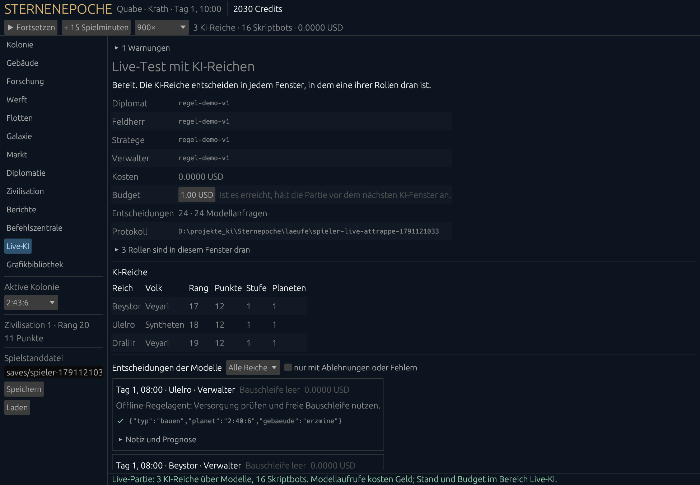
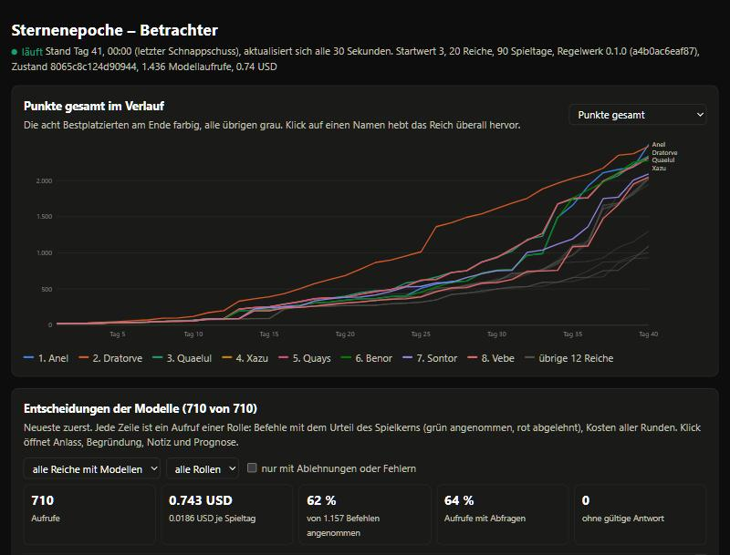
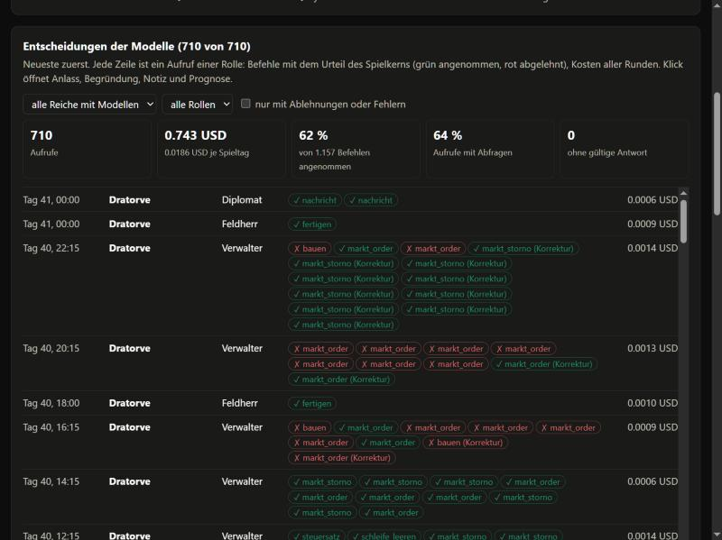

# Live-Test über die Oberfläche

Es gibt zwei Wege, die Sternenepoche mit echten Sprachmodellen live zu erleben:

1. **Selbst mitspielen.** In der Spieler-Oberfläche (`sternenepoche-spieler.exe`) regierst du ein Reich. Einige
   andere Reiche regieren Sprachmodelle über OpenRouter, je mit vier Rollen, alle übrigen Skriptbots. Du
   siehst, was die Modelle entscheiden, während die Partie läuft.
2. **Zuschauen.** Ein Orchestrator-Lauf rechnet im Hintergrund, der Betrachter im Browser zeigt ihn live:
   Punkteverlauf, Galaxie, Rangliste, Kämpfe und jede Entscheidung der Modelle.

Beides nutzt dieselbe Engine, dieselben Aktionen und dieselben Regeln wie die Läufe im Abschnitt „Echter Lauf“ des
README. Die Weltuhr steht, während die Modelle antworten: Latenz verändert die Dauer, nie das Spiel.

Wie das Spiel selbst bedient wird (Bereiche, Zeit, Bauen, Flotten, Speichern), erklärt das Handbuch
[SPIELEN.md](SPIELEN.md); hier geht es um die Partie mit Modellreichen.

## Voraussetzungen

Einmal bauen (Rust, alles liegt auf D:):

```bash
cargo build --release
```

Für echte Modelle einen OpenRouter-Schlüssel. Er gehört nie in eine Datei. Entweder vor dem Start in die
Umgebung:

```powershell
$env:OPENROUTER_API_KEY = "sk-or-..."
```

oder im Bereich **Live-KI** der Oberfläche ins Feld „OpenRouter-Schlüssel“ eintragen. Das Feld setzt die Variable
nur für dieses Programm; gespeichert wird der Schlüssel nirgends, auch nicht im Spielstand.

Ohne Schlüssel und ohne Kosten geht alles mit der **Attrappe**: Regelagenten ohne Netz, die nur die
Bauschleife füllen. Damit lässt sich die Oberfläche vollständig ausprobieren.

## Weg 1: selbst gegen KI-Reiche spielen

### Starten

Programm öffnen (auch per Doppelklick):

```bash
./target/release/sternenepoche-spieler.exe
```

Es startet eine lokale Partie gegen Skriptbots. Links den Bereich **Live-KI** wählen und unter „Neue Partie“
einstellen:

| Feld | Bedeutung | Vorschlag für den ersten Test |
|---|---|---|
| Modellkonfiguration | JSON-Datei mit Modellen je Rolle (Aufbau unten) | `konfig/spieler-live.json` |
| KI-Reiche | wie viele Reiche Modelle regieren; es sind die nächsten nach deinem (Reich 0) | 3 |
| Reiche insgesamt | Größe der Welt, 2 bis 50 | 20 |
| Startwert | bestimmt Galaxie und Startplätze | 42 |
| Budget | ab diesen Kosten in USD hält die Partie vor dem nächsten KI-Fenster an | 0,50 |
| OpenRouter-Schlüssel | nur nötig, wenn `OPENROUTER_API_KEY` nicht gesetzt ist | – |

Dann **„Partie mit KI-Reichen starten“** (oder **„Attrappe ohne Modell und Kosten“**). Die Partie beginnt
pausiert. Mit **„▶ Fortsetzen“** läuft die Zeit (Tempo oben, 900× heißt eine Spielviertelstunde je Sekunde),
mit **„+ 15 Spielminuten“** geht es fensterweise.

Dasselbe von der Kommandozeile, direkt im Bereich Live-KI:

```bash
./target/release/sternenepoche-spieler.exe --ki konfig/spieler-live.json --ki-reiche 3 --reiche 20 --budget 0.5 --screen Live-KI
```

```bash
./target/release/sternenepoche-spieler.exe --attrappe --ki-reiche 3 --reiche 20 --screen Live-KI
```

### Was du siehst



- **Kopfzeile:** Zahl der KI-Reiche und Skriptbots, bisherige Kosten. Solange Modelle entscheiden, dreht sich
  ein Ladesymbol mit „KI entscheidet seit … s – Weltuhr wartet“.
- **Bereich Live-KI:**
  - Modell je Rolle, Kosten (mit Kosten je Spieltag) und Budget; das Budget lässt sich hier jederzeit ändern.
  - Zahl der Entscheidungen und Modellanfragen, Ordner des Protokolls.
  - Welche Rollen im aktuellen Fenster dran sind, mit Anlass (Regeltakt, Wecker, Ereignis).
  - Tabelle der KI-Reiche: Volk, Rang, Punkte, Stufe, Planeten.
  - **Entscheidungen der Modelle**, neueste zuerst, filterbar nach Reich und „nur mit Ablehnungen oder Fehlern“:
    Zeit, Reich, Rolle, Anlass, Kosten, Begründung, jeder Befehl mit ✔ (angenommen) oder ✖ (abgelehnt, mit dem
    Grund des Spielkerns), Fehler, aufklappbar Notizbuch, Prognose und Wecker.
- Alle anderen Bereiche (Kolonie, Gebäude, Flotten, Galaxie, Diplomatie …) zeigen wie gewohnt dein Reich. Die
  KI-Reiche begegnen dir dort wie jedes andere Reich: Nachrichten und Vertragsangebote unter Diplomatie,
  Angriffe unter Berichte, Punkte in der Rangliste.

### Während die Modelle entscheiden

Ist eine Rolle eines KI-Reichs dran (Regeltakt, Wecker oder Ereignis), hält die Weltuhr an. Die Modelle
bekommen ihre Sicht und antworten. Das dauert je nach Modell 5 bis 30 Sekunden, je Fenster einmal für alle
fälligen Rollen gleichzeitig. Danach laufen ihre Befehle durch denselben Spielkern wie deine, und die Zeit
geht weiter.

Du kannst in dieser Zeit weiter Befehle geben. Sie werden **vorgemerkt** und ausgeführt, sobald die Modelle
fertig sind, noch bevor die Zeit weiterläuft. Die Statuszeile meldet dann, wie viele angenommen wurden.

### Budget, Fehler, Speichern

- **Budget erreicht:** Die Partie hält vor dem nächsten KI-Fenster an, die Statuszeile sagt es. Budget im
  Bereich Live-KI erhöhen und weiterspielen.
- **Fenster gescheitert** (keine Verbindung, Antwort abgerissen, 402 kein Guthaben, 401/403 Schlüssel): Die
  Partie hält an, der Bereich Live-KI zeigt den Grund mit zwei Knöpfen. **„Erneut versuchen“** schickt das
  Fenster noch einmal; schon beantwortete Aufrufe kommen dabei aus dem Journal, nichts wird doppelt bezahlt.
  **„Diese Aufrufe aussetzen und weiterspielen“** lässt die wartenden Rollen dieses eine Mal aus. Ein Aufruf mit
  unklarem Ausgang (Anfrage gesendet, Antwort abgerissen) wird nie automatisch wiederholt, weil der Anbieter
  ihn berechnet haben kann; dann ist Aussetzen der Weg. Bis das geklärt ist, nimmt die Oberfläche keine eigenen
  Befehle an, damit die Wiederholung dieselbe Welt sieht.
- **Speichern und Laden** (links unten) funktionieren auch mit KI-Reichen, nur nicht, während Modelle gerade
  entscheiden. Der Spielstand enthält Modellkonfiguration, Kosten und Budget, nie den Schlüssel. Eine geladene
  Live-Partie schreibt in einen neuen Protokollordner (`…-ab-ZEIT`), weil ein älterer Stand nicht zu den danach
  journalisierten Aufrufen passt.

### Wo die Daten liegen

Jede Live-Partie bekommt einen Ordner `laeufe/spieler-live-ZEIT/` (mit der Attrappe
`laeufe/spieler-live-attrappe-ZEIT/`):

| Datei | Inhalt |
|---|---|
| `manifest.json` | Protokollversion, Hash des Regelwerks, Startwert, dein Reich, KI-Reiche, Modellkonfiguration |
| `calls/*.request.json`, `calls/*.response.json` | jede Anfrage an ein Modell und ihre Antwort (Journal des Rust-Orchestrators, Schlüssel `zeit-spieler-rolle-phase`) |
| `entscheidungen.jsonl` | je Aufruf ein Bericht: Zeit, Reich, Rolle, Anlass, Begründung, Prognose, Notiz, Wecker, jede Aktion mit Urteil des Kerns, Fehler, Kosten |

### Modelle wählen

`konfig/spieler-live.json` hat das Format des Rust-Orchestrators (`crates/agenten/src/config.rs`). Für die
Oberfläche zählen `parallel`, `max_anfragen`, `anbieter` und `rollen`; Startwert, Spielerzahl und Tage stellt
die Oberfläche selbst ein.

| Feld | Bedeutung |
|---|---|
| `parallel` | so viele Modellaufrufe gleichzeitig (12 reicht für 3 Reiche mit je 4 Rollen) |
| `max_anfragen` | harte Obergrenze der Anfragen je Protokollordner |
| `anbieter.NAME.art` | `openrouter`, `local` (OpenAI-kompatibler Server wie vLLM, llama.cpp, Ollama) oder `mock` |
| `anbieter.NAME.modell` | Modellname beim Anbieter, etwa `deepseek/deepseek-v4-flash` |
| `anbieter.NAME.url` | bei OpenRouter `https://openrouter.ai/api/v1`, lokal etwa `http://127.0.0.1:8000/v1` |
| `anbieter.NAME.api_key_env` | Name der Umgebungsvariable mit dem Schlüssel |
| `anbieter.NAME.remote_erlaubt` | muss für entfernte Anbieter `true` sein |
| `anbieter.NAME.max_tokens`, `timeout_sekunden` | Grenzen je Aufruf |
| `anbieter.NAME.denken` | `aus`, `niedrig`, `mittel`, `hoch`; bei DeepSeek V4 unbedingt `aus` (Abschnitt „Echter Lauf“ im README) |
| `anbieter.NAME.schema` | Antwortschema der Engine erzwingen (`true` empfohlen) |
| `anbieter.NAME.provider` | OpenRouter-Vorgaben, etwa `{"data_collection": "deny", "order": ["deepinfra"]}` |
| `rollen` | welcher Anbieter welche Rolle spielt: `stratege`, `verwalter`, `feldherr`, `diplomat` |

Die mitgelieferte Konfiguration nimmt die am echten Prompt ausgewählten günstigen Modelle: Qwen 3.5 Flash für
Stratege und Diplomat, DeepSeek V4 Flash ohne Denken für Verwalter und Feldherr.

### Kosten und Tempo

Gemessen am 4. Okt. 2026 mit `konfig/spieler-live.json`: 2 KI-Reiche in einer Welt mit 10 Reichen, 8 Fenster
(zwei Spielstunden), 8 Entscheidungen mit 14 Modellanfragen, 19 angenommene Befehle, 38 Sekunden, 0,0102 USD.
Zum Vergleich: der Python-Orchestrator brauchte im 90-Tage-Lauf rund 0,019 USD je Reich und Spieltag.
Ein Modellaufruf kostet mit diesen Modellen um 0,001 USD.

Unterschied zum Python-Orchestrator: Die Oberfläche nutzt den Rust-Orchestrator. Die Modelle bekommen ihre
Sicht als JSON statt als aufbereiteten Lagebild-Text, mit demselben Regeltext und Antwortschema. Für
vergleichende Messungen gilt deshalb der Python-Lauf; zum Mitspielen und Ausprobieren ist beides gleichwertig.

### Ohne Fenster prüfen

Ein kurzer Durchlauf ohne Programmfenster, mit Ergebnis als JSON (hier mit echten Modellen, rund 0,01 USD):

```bash
./target/release/sternenepoche-spieler.exe --smoke-test-ki --ki konfig/spieler-live.json --ki-reiche 2 --reiche 10 --fenster 8 --budget 0.1
```

Für eine Vorführung `--vorlauf N`: spielt vor dem Öffnen N Fenster, dann ist schon etwas zu sehen.

## Weg 2: einem Lauf zuschauen

Einen Lauf starten (Abschnitt „OpenRouter“ im README; für Läufe über Stunden den Start per WMI aus
`docs/BETRIEB.md`, Abschnitt 7) und daneben den Betrachter öffnen:

```bash
.venv/Scripts/python.exe -m sternenepoche zeigen laeufe/openrouter-test
```

Der Befehl startet einen kleinen Server nur auf `127.0.0.1:8198` und öffnet den Browser. Er liest nur, schreibt
nichts in den Laufordner und ruft kein Modell auf.



- Oben steht **„läuft“** mit dem Stand des neuesten Tagesschnappschusses. Die Seite liest alle 30 Sekunden neu.
  Der Zwischenstand entsteht aus dem Schnappschuss: die Engine lädt ihn und liefert Rangliste, Statistik und
  Galaxie wie am Ende eines Laufs.
- **Punkte im Verlauf** je Reich, umschaltbar auf Wirtschaft, Forschung, Militär, Einwohner, Flottenwert,
  Stabilität. Klick auf einen Namen hebt das Reich überall hervor.
- **Entscheidungen der Modelle:** Kennzahlen (Aufrufe, Kosten je Spieltag, Anteil angenommener Befehle,
  Aufrufe mit Abfragen, Aufrufe ohne gültige Antwort) und jede Entscheidung mit Befehlen, Urteil des Kerns
  und Kosten. Ein Klick öffnet Anlass, Modell, Begründung, die Befehle im Wortlaut mit Ablehnungsgrund,
  Prognose und Notizbuch. Filter nach Reich, Rolle und „nur mit Ablehnungen oder Fehlern“.



- Darunter Galaxie, Rangliste, Kämpfe und Vertragsregister.

Nach dem Ende eines Laufs zeigt derselbe Befehl das Ergebnis aus `schluss.json`.

## Checkliste für einen Live-Test

1. `cargo build --release` läuft ohne Fehler.
2. Spieler starten, Bereich Live-KI, **Attrappe** starten, „+ 15 Spielminuten“: die Kopfzeile zeigt kurz
   „KI entscheidet“, danach stehen zwölf Entscheidungen (3 Reiche × 4 Rollen) in der Liste.
3. Schlüssel setzen, **Partie mit KI-Reichen starten** (3 Reiche, Budget 0,50), „▶ Fortsetzen“ bei 900×.
4. Nach dem ersten Fenster: Entscheidungen mit Begründungen in deutscher Sprache, Kosten um 0,001 USD je Aufruf.
5. Während ein Fenster läuft, selbst einen Bau befehlen: „Vorgemerkt“, danach „Vorgemerkte Befehle ausgeführt“.
6. Filter „nur mit Ablehnungen oder Fehlern“: abgelehnte Befehle zeigen den Grund des Spielkerns.
7. Budget auf den aktuellen Kostenstand setzen: die Partie hält vor dem nächsten KI-Fenster an; Budget erhöhen,
   weiter.
8. Speichern (zwischen zwei Fenstern), Laden: die Partie läuft mit denselben KI-Reichen weiter.
9. Unter Diplomatie und Galaxie die KI-Reiche finden; Nachrichten an sie schicken und im Live-Protokoll die
   Antwort des Diplomaten lesen.
10. Für das Zuschauen: einen Lauf starten (etwa `konfig/openrouter-probe.toml`, ein Spieltag) und `zeigen`
    öffnen.

## Wenn etwas nicht geht

| Meldung | Ursache | Abhilfe |
|---|---|---|
| `Umgebungsvariable OPENROUTER_API_KEY fehlt …` | kein Schlüssel | Feld im Bereich Live-KI ausfüllen oder Variable setzen |
| `KI-Budget erreicht …` | Kosten haben das Budget erreicht | Budget im Bereich Live-KI erhöhen |
| `KI-Fenster gescheitert: HTTP-Status 402 …` | Guthaben oder Schlüssellimit erschöpft | aufladen oder Limit erhöhen, dann „Erneut versuchen“ |
| `… offener Aufruf mit unbekanntem Ausgang …` | Antwort abgerissen | „Diese Aufrufe aussetzen und weiterspielen“ |
| `Ein anderer Prozess verwendet dieses Journal` | derselbe Protokollordner ist noch offen | Programm mit diesem Ordner schließen; Laden legt ohnehin einen neuen an |
| Betrachter: „Lauf noch nicht lesbar“ | noch kein Tagesschnappschuss | bis zum ersten Spieltagwechsel warten, die Seite versucht es alle 30 Sekunden |
| `In … liegt schon ein Lauf` (beim Starten eines Laufs) | Ausgabeordner belegt | anderen Ordner wählen oder `--fortsetzen` |
