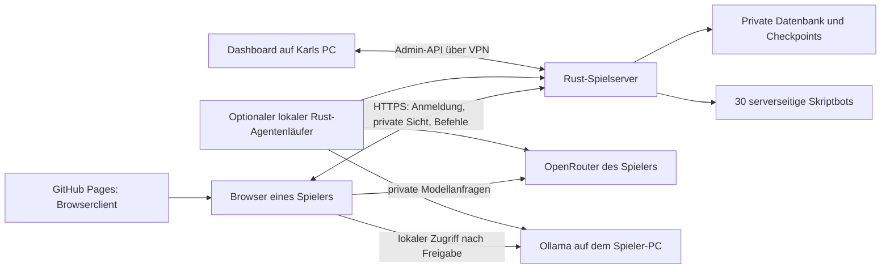

# Sternenepoche: öffentliches Spiel, Browser und lokale Verwaltung

Stand: 8. Oktober 2026. Verbindlicher Onlinevertrag aus Karls Auftrag.
Aktuelle Spieleroberfläche: Die Browseroberfläche übernimmt die Struktur der 26 Referenzbilder
aus `beispiele/` mit ausschließlich eigenen Sternenepoche-Motiven. Sie ist mit der gemeinsamen Rust-Welt verbunden.
Der Implementierungsstand und die Abnahmekriterien stehen in Abschnitt 12.
„Beschlossen“ bedeutet in diesem Dokument nicht automatisch „bereits ausgeliefert“.

## Überarbeitung der Spieleroberfläche vom 8. Oktober

| Vorher | Danach | Zweck |
| --- | --- | --- |
| Separate 3D-Laufansicht und reine Tabellenkarte | Integrierter Sternenatlas mit Sektorwolken, Systemen und animierten Planeten; native HTML-Berichte und Tastaturzugang | Räumliche Navigation für Menschen, dieselbe Informationsgrenze wie für Agenten. |
| Sieben grobe Tabs, Gebäudetabellen | 17 Bereiche, Rohstoffleiste, eigene Planetenauswahl, bebilderte Kacheln und Detailansichten | Menschen können Angebote, Kosten und Voraussetzungen direkt vergleichen. |
| Volksnamen im Auswahlfeld | Vier Porträtkarten mit berechneten Vor- und Nachteilen | Die Wahl ist vor der Reichsgründung verständlich und danach für diese Epoche fest. |
| Gerundete Restminuten | Sekundengenaue Bauzeiten und Werftphasen, gespeicherte Baudauer, Forschungsbeginn, Uhrzeiger-/Ruhemodus | Fortschritt folgt dem Server, friert bei Pause ein und übersteht Neustarts. |
| Weitere Funktionen im generischen Befehlsformular | Versorgung, Imperiumsvergleich, Technologiebaum, Simulator, Verbände, Kolonie- und Reparaturplanung | Bestehende Rust-Funktionen werden über konkrete Spieleransichten erreichbar. |

Alle 402 Motive wurden gegen ihre geprüfte Herkunft und Dateihashes validiert. Der Web-Paketinhalt enthält
nur verkleinerte Bilder, Anzeigenamen und Bildzuordnungen (rund 8 MiB), keine Produktionsworkflows oder Betriebsdaten.
Der Server liefert genau diese Dateien aus seinem Programm aus; Pages veröffentlicht dieselbe ausdrücklich
freigegebene Dateiliste. Lokale Verwaltung, Konten, Modellschlüssel und Spielstände bleiben privat.

### Abgleich mit der verlinkten OGame-FAQ

Die [FAQ](https://board.de.ogame.gameforge.com/index.php?thread/193284-die-h%C3%A4ufigsten-fragen-neuer-spieler/)
und ihre Antworten wurden für Verbandsangriff, Rapidfire, Planetenspionage, Angriffserkennung,
Saven, freie Kolonisation, Startfracht und Schildkuppeln gelesen. Die Referenz hat eigene Regeln;
Sternenepoche behält Karls Aufklärungs- und Kolonisationsvorgaben sowie das aktive Regelprofil.

| Spielprinzip | Umsetzung in Sternenepoche |
| --- | --- |
| Bauangebote, Kosten, Voraussetzungen und laufender Auftrag | Detailpanel plus farbige bzw. gesperrte Kacheln; Serveraufträge mit Restzeit und Fortschritt. |
| Rapidfire, Schild, Struktur und Forschung | Bestehender deterministischer Einzelkampf, maximal sechs Runden im aktuellen Profil. Der Simulator berücksichtigt nun auch Volksboni des Verteidigers und dessen tatsächliche Einheitenkosten. |
| Verbandsangriff und gemeinsames Eintreffen | Bestehende Verbandslogik; eigene Flotte eröffnet einen Verband, passende verbündete Flotte tritt über ihre Nummer bei. |
| Fehlende Spionagedaten bedeuten unbekannt | System- und Planetensonde bleiben getrennt. Simulator verweigert die Rechnung ohne vollständige Schiff- und Verteidigungsbeobachtung. |
| Saven schützt Schiffe und Fracht während der Abwesenheit | Eigene Mission mit Hinflug, Wartezeit, Rückflug, genauer Treibstoffreserve, Rückruf und tatsächlicher Landungsprüfung. |
| Freie Kolonisation benötigt Astrophysik und Kolonieschiff | Zusätzlich eigene Sondenbeobachtung, bewaffnete Begleitung und Startfracht; Kapazität für laufende freie und feindliche Kolonisation wird gemeinsam reserviert. |
| In der OGame-FAQ ist keine Übernahme fremder Planeten vorgesehen | Sternenepoche ergänzt die bereits festgelegte Kampfkolonisation: Bombardierung, höchstens 30 % Integrität, Orbitkontrolle, mindestens 30 Spielminuten und zwei vollständige Verteidiger-Reaktionen; ursprüngliche Heimat geschützt. |

Die Anleitung im Browser verwendet das aktive Serverprofil einschließlich Kolonisationsregeln v2.
Die vollständige Referenz wird nicht als pauschale Behauptung einer identischen OGame-Kopie verwendet:
Monde, Echtgeldfunktionen und OGame-spezifische Kontoregeln sind keine zusätzlichen zugesagten Spielfunktionen.

## 1. Die drei Ebenen

| Ebene | Aufgabe | Laufzeit und Daten |
|---|---|---|
| Öffentliche Spielwelt | Anmeldung, 30 Bots und 20 mögliche Teilnehmerplätze (zunächst drei freigegeben), autoritative Regeln, Weltuhr, Speicherung | Rust-Dienst auf dauerhaft erreichbarem Host, HTTPS, private Datenbank |
| Browser von GitHub Pages | Zuschauen, als Mensch spielen, eigenen Agenten über Ollama/OpenRouter oder gemischt betreiben | Statische Website von GitHub; erhält ausschließlich erlaubte Spielersicht und sendet Befehle an den Rust-Dienst |
| Dashboard auf Karls PC | Welt verwalten, Spieler und Bots kontrollieren, Zeit/Regeln konfigurieren, sichern, zurücksetzen | Lokale Rust-Anwendung mit eigenem Adminzugang; verbindet sich mit der privaten Verwaltungs-API |

GitHub ist Quellcode- und Website-Host. Pages ist statisches Hosting und führt keine
dauerhaften Rust-/Pythonprozesse aus. Deshalb liegt die gemeinsame Welt auf einem zusätzlichen
Host. Beschlossen: **zunächst Karls PC als Host**, später ein VPS. Der PC-Dienst ist nur erreichbar,
während der PC läuft. Der Umzug übernimmt denselben Rust-Dienst und die private Datenbank;
Browser/API-Adresse und Betriebskonfiguration ändern sich, die Engine bleibt dieselbe.
[GitHub Pages: Hostingmodell](https://docs.github.com/en/pages/getting-started-with-github-pages/what-is-github-pages)

Beim PC-Betrieb beherbergt Karls PC Welt und Dashboard. Nach dem VPS-Umzug unterbricht
das Ausschalten des Verwaltungs-PCs die dort laufende Welt nicht. Ollama wird grundsätzlich auf dem Gerät des jeweiligen Spielers angesprochen.
`localhost` auf dem Spielserver bezeichnet dessen Gerät und kann keine Spielermodelle auf
einem anderen PC erreichen.

## 2. Einstieg, Konten und Plätze

Die Startseite zeigt Serverzustand, Spieltempo, Epochenende, 30 Botplätze sowie freie und
belegte Teilnehmerplätze. Drei verständliche Einstiegskarten führen zu:

1. **Zuschauen:** öffentliche Rangliste, aggregierter Verlauf und öffentlich freigegebene
   Ereignisse. Kein Platzverbrauch; keine Modellschlüssel erforderlich.
2. **Mensch:** Konto anmelden, einen der freigegebenen Plätze belegen oder auf die Warteliste treten, Volk wählen; der nächste freie Startplatz wird atomar zugeteilt. Bauen, forschen, Flotten senden, erkunden, handeln und diplomatisch handeln.
3. **Eigener Agent:** denselben Platztyp belegen, Absicht und Modellbetrieb auswählen;
   Ollama, OpenRouter oder pro Rolle gemischt. Ein Agent kann später auf Mensch/Assistenz
   umgestellt werden, ohne ein zweites Reich zu erzeugen.

Konto, Sitz und Steuerungsart sind getrennte Objekte. Ein Zuschauer kann später einen freien
Sitz beziehen und ein ausgeschiedener Spieler Zuschauer bleiben. Ein Konto kann pro Welt
höchstens einen Sitz besitzen. Ein Mensch mit KI-Unterstützung belegt ebenfalls nur einen Sitz.
Die vier KI-Regierungsrollen sind interne Aufgaben innerhalb desselben Reiches.

**Genau 50 Reiche:** 30 serverseitige Bots plus 20 reservierte Startmöglichkeiten, nicht 42
Reiche und nicht 50 schon wirtschaftende Spieler. Unbelegte Sitze haben keine Produktion,
Forschung, Punkte oder Flotten. Die Engine erzeugt deren Startort deterministisch, die
Aktivierung setzt dort erst bei Beitritt die Startressourcen, Bevölkerung und Schutzfrist.
Die erste Lieferung teilt Startorte automatisch zu; sie gibt weder fremde Heimatkoordinaten
noch unbekannte Ressourcenprofile über die Lobby preis. Eine Sektorwahl ist eine optionale spätere Erweiterung. Das Volk darf nur vor Sitzaktivierung frei wechseln.

Sitzvergabe erfolgt in einer Datenbanktransaktion mit eindeutiger Kombination Welt/Sitz
und Welt/Konto. Bei zwei gleichzeitigen Anmeldungen auf den letzten Platz gewinnt genau eine;
die andere sieht „keine freien Plätze“. Ein ungültiger Modellschlüssel verbraucht keine zusätzlichen
Sitze und verhindert weder menschliches Spielen noch einen späteren Agentenstart.

Logout oder geschlossener Browser geben den Sitz nicht frei. Ein Reich bleibt in der Welt;
seine Produktion, Bauten und Flotten laufen weiter, solange es nicht besiegt wurde.
Das Ausscheiden folgt den unten beschriebenen Krisenregeln. Ein besiegter Platz bleibt
für den Rest der Epoche belegt und wird erst beim Epochenwechsel neu vergeben.
Er vererbt dem nächsten Konto keine privaten Daten oder alten Truppen.
Mehrfachkonten werden im aktuellen PC-Testbetrieb nicht automatisch als dieselbe Person
erkannt. Sperren gelten auf Kontoebene. Für eine gewertete öffentliche Saison braucht es
eine definierte Mehrfachkonten- und Einspruchsregel; bloße IP-Gleichheit reicht dafür nicht.

Später Beitritt startet mit den normalen Anfangswerten und einer Schutzfrist ab Beitritt.
Ein älteres Reich hat einen wirtschaftlichen Vorsprung; die Rangliste zeigt deshalb das
Beitrittsalter. Für einen fairen Saisonvergleich schließt die Anmeldung nach einer vorher
angezeigten Startphase. In einer offenen Testwelt bleiben freie Plätze länger beziehbar.
Diese beiden Weltarten werden beim Erzeugen festgelegt, nicht still im laufenden Spiel geändert.

## 3. Ein Regelkern und eine autoritative Welt

`crates/kern` bleibt die einzige Spielimplementierung. Browser, lokale UI, Skriptbots,
Modellagenten und Admin-Dienst führen dieselben Rust-Aktionen aus. Der Python-Webport ist
ein Prototyp und wird nicht parallel als zweite autoritative Engine weitergeführt.

Der neue Dienst erhält die Bausteine `server` (Welt-Aktor, HTTP, Authentifizierung und SQLite),
`controller` (lokale Verwaltung) und optional `agent-client` (lokaler Dauerläufer).
Vorhandene Provider-, Journal- und Gedächtnisfunktionen aus `agenten` werden wiederverwendet;
die Welt wird für Online-Teilnehmer nicht in private lokale Kopien aufgespalten.

Ein Welt-Aktor schreibt den Zustand. HTTP-Threads und Modellprozesse lesen private
Projektionen und stellen validierte Befehle in seine begrenzte Warteschlange. Kein Modellaufruf
hält den Welt-Lock. Providerantworten sind Vorschläge; der Server prüft Besitzer, Rolle,
Voraussetzungen, Ressourcen, Zahlenbereiche, Frist und Steuerungs-Lease vor jeder Wirkung.

Eine Sitzung bestimmt die Spieler-ID; ein Client kann sie nicht im Request überschreiben.
`Rolle::Alle` ist kein vom Internet akzeptierter Rollenwert. Manuelle Menschenbefehle werden
intern nach dem erlaubten Aktionsbereich geroutet; ihre Berechtigung zum gesamten eigenen
Reich wird serverseitig vergeben. Agenten erhalten begrenzte Rollen-/Toolrechte.

Kompletter Weltzustand, Seed, RNG, Warteschlange und Checkpoints bleiben auf dem Server.
Weder Browser-WASM noch heruntergeladene JSON-Welten berechnen verbindliche fremde Zustände.
Ein WASM-Helfer wäre später nur für Vorschauen mit bereits sichtbaren Daten zulässig.

## 4. Zeit und Reihenfolge

Standardtempo des öffentlichen Spiels ist **1 Spielsekunde je Echtsekunde**. Die Warnung
„zwei Stunden“ meint zwei Spielstunden; bei Testtempo 60× sind das zwei Echtminuten.
Die Oberfläche zeigt Serverzeit sowie bei Angriffskontakten die Spiel- und geschätzte Echtzeit
bis Ankunft. Tempo liegt zwischen 1× und 3600×; Pause ist ein eigener Schalter.

Eine monotone Serveruhr berechnet die verstrichene Laufzeit. `sleep(2)` ist keine Zeitquelle;
eine langsame Anfrage darf keine Sekunden verlieren. Rust verarbeitet Ereignisse chronologisch
bis zum zulässigen Weltzeitpunkt. Produktion, Forschung, Flüge und Rückkehr hängen an derselben Uhr.
Menschliche Befehle wirken sofort nach serieller Validierung bei der aktuellen Serverzeit.
Skriptbots handeln standardmäßig alle zwei Spielstunden; das Dashboard erlaubt 900 bis 86400
Spielsekunden. Browseragenten handeln standardmäßig nach jeder Runde mit 60 echten Sekunden
Abstand; dieser Abstand ist von der Weltgeschwindigkeit unabhängig. Sensorereignisse machen
Kontakte sofort sichtbar. Ein eigener dringlicher Modellaufruf ist noch keine Funktion von V1.

Das Live-Spiel wartet nicht auf einen langsamen Agenten. Modellaufrufe enden spätestens nach
120 echten Sekunden; der Server validiert Antworten gegen den dann aktuellen Zustand,
Weltkennung und Lease. Er datiert keine Entscheidung zurück. Ein gemeinsames Aufruflimit gilt
für alle ausgewählten Rollen eines Browseragenten, jede Antwort erlaubt höchstens acht Aktionen.
Eine zusätzliche aktionsübergreifende Quote für eine gewertete Saison ist eine spätere Regel.
Nach drei aufeinanderfolgenden Fehlern bleibt das Reich unbetreut und die Steuerung geht an den
Besitzer zurück. Ein automatischer Notfallplan ist in V1 nicht aktiviert.

Das Forschungslabor darf weiterhin gemeinsame Inferenzfenster einfrieren. Dieser Modus ist
getrennt bezeichnet und wird niemals als Live-Regel im öffentlichen Spiel eingeschaltet.

Sensorereignisse werden vor Wirkungen desselben Zeitstempels ausgewertet. Fertige Gebäude,
Werftaufträge, Rückkehr und Kampf folgen der dokumentierten Engine-Reihenfolge. Eine bereits
eingetroffene Angriffsflotte kann nicht nachträglich durch einen verspäteten Save-Befehl umgangen
werden. Bei exakt gleicher Rückkehr- und Kampfzeit stehen zurückgekehrte Schiffe wieder am Planeten.

Nach einem Serverausfall lädt der Dienst den letzten atomar gespeicherten Stand einschließlich
Pausestatus und setzt von dort fort. Es gibt keinen Echtzeit-Nachholangriff für die ausgefallene
Zeit. Karl sieht Stand und neue Prozesslaufzeit im Dashboard. Planmäßige Wartung beginnt mit
dem Pausenschalter; dessen Status übersteht den Neustart. Browser-/Agentenausfälle pausieren
die Welt dagegen nicht. Browseragenten überspringen Modellaufrufe während einer Weltpause.

## 5. System- und Planetenaufklärung

Koordinaten und mögliche Planetenslots sind öffentlich. Vor einer Erkundung bleiben Typ,
Felder, Bewohner und Ressourcen unbekannt. Das eigene Heimatsystem ist kartiert; die eigene
Heimatwelt ist vollständig bekannt. Auch im Heimatsystem braucht jeder fremde Planet eine Sonde.

| Auftrag | Benötigte Flotte | Neues Wissen bei Ankunft |
|---|---|---|
| `system_erkunden` | Mindestens eine Spionagesonde, keine anderen Schiffe oder Fracht | System ist kartiert; Nebel und Asteroidengürtel bekannt. Kein Planetenscan |
| `spionage` auf einen freien Planetenslot | Eigene Sonde, zuvor kartiertes System | Typ/Zone, Felder, Ressourcenprofil, zum Scanzeitpunkt unbewohnt |
| `spionage` auf einen bewohnten Planeten | Eigene Sonde, zuvor kartiertes System | Besitzer und Ressourcenstand; weitere militärische/technische Daten nach Spionageregeln |

Eine Sonde fliegt physisch, kostet Treibstoff, belegt einen Flottenplatz und kann verloren gehen.
Eine erfolgreiche Erkundung verbraucht nicht automatisch die Sonde: Überlebende kehren zurück.
Ein Modell, ein UI-Klick oder eine reine Werkzeugabfrage ersetzt keine Flugmission.

Nebel, Gürtel und Planetentypen haben im Online-Profil keine öffentlich vorhersehbare
Koordinatenfolge. Der Seed ist geheim. Völker- und Agentenprompts enthalten Regeln, keine
fertige versteckte Galaxiekarte. Bessere Spionagetechnik verfeinert Ressourcenintervalle;
wiederholte gleiche Messungen mitteln sich nicht zu einem kostenlosen exakten Wert.

Ein Scan ist eine historische Beobachtung mit Zeitstempel und Alter. Der Planet kann danach
besiedelt, verlassen oder erobert werden und Ressourcen verändern. Das Lagebild aktualisiert
solche Fremddaten erst nach einer neuen eigenen Sonde. Im Startvertrag werden private Scans
nicht automatisch zwischen Bündnispartnern geteilt; Nachrichten können ausdrücklich Wissen mitteilen.

Das aktuelle Ressourcenmodell kennt Ertragsfaktoren und Lagerbestände, keine endlichen
Erzadern. „Ressourcen vorhanden“ bedeutet somit Produktionsprofil und beobachteter Bestand.
Typ/Zone bestimmt die Deuterium-, Nahrungs- und Solar-Eignung; Erz/Kristall haben gemessene
Ertragsintervalle. Xenokristall hängt an einem erkundeten Nebelsystem und passender Extraktion.

Kolonisation benötigt eine eigene Planetenaufklärung, Kolonieschiff, bewaffnete Eskorte und
Startfracht nach Kolonisationsregeln v2. Eine inzwischen besiedelte Welt scheitert bei Ankunft;
ein vorheriger freier Bericht reserviert das Ziel nicht. Zwei Kolonisierer können um dasselbe
Ziel konkurrieren; nur eine Gründung entsteht. Heimatwelten bleiben gegen Übernahme geschützt.

## 6. Sensoren, Geheimdienst und Abschirmung

Jeder eigene Planet hat Basissensoren. Sie melden einen feindlichen Anflug **120 Spielminuten
vor Ankunft**. Ein kürzerer Flug wird sofort nach Abflug gemeldet. Abschirmung kann diese
Grundwarnung nicht unterdrücken. Der erste Kontakt zeigt Ziel, genaue Ankunft und verbleibende
Zeit; Besitzer, Herkunft, Schiffszahl, Typen, Fracht und genaue feindliche Mission bleiben verborgen.

Der Ausbau hat vier getrennte Komponenten:

- **Geheimdienst:** lokales Auswertungsgebäude, ab Zivilisationsstufe II; reguläre Baukosten,
  Arbeits-/Energiebedarf, Bauzeit, Felder und reparierbare Integrität.
- **Sensorphalanx:** lokaler Sensorbau, ab Stufe III.
- **Überwachungstechnik:** Reichsforschung, Labor II, Spionagetechnik I und eigener Geheimdienst.
- **Spionagetechnik:** Reichsforschung für aktive und passive Auswertung.

Wirksame Sensorstärke `S` ist das Minimum der vier Ausbaustufen. Beschädigung reduziert
die Gebäudeanteile; ein nicht gebautes Glied bedeutet `S=0`. Ausgebildete Syntheten erhalten
`+1` zu `S`, sobald dieses Minimum positiv ist. Alle anderen Völker haben keinen solchen
passiven Bonus. Ein Volksbonus allein ersetzt keine Forschung und kein Gebäude.

Vorwarnzeit: `120 + 30 × S` Spielminuten, frühestens ab Flottenstart.
Detailstärke: `D = max(0, S − Abschirmung_der_Flotte)`.

| D | Passive Anzeige |
|---|---|
| 0 | Nur Kontakt, Ziel und exakte Ankunft |
| 1–2 | Zusätzlich Besitzer und Schiffszahl als Zehnerintervall |
| 3–5 | Zusätzlich genaue Gesamtzahl der Schiffe |
| ab 6 | Zusätzlich genaue Schiffstypenzahlen und Mission |

Passive Sensoren zeigen keine Ladung und keine Herkunftskoordinate. Ein Verteidigungsbündnis
teilt erfasste Warnungen und Ankunftszeiten. Ein Partner muss für Details selbst ausgerüstet sein;
es gibt keine kostenlose Übernahme der stärksten befreundeten Auswertung.

**Abschirmtechnik** ist eine eigene Forschung ab Stufe II. Ihr Stand beim Abflug wird an der
Flotte gespeichert und bleibt dort bis zur Rückkehr. Späteres Forschen rüstet eine unterwegs
befindliche Flotte nicht magisch nach. Abschirmung verändert keine Flugzeit, Kampfkraft oder
Basiswarnung und ist von der militärischen Schildtechnik getrennt.

Die Kennzahlen sind ein erster expliziter Balancevertrag. Vor einer öffentlichen Saison
müssen Vorwarnzeiten, Forschungskosten und Volksboni mit dem Online-Profil erneut balanciert
werden; die alte Laborbalance beweist deren Fairness nicht.

## 7. Eine Sonde auf den Anflug

Der Spieler wählt einen bereits erfassten Kontakt und „Flotte mit Sonde untersuchen“.
`flotte_ausspaehen` benötigt eigenen Startplaneten, Kontakt-ID, 1–1000 Sonden und Geschwindigkeit.
Unbekannte IDs, fremde unentdeckte Flotten und veraltete Kontakte liefern dieselbe Ablehnung.
Damit ist die API keine Suchmaschine über geheime Flottenkennungen.

Die Sonde fliegt zum bekannten Anflugkorridor am verteidigten Ziel. Ihre Flugzeit wird mit
normalem Sondentempo berechnet. Sie muss strikt vor der Angriffsankunft eintreffen; zu spät
würde sie kein rechtzeitiges Wissen liefern und der Start wird ohne Ressourcenabzug abgelehnt.
Es gibt im ersten Vertrag keine dreidimensionale Verfolgung oder Kämpfe zwischen bewegten
Flotten: der Anflugkorridor ist eine ausdrücklich definierte spielmechanische Begegnung.

Aktive Auswertungsstärke `A = Spionagetechnik + wirksamer Geheimdienst_am_Sondenstart`.
Ausgebildete Veyari erhalten bei Spionagetechnik über 0 einen zusätzlichen Punkt zu `A`.
Ohne Abschirmung sieht eine eingetroffene Sonde die Schiffstypen. Bei Abschirmung muss `A`
**größer** als diese sein. Mehr Sonden ersetzen diesen technischen Vorsprung nicht.
Ladung wird nur bei erfolgreichem Scan und `A ≥ Abschirmung + 5` bekannt.

Der Bericht zeigt die gemessenen Schiffszahlen samt Zeit, nicht dauerhaft die lebende Flotte.
Er bleibt nach Rückruf/Kampf als historischer Bericht erhalten. Verschwindet der Anflug vor
Sondenankunft, gibt es „Kontakt verloren“ und die Sonde kehrt zurück. Ein Bericht über eine
alte Flotte wird keiner anderen Flotte wiederverwendeter Koordinaten zugeordnet.

Der Angreifer bemerkt die Untersuchung. Im Startvertrag wird die gesamte Sondengruppe
mit deterministischem Risiko 10 % nach erfolgreicher, 50 % nach verdeckter Untersuchung
abgeschossen; der bis dahin entstandene Bericht bleibt. Das ist keine garantierte Flucht.
Der Besitzer selbst sieht vollständige Daten seiner eigenen Flotten. Andere Spieler und
Zuschauer erhalten den privaten Bericht nicht.

## 8. Saven / Leerfahrt

`saven` ist eine nicht feindliche eigene Flugmission. Schiffe und gewählte Ressourcen verlassen
den Planeten und sind während des Flugs beziehungsweise der befristeten Wartezeit nicht Teil
seiner Verteidigung. Verteidigungsanlagen, Gebäude und Bevölkerung können nicht mitsaven.
Credits sind ohnehin keine Plünderfracht.

Der Spieler wählt eine andere gültige Planetenskoordinate, Schiffe, Geschwindigkeit, Fracht
und optional 0–72 Spielstunden Wartezeit. Eine Vorschau zeigt Hinflug, Wartezeit, Rückkehr,
Treibstoff, Laderaum und Ressourcen, die zurückbleiben. Die Flotte landet am Ziel nicht,
liefert nichts ab, kolonisiert nichts und greift niemanden an. Sie wartet außerhalb des
planetaren Kampfbereichs und fliegt danach zurück. Im ersten Regelvertrag gibt es keine
Abfangkämpfe im freien Raum.

Treibstoff für beide Strecken wird beim Start bezahlt. Für Ladung gelten Laderaum und echter
Bestand; doppelte oder überlaufende Mengen sind ungültig. Unterhalt und ein regulärer
Flottenplatz gelten während der ganzen Mission. Geschwindigkeit und Entfernung verändern
die Abwesenheitszeit; Rückruf kürzt den Hinflug nach derselben Rückkehrformel wie andere Flotten.
Es gibt keine zusätzliche pauschale „Safe“-Schaltfläche ohne Schiffs-/Treibstoffprüfung.

Die sichere Zeit endet bei der tatsächlichen Rückkehr. Der Besitzer kann die Rückkehr planen,
muss aber rechtzeitig wieder handeln. Eine am Start bereits wirkende feindliche Blockade
verhindert den Save-Start. Wird der Rückkehrplanet verloren, gilt die Umleitung zur eigenen
Heimat; ein blockierter Rückkehrorbit verhindert die Landung und bindet die Flotte weiter.
Diese Regeln gelten für Menschen, Agenten und Bots gleich.

Ein Save schützt nur die mitgenommene Fracht. Produktion und nicht verladenes Material auf
dem Planeten bleiben plünderbar. Saven garantiert keinen Sieg und keinen dauerhaften Schutz.
Ein Gegner kann die Rückkehr zeitlich planen, wenn er dafür erlaubte Informationen gewinnt;
das öffentliche Zuschauerprotokoll darf diese Rückkehr niemals verraten.

## 9. Agenten auf dem eigenen PC

Der Browser zeigt vier Zustände: Verbindung prüfen, Modell auswählen, Probelauf ohne Aktion,
Agent starten. Ein Test stellt eine begrenzte Anfrage und zeigt Latenz, Ausgabeformat und
Kosteninformation. Kein Modell wird automatisch heruntergeladen. Jeder Provider hat ein
explizites Budget, Tokenlimit, Timeout und erlaubte Rollen.

Bei **Ollama** holt der Browser nach Browserfreigabe lokale Modellinformationen und spricht
das Modell auf dem Spieler-PC an. Ollama bleibt an Loopback gebunden. Die Anleitung verwendet
eine konkrete erlaubte Website-Origin in `OLLAMA_ORIGINS`, keinen pauschalen Internetzugang.
HTTPS-Seiten können zusätzliche Browserfreigaben für lokalen Netzwerkzugriff verlangen;
die UI muss das erkennen und erklären. Ein optionaler lokaler Rust-Läufer bietet einen
gepaarten Loopback-Endpunkt, wenn Direktzugriff im Browser nicht unterstützt wird.
[Ollama: Origins und lokale Bindung](https://docs.ollama.com/faq),
[Chrome: Local Network Access](https://developer.chrome.com/blog/local-network-access)

Bei **OpenRouter im Browser** ruft der Browser den Provider direkt auf. Der persönliche
Schlüssel wird im Standard nur im Arbeitsspeicher gehalten, nicht im Git-Repository, Log,
Shared Snapshot oder Spielserver gespeichert. Optional kann später OpenRouter-PKCE angeboten
werden. Fremde Planetennamen, Nachrichten und Modellantworten werden als Text dargestellt;
sie dürfen kein HTML oder Skript ausführen und den Schlüssel auslesen.
[OpenRouter: Browserauthentifizierung und PKCE](https://openrouter.ai/docs/guides/overview/auth/oauth)

Browseragenten laufen, solange der Browser aktiv ist; Tab-Drosselung, Schlafmodus und
Browserende sind echte Grenzen. Die Oberfläche zeigt verlorenen Heartbeat. Für durchgehenden
lokalen Betrieb nutzt man den optionalen Rust-Läufer auf dem PC. Ein späterer serverseitiger
OpenRouter-Agent wäre ein eigener, ausdrücklich gewählter Betriebsmodus mit Schlüsseltresor
und Budget; er ist kein stiller Ersatz für ein offline gegangenes lokales Modell.

**Mischbetrieb** wählt pro Rolle Provider und Modell. Human-Assistenz kann Antworten zunächst
als Vorschläge zeigen; Auto-Modus sendet validierbare Befehle direkt. Die Kontrolle hat eine
Lease mit Generation. Moduswechsel oder Stop widerrufen diese Lease; eine alte Providerantwort
kann danach nicht mehr bauen, angreifen oder Ressourcen verbrauchen. Gleichzeitige Tabs
besitzen höchstens eine aktive Agenten-Lease; ein zweiter Tab darf beobachten.

Alle LLMs erhalten die private Rust-Sicht und genau die erlaubten Tools. Kleine Zustandsseiten,
Berichte und ein privates Gedächtnis ersetzen einen kompletten Welt-JSON-Prompt. Jede
Entscheidung protokolliert Modell, Zeit, Vorschlag, Urteil, Wirkung, Latenz und gemeldete Kosten;
das private Modellgespräch wird nur dem Eigentümer und berechtigten Admin angezeigt.

## 10. Lokales Verwaltungsdashboard

Das Dashboard startet auf Karls PC und verbindet sich mit dem gewählten Spielserver. Sein
Adminzugang wird getrennt von Spieleranmeldungen verwaltet und sicher lokal abgelegt.
Admin-Endpunkte sind über VPN erreichbar; sie gehören nicht in das öffentliche Pages-Paket.
Die Spieloberfläche braucht keine Adminrechte und erhält niemals den Adminschlüssel.

| Bereich | Konkrete Funktionen |
|---|---|
| Welt | Spielzeit, Tempo, Pause/Fortsetzen, Epochenende, Regelversion, Spieler-/Slotzahlen, Wartungsbanner |
| Zeit | Tempoänderung mit sichtbarem Wirksamkeitszeitpunkt; KI-Takt, Entscheidungsfrist und Agentenlimits |
| Spieler | Konten suchen, Sitz/Steuerungsart sehen, sperren/entsperren, Sitzfreigabe vorbereiten, Zugriff und private Daten korrekt trennen |
| Bots | Bottyp, letzte gültige Handlung, Bau/Forschung/Flotten, angenommene und abgelehnte Befehle, aktuelle Ziele, Fehlerursache |
| Agenten | Eigentümer, lokale/Remote-Rolle, Lease, Heartbeat, Antwortlatenz, Schemafehler, Budgetgrenzen, letzte gültige Entscheidung |
| Zustand | Eigene Admin-Karte der Welt, laufende Flüge/Kämpfe, Ereigniswarteschlange, Ressourcen- und Slot-Invarianten |
| Betrieb | Uptime, Tick-Verzug, DB-/Queue-Größe, letzte Sicherung, Laufwerkplatz, Fehler-/Ablehnungsraten |
| Sicherung | Checkpoint plus Datenbanksicherung, Versions-/Hashprüfung, Wiederherstellung in separater Testwelt |
| Reset | Vorschau von Welt-ID, Spielerwirkung und Archiv; vollständige Sicherung; erst dann ausdrücklich bestätigter Epochenwechsel |

„Bot funktioniert“ wird nicht nur aus „Prozess lebt“ abgeleitet. Ein Bot meldet Fortschritt,
letzten gültigen Befehl und begründetes Warten. Das Dashboard markiert wiederholte ungültige
Befehle, fehlende Versorgung, volle Flottenplätze, fehlende Forschung und ausbleibende
erwartete Bauten. Ein wartender Bot kann korrekt auf Ressourcen oder Bauabschluss warten.
Administrativer Blick und operative Änderungen werden im privaten Audit protokolliert; ein Admin-Spieler soll dadurch
keinen unmarkierten Vorteil in einer gewerteten Saison erhalten.

Grundregeln, Galaxie und Kosten sind pro Epoche unveränderlich. Ein Rule-Editor erstellt ein
validiertes Profil für die nächste Welt. Tempo, Pause, Sperren und operative Limits können
mit Audit im laufenden Betrieb verändert werden. Manuelle Ressourcen-/Schiffseingriffe sind
in einer ausdrücklich markierten Testwelt erlaubt; in einer gewerteten Saison gesperrt.

Reset erzeugt eine neue Welt-ID, archiviert alte Checkpoints und protokolliert seinen Grund.
Alle alten Sitzungen, Leases, Commands und Providerantworten beziehen sich weiter auf die
alte Welt und können nichts in der neuen Welt auslösen. Konten bleiben; Sitze müssen neu
bezogen werden. Reset und Sitzfreigabe werden nicht mit einem harmlosen Prozessneustart vermischt.

## 11. Netzwerk, Daten und Veröffentlichung

Der Browser enthält eine öffentliche Konfiguration mit HTTPS-API-Basisadresse und
Protokollversion. Ein relativer `/api`-Fetch auf `github.io` ist nur mit einem tatsächlich dort
vorhandenen Proxy zulässig; geplant ist die ausdrücklich konfigurierte externe Basisadresse.
Bei unerreichbarem Backend steht „Server nicht erreichbar“, keine lokal vorgespielte Welt.

| API-Bereich | Zugriff und Inhalt |
|---|---|
| `/v1/public/status`, `/ranking`, `/events` | Öffentliche Metadaten; keine Flotten, fremden Strategien oder privaten Inventare |
| `/v1/auth/register`, `/login`, `/logout` | Konto-ID unabhängig vom Spieler-Sitz, begrenzte Loginversuche und ablaufende Sitzungen |
| `/v1/worlds/{id}/join` | Atomare Vergabe eines der 20 Plätze |
| `/v1/me/state`, `/reports`, `/query` | Ausschließlich vom Kern gefilterte eigene Sicht; einschließlich Galaxieabfragen |
| `/v1/me/commands` | Validierte Aktionsliste mit Welt-ID, Request-ID, Lease-Generation und optionaler Entity-Version |
| `/v1/me/agent/lease`, `/heartbeat`, `/stop` | Exklusive Ausführungsberechtigung, Frist und Status; keine Provider-Geheimnisse |
| `/v1/admin/...` | Getrennter Adminzugang über VPN, Verwaltung und auditiertes Monitoring |

Authentifizierte Antworten tragen `Cache-Control: no-store`. Private Zustände werden weder
über CDN noch Serviceworker gemeinsam gecacht. Ein Eventstream wird pro Sitzung gefiltert;
ein Zuschauerstream ist eine eigene öffentliche Projektion. Reconnect liefert einen neuen
privaten Snapshot mit Sequenz, kein globales ungefiltertes Ereignisarchiv.

Ein Request hat eine vom Konto/weltgebundene eindeutige ID. Wiederholung desselben Requests
liefert das gespeicherte Ergebnis und verbraucht keine Ressourcen doppelt. Eine wiederverwendete
ID mit anderen Daten wird abgelehnt. Stale Leases/Welt-IDs scheitern vor Ausführung. Queue- und
Aktionslimits gelten identisch für Menschen und Agenten. Modelle können Fehler korrigieren,
aber nicht unbegrenzt kostenlose Angriffs-/Erkundungsversuche im Server auslösen.

SQLite mit WAL reicht für eine erste einzelne 50-Reiche-Welt. Konten, Sitzvergabe, Sessions,
Commands und Audit liegen in Tabellen; Welt/Ereigniswarteschlange und Dienst-/Bot-/Leasezustand
werden als versionierter Checkpoint in derselben Transaktion gespeichert. Checkpoint, angenommene Commands
und deren Ergebnis bilden einen atomaren Commit. Ein Crash zwischen Antwort und Empfang
führt bei Wiederholung zum gespeicherten Ergebnis. Checkpoints speichern Regelbytes/-hash,
Engineformat, Zeit, RNG, Queue und Aufklärungszustand. Restore wird vor Freigabe gegen Hash
und Replay geprüft. Es gibt pro Welt einen Writer; mehrere HTTP-Prozesse rechnen nicht parallel
verschiedene Versionen derselben Welt.

Passwörter werden mit Argon2id gehasht, Tokens zufällig erzeugt, serverseitig nur gehasht
gespeichert und widerrufbar gemacht. Transport erfolgt über HTTPS. CORS erlaubt ausdrücklich
die tatsächliche Pages-Origin und das lokale Verwaltungs-/Testfrontend. Beliebige Origins und
beliebige vom Client gewählte Provider-/Netzwerk-URLs werden nicht als Server-Proxy zugelassen.
Uploads sind begrenzt; freie Agenten-Shells gehören nicht in den öffentlichen Spielprozess.

Spielerinformationen werden in fünf Kategorien getrennt: öffentlich, eigenes Reich,
historischer privater Scan, berechtigte Bündniswarnung und Admin. Diese Grenze gilt auch für
Fehlertexte, Tooltipdaten, Kampfvorschauen, Markt-/Trümmeranzeigen und Modellprotokolle.
Ein fehlgeschlagener Befehl darf nicht kostenlos verraten, wer einen unbekannten Planeten
besitzt. Das erfordert neben gefilterten Erfolgsantworten eine gezielte Fehlerroutenprüfung.

Pages enthält nur explizit freigegebene statische Client-/Dokumentationsdateien. `data/`,
Konten, Provider-Schlüssel, Adminoberfläche, Saves, interne Logs, virtuelle Umgebungen und
Checkpoints werden ausgeschlossen. Quellcode gehört ins Git-Repository, nicht automatisch
ins Web-Artefakt. Eine fertige Clientversion bekommt eine passende API-/Regelversion;
Inkompatibilität wird sichtbar gemeldet. Ein GitHub-Workflow baut/publiziert Dateien, er
ist keine Ersatzweltuhr und kein dauerhaftes Serverhosting.

## 12. Umsetzung und verbindliche Abnahme

Aktueller Betrieb: offene PC-Testwelt. Eine gewertete Saison mit geschlossenem
Anmeldefenster, Sitzneuvergabe und automatischer Mehrfachkontenerkennung ist noch nicht
ausgeliefert. Die folgenden Abschnitte nennen solche Betriebsregeln als Zielvertrag,
nicht als vorhandene Funktionen. Betrieb und Umzug: [SERVER-BETRIEB.md](SERVER-BETRIEB.md).

### Bereits in diesem Auftrag umgesetzt

Rust-Kern und natives Spiel: eigener Online-Regelsatz, Geheimdienst und Forschungen,
System- und Planetensonden, verdeckte Galaxiedaten, private Sensorstufen, Sensorereignis,
physische Flottensonden mit Abschirmung, historische Flottenberichte und Save-Mission.
Das native Spiel startet neue Partien mit diesem Profil; alte gespeicherte Partien behalten
ihr Profil. Die aktuelle V8-Speicherung enthält Aufklärung, genaue Auftragszeiten und dauerhaftes Ausscheiden.
Die jeweiligen Erweiterungen erhalten das Laden älterer unterstützter Snapshots; deren Profil bleibt erhalten.
Dazu kommen der Rust-Dienst `crates/server`, Browser `web-client`, separates lokales
Adminfrontend, Auth/Sitze/Leases, monotone Uhr und SQLite-Transaktionen. Backend und Dashboard
starten auf dem PC; HTTPS-/systemd-/SSH-Vorlagen bereiten den VPS vor. Die GitHub-Packliste
und Ignore-Regeln schließen Betriebsdaten und das Adminfrontend aus; der Pages-Workflow
liefert ausschließlich das freigegebene Paket aus.

Aktuelle API V1 verwendet `/api/lobby`, `/api/register`, `/api/login`, `/api/logout`,
`/api/me`, `/api/claim`, `/api/view`, `/api/tool`, `/api/context`, `/api/command`,
`/api/lease` und `/api/agent-report`. `/api/rules` liefert Regeltext und Antwortschema.
Admin-V1: eigener Loopback-Listener mit `/api/admin/bootstrap`, `/api/admin/status` und
`/api/admin/action`. Die `/v1/...`-Tabelle in Abschnitt 11 bezeichnet die fachlichen
Bereiche; sie ist kein zweiter parallel implementierter HTTP-Vertrag.

Agenten-V1 wählt eine Grundeinstellung und optional einen eigenen Anbieter/ein Modell je Rolle.
Mensch und Agent können verschiedene Rollen desselben Reichs übernehmen. Ein Modell-Probelauf
führt keine Spielbefehle aus. Das Modell bekommt nur eigene Startkoordinaten und aktuelle
Bau-/Forschungsangebote; der Server prüft jeden Befehl erneut. Ungültige Modellantworten und
abgelehnte Spielbefehle werden angezeigt und begrenzt. Nativer unbeaufsichtigter
Multiplayer-Läufer und serverseitig verifizierte Providerkosten sind spätere Erweiterungen. Das Anbieter-Schlüssellimit begrenzt Geld;
das Browser-Aufruflimit begrenzt Aufrufe. Öffentliche Zuschauer sehen Weltmetadaten, Rangliste und stündliche Gesamtwerte zu Reichen,
Kolonien, Punkten und Stufen; private Events/Strategien werden nicht gestreamt.

### Abnahmen und verbleibender Betriebsnachweis

| Lieferung | Enthält | Abnahme |
|---|---|---|
| O1 – Rust-Weltdienst | Autoritativer Welt-Aktor, Live-Uhr, SQLite, Wiederanlauf, 30 echte Bots und 20 inaktive Sitzreservierungen | 24 Stunden Lauf; gleiche Ereignisse/Hashes nach Crash+Resume; keine Produktion unbesetzter Plätze |
| O2 – Konten und gemeinsame Clients | Login auch für Zuschauer, atomare Sitze, eigene Sicht, vollständige menschliche Befehle, öffentliche API-Konfiguration | Zwei unabhängige Browser spielen dieselbe Welt; weitere Anmeldung wartet; Logout/Neustart verlieren keinen Besitz |
| O3 – Browser-/lokale Agenten | Ollama, OpenRouter, Mischrollen, private Prompts, exklusiver Lease, Fehler-/Kostenanzeigen | Echtes Ollama auf dem Spieler-PC; Server sieht keinen lokalen Modellcall; Mock-Providerprüfungen für Budget, Timeout, Stop und doppelte Antworten |
| O4 – Lokales Dashboard | Zeit, Konten, Bots/Agenten, Invarianten, Backups, Resetvorbereitung | Änderungen wirken auf den richtigen Server; Adminrechte nie auf Pages; Reset invalidiert jede alte Antwort |
| O5 – Öffentliche Freigabe | HTTPS, VPN-Admin, passende Browserversion, gefilterte Streams, Backupbetrieb, Online-Balance | Welt von zwei getrennten Netzen spielbar; Paket enthält keine Betriebsdaten; alle Sicht-/Fehlerkanäle und Botstrategien geprüft |

### Spielmechanische Pflichtszenarien

1. Neue Welt: 30 Bots aktiv, 20 mögliche Plätze, zunächst drei freigegeben; zwei konkurrierende letzte Anmeldungen, genau eine sofort aktiv und eine wartend.
2. Ein Zuschauer loggt erneut ein, kann keinen Befehl ausführen und keine Strategie auslesen.
3. Ein Systemscan entdeckt keinen Planeten; zwei benachbarte Planeten erfordern zwei eigene Scans.
4. Fremder Besitzer/Ressourcen ändern sich, ohne dass ein alter Scan heimlich mitaktualisiert wird.
5. Lange Angriffsroute: vor dem Sensorzeitpunkt kein Kontakt, danach genaue ETA ohne genaue Zahl.
6. Kurze Route: Warnung sofort; Sensorereignis geht nicht zwischen zwei Fenstern verloren.
7. Ein Gebäude allein und ein Volksbonus allein ersetzen keine erforderliche Forschung.
8. Gleich starke Abschirmung verhindert aktive Details; stärkerer Geheimdienst/Spionage überwindet sie.
9. Nachträgliche Abschirmforschung verändert eine schon gestartete Flotte nicht.
10. Zu späte/unsichtbare Flottensonden verbrauchen weder Material noch Flottenplätze.
11. Zurückgerufener Kontakt liefert bei späterer Sondenankunft kein erfundenes Live-Ergebnis.
12. Save-Schiffe fehlen im Planetenkampf; Fracht wird nicht verschenkt; Treibstoff und Rückkehr sind echt.
13. Voller Flottenplatz, fehlender Treibstoff, Ladungsüberlauf und Blockade verhindern ungültige Saves.
14. Verlust/Blockade des Rückkehrplaneten, Rückruf und gleicher Rückkehr-/Angriffszeitpunkt.
15. Geheimdienst beschädigen/reparieren reduziert/stellt Sensorwirkung her; fehlende Infrastruktur wirkt nicht.
16. Langsamer lokaler Agent blockiert weder Menschen noch andere Modelle; Stop/Reset invalidiert spät eintreffende Befehle.
17. Doppelte Requests, fremde IDs, Rollenüberschreibungen, veraltete Versions-/Leaseangaben und manipulierte Mengen.
18. Gegenprobe aller öffentlichen Views, Fehlerrouten, Bots und Kampfvorschauen gegen die Informationsgrenze.

Die aktuellen Regressionsprüfungen umfassen Kern, Server, Agentenlabor, Browseragenten, Verwaltung,
echte HTTP-/SQLite-Neustarts und Epochenende. Drei getrennte Onlinewelten mit je 30 Skriptbots
durchlaufen jeweils 365 Spieltage; täglich werden Bestände, Besitz, Flotten und reservierte Plätze geprüft.
Neustarts und Resets gehören zum selben Prüfverfahren. Ein gemischter Krisentest prüft zusätzlich
acht dauerhafte Niederlagen, acht Reparaturrettungen und vierzehn unbeschädigte Reiche.
Die Zahlen und Grenzen dieser Abnahme stehen in [SERVER-BETRIEB.md](SERVER-BETRIEB.md).
Frühere Modellproben und der damalige Stand bleiben in [INVENTUR-2026-10-07.md](INVENTUR-2026-10-07.md)
als historische Belege erhalten. Beschleunigte Spieljahre belegen keinen 24-Stunden-Dauerbetrieb und
keine Modellqualität über OpenRouter; der VPS-Umzug ist vorbereitet und noch nicht live abgenommen.

### Integrierte Steuerung und Diagnose

Die Browseroberfläche bietet Regierung und Stufenaufstieg, Forschung und Fertigung,
Marktorders, Nachrichten, Verträge, Allianzen, strukturierte Berichte und Sondenplanung.
Die Save-Vorschau nennt Hinflug, Aufenthalt, planmäßige Rückkehr, reservierten Treibstoff
und Fracht. Einwegaufträge bekommen eine eigene Vorschau. Ein abgerissener Netzwerkaufruf
wird mit identischer Befehlskennung wiederholt; ein ungeklärter Befehl blockiert neue
Befehle, bis seine Antwort abgerufen wurde.

Die lokale Verwaltung enthält zusätzlich Botdiagnosen und letzte Befehle mit Ablehnungsgrund,
Modellname und Entscheidungen der Spieleragenten, vollständige private Systemkarte,
Ereigniswarteschlange, Auditprotokoll, Betriebshinweis und einen RON-Profilentwurf für
die nächste Epoche. Profilprüfung und Resetvorschau verändern die laufende Welt nicht.
Ungültige Start-, Zeit-, Flug- und Zahlenwerte werden vor der Weltgenerierung abgelehnt.
Ein Reset verwendet den geprüften Text und sichert die vorige Welt.

Die Botlogik berücksichtigt den Geheimdienst als Bauziel, prüft Forschungsinfrastruktur
und kennt im Onlineprofil keine fremden Heimatkoordinaten für Vertragspartnerauswahl.
Freie Teilnehmerplätze sind keine Diplomatiepartner. Überwachung und Abschirmung
benötigen Spionagetechnik Stufe 1; Überwachung zusätzlich einen eigenen Geheimdienst.

Der PC-Spielzugang ist über [Tailscale Funnel mit TLS](https://desktop-3dei636.taila4f584.ts.net/)
freigegeben, in Pages vorkonfiguriert und direkt im Browser geprüft. Dashboard und Betriebsdaten
bleiben lokal. Zunächst werden drei aktive Teilnehmer aufgenommen; alle weiteren angemeldeten
Spielinteressenten warten nach FIFO. `admission_limit` und Warteliste werden im selben
SQLite-Checkpoint wie die Welt transaktional gespeichert. Eine Kapazitätserhöhung aktiviert
die ersten gültigen Wartenden atomar mit ihrem gewählten Volk/Modus; Wiederholungen überholen
niemanden. Wartende erhalten keine Wirtschaft, Planeten oder privaten Spielsichten.
Die vollständigen Eintritts-, Sperr-, Neustart- und Resetregeln stehen in
[SERVER-BETRIEB.md](SERVER-BETRIEB.md). Ein echter Test aus zwei unabhängigen fremden Netzen,
24 Stunden Dauerbetrieb, bezahlte OpenRouter-Inferenz und Saisonbalance bleiben separate
Betriebsabnahmen; der öffentliche Relaypfad mit gültiger Zertifikatsprüfung ist belegt.

### Endgültiges Ausscheiden innerhalb einer Epoche

Eine echte Niederlage beendet die Teilnahme von Menschen, Skriptbots und Modellagenten.
Die Onlinewelt prüft stündlich zwei unabhängig laufende, in der eigenen Ansicht sichtbare
Rettungsfristen: 72 ununterbrochene Spielstunden unter 50 Prozent lebensnotwendiger
Versorgung auf allen bewohnten eigenen Planeten oder 48 Stunden ohne erreichbaren
Wiederanlauf der Rohstoffwirtschaft. Syntheten benötigen Energie statt Nahrung.
Diese beiden Fristen sind im lokalen Dashboard einstellbar; Pausen frieren sie ein.
Ein kurzfristiger Engpass allein ist damit noch keine Niederlage.

Der Wirtschaftstest berücksichtigt vorhandene Bestände, tatsächlich mögliche
Grundproduktion und Reparaturen, gesunde Kolonien, Handel und Hilfs-/Rückkehrflotten.
Unbezahlte Warteschlangen verdecken eine zusammengebrochene Wirtschaft nicht.
Wiederholte erfolgreiche Bombardements können Gebäude in der Onlinewelt bis auf
null Integrität zerstören; die frühere Untergrenze von 30 Prozent gilt hier nicht mehr.
Erholt sich die jeweilige Versorgung oder Wirtschaft rechtzeitig, endet ihre Krise.

Nach Fristablauf wird das Reich dauerhaft als besiegt gespeichert, ausgegraut und
in den Ranglisten nach den aktiven Reichen geführt. Menschen und Agenten erhalten
keine Befehlsfreigabe mehr; Bots, Produktion, Aufträge und eigene Flotten stoppen.
Das Konto darf weiter seine Ansicht und Berichte lesen. Die ursprüngliche Heimatwelt
bleibt besiedelte Ruine und kann weder kolonisiert noch übernommen werden. Andere
Kolonien bleiben eroberbar. Eine Lieferung kann ausgeschiedene Reiche nicht wiederbeleben.
Der belegte Platz wird erst in der nächsten Epoche frei; damit entstehen innerhalb
derselben Epoche keine Wiederanmeldungs- und Wiederbelebungsschleifen.

Niederlagen, Krisen und Fristen überleben Serverneustarts in der V8-Erweiterung des
Spielstands. Beim Epochenreset werden die Zustände gelöscht, die eingestellten Fristen
bleiben erhalten. Kern- und Servertests prüfen Erholung, Reparatur, Handel, Kolonien,
Syntheten, wiederholte Bombardements, gesperrte Befehle und Agenten sowie Neustarts.
