# Selbst spielen: das Handbuch

**Online-Oberfläche, 8. Oktober 2026:** Der [öffentliche Spielzugang](https://desktop-3dei636.taila4f584.ts.net/)
verwendet jetzt die eigenen Völker-, Gebäude-, Forschungs-, Schiffs- und Planetenmotive.
Vor der Reichsgründung zeigen vier Völkerkarten die Vorteile und Nachteile aus dem aktiven Serverprofil.
Die Volkswahl gilt für die Epoche; Mensch, Agent oder Mischbetrieb können später gewechselt werden.
Die Alpha-Freigabe bleibt bei drei der zwanzig möglichen Spielerplätze, danach folgt die Warteliste.

Die Rohstoffleiste gilt für den rechts ausgewählten Planeten. Links stehen 17 Spielbereiche,
darunter Gebäude, Versorgung, Forschung, Werft, Verteidigung, Flotten, Kolonisation,
Imperiumsvergleich und Technologiebaum. Gesperrte Kacheln nennen Voraussetzungen.
Ein Gebäudeklick öffnet Wirkung, Kosten, nächste Stufe und Bauzeit; ein Ausbau startet einen echten Serverauftrag.
Aktive Kacheln zeigen Restzeit, Prozent und eine Einfärbung im Uhrzeigersinn. Die Werft zeigt das nächste Stück.
Bei Weltpause oder Bauunterbrechung durch Unruhen bleibt der Fortschritt stehen. Fertig ist ein Auftrag erst,
wenn der Server ihn bestätigt. Forschung ist eine Prognose bei unveränderter Laborleistung und wird an vollen
Spielstunden verrechnet. Unter Spielerprofil wählst du Systemvorgabe, Uhrzeiger oder ruhige Darstellung.

**Flotten & Saven:** „Neue Flotte planen“ aufklappen. Schiffe, Ziel, Mission, Geschwindigkeit und Wartezeit wählen;
„Flugzeit & Treibstoff prüfen“ zeigt den Plan. Bei Saven lässt sich die Fracht automatisch mit Treibstoffreserve
für beide Strecken verladen. Eigene Flotten, Rückruf und erfasste Angriffe stehen unmittelbar darunter.
Die Galaxie zeigt nur eigene Sondenbeobachtungen. Im Bereich Kampf & Verbände simuliert dieselbe Engine
die im Flottenformular gewählte Zusammensetzung anhand eines vollständigen Spionageberichts; Berichtsalter,
geschätzte Technik, Siegchance und Verluste bleiben sichtbar. Verbandsbeitritt nutzt echte Flottennummern.

**Kolonisation:** Die Checkliste zeigt Astrophysik, Infrastruktur, Bauteile, Kolonieschiff und eigene Aufklärung.
„Startfracht anzeigen“ liefert die vom Server berechnete Mindestfracht. Freie Kolonisation und Kampfkolonisation
führen zur Flottenplanung. Laufende Besetzungen zeigen Restzeit und Reaktionsfenster; beschädigte Gebäude
erhalten eine Reparaturquote mit Kosten und Dauer vor dem Start.

**Neu: Freischaltübersicht und Raketenbilder.** Unter **Forschung** stehen die fünf Zivilisationsstufen
nebeneinander, mit allen Technologien, benötigten Laborstufen und deinem Forschungsstand. Öffne
„Aufstieg“, „Wirkung“, „Gebäude“ oder „Einheiten“ für Details aus dem geltenden Regelwerk. Die Übersicht
lässt sich komplett zuklappen; Forschungsaufträge und Kosten stehen darunter. In schmalen Fenstern
kannst du die Stufen horizontal verschieben. Unter **Werft → Raketen** haben Abfang- und Interplanetarraketen
jetzt eigene Bilder. `Spielen.cmd` startet die neue Version; eine bereits laufende ältere Anwendung neu starten.

**Stand 5. Oktober 2026:** Neue Menschenpartien verwenden Kolonisationsregeln v2, wie der aktuelle Regelkern. Alte Spielstände behalten ihre damalige Kolonisationsversion. Die älteren Invasionsbeschreibungen weiter unten gelten nur für solche Altstände. In neuen Partien zuerst mit einer Sonde aufklären; freie Kolonisation braucht Kolonieschiff, bewaffnete Eskorte und die im Flottenformular genannte Startfracht. Fracht nach Ankunft selbst verbauen. Bombardierung senkt Gebäudeintegrität, Kampfkolonisation braucht Orbitkontrolle und zwei volle Reaktionsfenster (mindestens 30 Spielminuten). Nur ursprüngliche Heimatwelten sind dauerhaft vor Übernahme geschützt. Reparaturkosten und Reparaturknopf stehen am beschädigten Gebäude. Transporte zu eigenen Orbitflotten wählst du im Flottenformular ausdrücklich als Flottenversorgung.

Bilder erscheinen direkt an Schiffen, Verteidigung, Gebäuden, Forschungen, Missionen und Zivilisationsstufen; alle 400 Motive stehen in der Grafikbibliothek. Während der Produktion werden neue Dateien automatisch nachgeladen. „Bild folgt“ bedeutet, dass noch kein gültiges Bild vorliegt. Bildmotive ändern keine Spielwerte.

Willkommen in der Sternenepoche. Du regierst ein junges Reich auf seiner Heimatwelt, 49 andere Reiche teilen sich
mit dir eine Galaxie, und nach 365 Spieltagen gewinnt, wer am meisten aufgebaut hat. Die anderen Reiche führen
Skriptbots oder, wenn du magst, Sprachmodelle. Für alle gelten dieselben Regeln, dieselben Aktionen und dieselbe
Uhr.

Dieses Handbuch erklärt das Spiel so, wie du es auf dem Bildschirm siehst: wo was steht, was du dort tust und was
du dabei wissen solltest. Jede Zahl darin stammt aus dem Regelwerk (`regeln/regelwerk.ron`). Ändert sich das
Regelwerk, zeigt das Spiel die neuen Werte; die vollständigen Tabellen erzeugt die Engine nach
[REGELWERK.md](REGELWERK.md).

Im Spiel selbst hilft dir dreierlei:

- **„So funktioniert es“** unter jeder Überschrift klappt eine kurze Erklärung des Bereichs auf, darunter die
  Regeln im Wortlaut.
- **„Was jetzt ansteht“** in der Übersicht sagt dir jederzeit, wo es hakt, mit einem Knopf zum passenden Bereich.
  Dringendes (Angriff, Strommangel, Hunger) erscheint zusätzlich als roter Balken über jedem Bereich.
- **Tooltips:** Fährst du mit der Maus über eine Zahl, einen grauen Knopf oder eine Kachel, steht dort, was sie
  bedeutet oder warum etwas gerade nicht geht.

## Inhalt

1. [Starten](#1-starten)
2. [Was du auf dem Bildschirm siehst](#2-was-du-auf-dem-bildschirm-siehst)
3. [Die Zeit](#3-die-zeit)
4. [Die ersten Tage: ein Fahrplan](#4-die-ersten-tage-ein-fahrplan)
5. [Die Bereiche im Einzelnen](#5-die-bereiche-im-einzelnen)
6. [Der Weg durch die Zivilisationsstufen](#6-der-weg-durch-die-zivilisationsstufen)
7. [Die vier Völker](#7-die-vier-völker)
8. [Punkte und Sieg](#8-punkte-und-sieg)
9. [Gegen Sprachmodelle spielen](#9-gegen-sprachmodelle-spielen)
10. [Speichern, Laden, neue Partie, Ansicht](#10-speichern-laden-neue-partie-ansicht)
11. [Wenn etwas nicht geht](#11-wenn-etwas-nicht-geht)
12. [Für Fortgeschrittene](#12-für-fortgeschrittene)

## 1. Starten

Einmal bauen (dauert beim ersten Mal einige Minuten):

```bash
cargo build --release
```

Danach genügt ein Doppelklick im Projektordner:

| Datei | Was startet |
|---|---|
| `Spielen.cmd` | eine neue Partie: du gegen 49 Skriptbots, ohne Netz und ohne Kosten |
| `Live-Test.cmd` | dasselbe Programm im Bereich Live-KI, um gegen Sprachmodelle zu spielen (Abschnitt 9) |

Oder von der Kommandozeile, etwa mit einer bestimmten Galaxie:

```bash
./target/release/sternenepoche-spieler.exe --seed 7
```

Jeder Startwert (`--seed`) ergibt eine andere Galaxie, einen anderen Namen und ein anderes Volk für dich. Die
Partie beginnt angehalten; nichts passiert, bevor du die Zeit laufen lässt.

## 2. Was du auf dem Bildschirm siehst

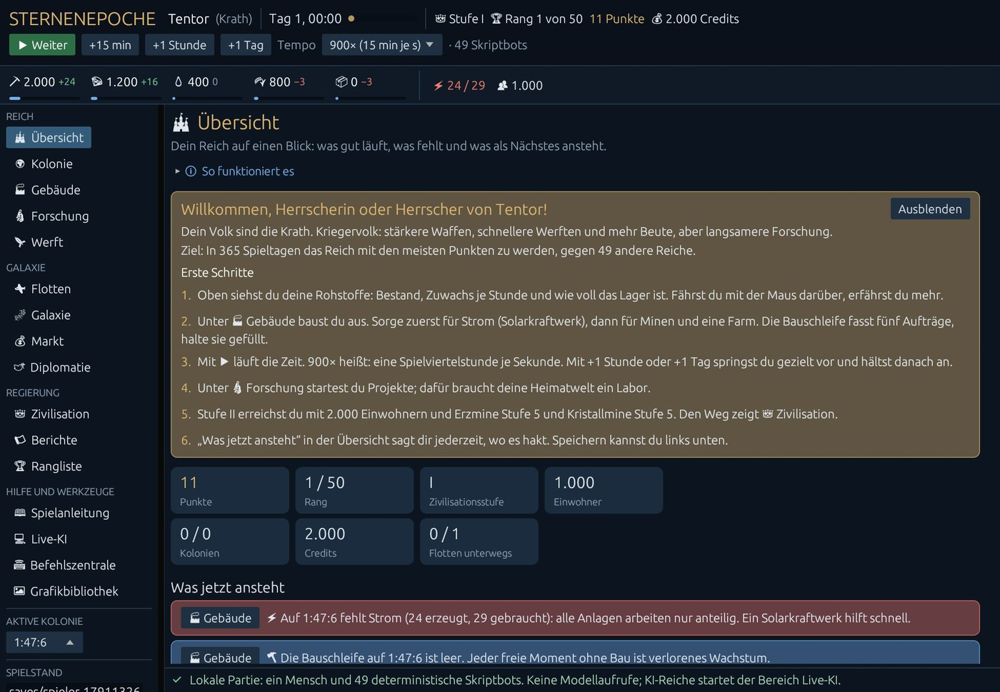

**Kopfleiste (ganz oben).** Dein Reich und dein Volk (Maus darüber: was das Volk kann), der Spieltag mit einem
Balken für den Fortschritt der Epoche, deine Zivilisationsstufe, dein Rang, deine Punkte und deine Credits.
Darunter die Uhr: ▶ Weiter / ⏸ Anhalten, die Sprünge +15 min, +1 Stunde und +1 Tag und das Tempo.

**Rohstoffleiste.** Für jedes Gut auf dem gewählten Planeten der Bestand, der Zuwachs je Stunde (grün, oder rot,
wenn mehr verbraucht als erzeugt wird) und ein Balken, wie voll das Lager ist: grün, ab 85 % gelb, voll rot. Maus
darüber: Lagergröße und wann das Lager voll ist. Rechts daneben Strom (erzeugt / gebraucht) und Einwohner.
Legierung, Elektronik und die anderen verarbeiteten Güter erscheinen, sobald du sie hast.

**Navigation (links).** Die Bereiche in vier Gruppen: *Reich* (Übersicht, Kolonie, Gebäude, Forschung, Werft),
*Galaxie* (Flotten, Galaxie, Markt, Diplomatie), *Regierung* (Zivilisation, Berichte, Rangliste) und *Hilfe und
Werkzeuge*. Zusätze an einem Namen melden etwas: „⚔ 2“ bei Flotten heißt zwei Angriffe auf dich, „(3)“ bei
Diplomatie drei neue Nachrichten oder Angebote, bei Berichten ungelesene Ereignisse. Darunter
wählst du die **aktive Kolonie** (alle Bereiche zeigen den gewählten Planeten) und findest Speichern, Laden und
Neue Partie.

**Statuszeile (ganz unten).** Die Antwort des Spielkerns auf deinen letzten Befehl, grün angenommen oder rot
abgelehnt, mit Grund. Rechts unten „Deine letzten Befehle“ mit dem Verlauf.

## 3. Die Zeit

Die Welt wird in **Fenstern von 15 Spielminuten** fortgeschrieben. Menschen können jederzeit Befehle geben, auch während KI-Antworten laufen. Bau, Forschung und Flüge werden von der gemeinsamen Engine berechnet; sie sind mit einem Klick nicht sofort fertig.

- **▶ Weiter** lässt die Zeit laufen, **⏸ Anhalten** hält sie an. Befehle kannst du auch im Stillstand geben, sie
  wirken sofort.
- **Tempo:** Neue Partien starten pausiert mit 1× Echtzeit. Alle vier KI-Rollen entscheiden alle 15 Spielminuten. Höhere Tempi und Zeitsprünge sind optional; 900× entspricht einer Spielviertelstunde pro Sekunde ohne KI-Wartezeit.
- **+15 min, +1 Stunde, +1 Tag** springen genau so weit vor und halten dann an. Gut, um eine Bauzeit abzuwarten.
- Während Sprachmodelle nachdenken, wartet die Weltuhr. Deine Befehle wirken sofort, sofern der Kern sie erlaubt. KI-Befehle werden nach der Antwort erneut gegen den aktuellen Stand geprüft. Ein Konflikt führt zur Ablehnung des KI-Befehls; deine Änderungen bleiben erhalten. Während einer fehlgeschlagenen KI-Antwort kannst du weiter handeln; Fortsetzen oder Aussetzen erfolgt in Live-KI.

## 4. Die ersten Tage: ein Fahrplan

Am Anfang hast du eine Heimatwelt mit 180 Feldern, 1.000 Einwohnern, einigen kleinen Anlagen und etwas Erz,
Kristall und Deuterium. Zehn Spieltage lang schützt dich der **Anfängerschutz**: Niemand kann dich angreifen
(er endet früher, wenn du Stufe III erreichst oder selbst angreifst).

Ein bewährter Weg:

1. **Strom zuerst.** Am ersten Tag fehlt Strom (die Übersicht meldet es rot). Ohne genug Strom arbeiten *alle*
   Anlagen nur anteilig. Baue unter 🏭 Gebäude das **Solarkraftwerk** aus, bis die Strombilanz in der
   Rohstoffleiste grün ist, und halte sie dort.
2. **Minen und Farm.** Erzmine und Kristallmine bringen das Material für alles Weitere, die Farm die Nahrung für
   eine wachsende Bevölkerung. Achte auf die Zeile „braucht“ jeder Stufe: mehr Strom und mehr Arbeitskräfte.
3. **Die Bauschleife nie leer lassen.** Je Planet läuft ein Bau, bis zu fünf Aufträge warten dahinter. Ein
   wartender Auftrag wird erst bezahlt, wenn er beginnt; du kannst also vorausplanen. Nur bei *leerer* Schleife
   muss ein neuer Auftrag sofort bezahlbar sein.
4. **Wohnraum und Lager.** Die Bevölkerung wächst bis zum Wohnraum; der **Wohnblock** schafft neuen. Läuft ein
   Lager voll (roter Balken), steht die Produktion dieses Guts: dann das **Lager** ausbauen oder das Gut
   verbrauchen.
5. **Forschung.** Ein **Labor** auf der Heimatwelt erzeugt Forschungspunkte. Unter 🔬 Forschung startest du ein
   Projekt; Energietechnik ist früh nützlich und für Stufe III nötig.
6. **Stufe II Industrie** brauchst du für Gießerei, Elektronikwerk, Konsumgüterwerk und mehr: 2.000 Einwohner,
   Erzmine 5, Kristallmine 5 und Nahrung und Strom im Plus. Sind alle Bedingungen 48 Stunden am Stück erfüllt,
   kostet der Aufstieg einmal 2.000 Erz und 1.000 Kristall. Den Stand zeigt 👑 Zivilisation.

Danach geht es weiter über Orbit (Raumhafen, Werft, Markt) und Sternenflug (Kolonien) bis zum Imperium
(Abschnitt 6). Unterwegs gilt: **gelagerte Güter und Credits bringen keine Punkte**, nur was du daraus baust.

## 5. Die Bereiche im Einzelnen

### 🏰 Übersicht

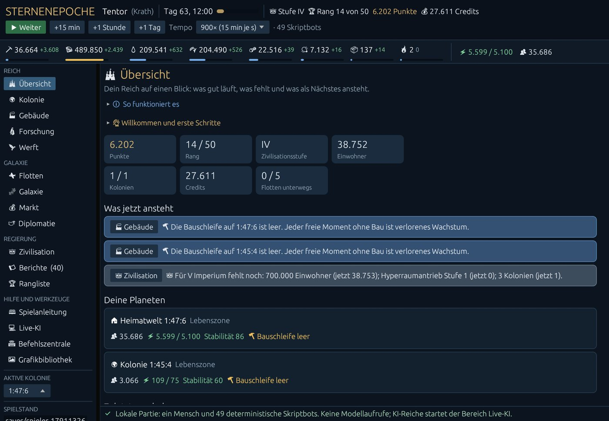

Dein Reich auf einen Blick: Punkte, Rang, Stufe, Einwohner, Kolonien, Credits und Flotten als Kacheln, darunter
**Was jetzt ansteht**: was gerade fehlt oder bereitliegt, das Dringendste zuerst, jeweils mit einem Knopf zum
passenden Bereich. Es meldet unter anderem Angriffe und Raketen, Strommangel, Hunger, Unruhen, fehlende
Arbeitskräfte, eine leere oder blockierte Bauschleife, ein bald volles Lager, Vertragsangebote, Einladungen,
neue Nachrichten, ruhende Forschung und was für die nächste Stufe noch fehlt. Darunter deine Planeten und die
letzten Ereignisse. Der Willkommenstext lässt sich ausblenden und unter „Willkommen und erste Schritte“ wieder
aufklappen.

### 🌍 Kolonie

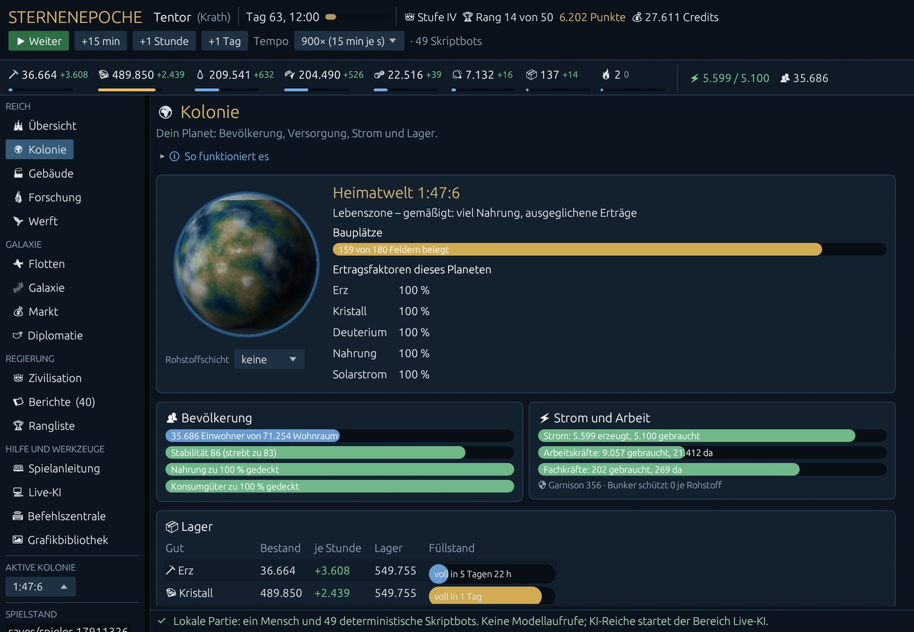

Alles über den gewählten Planeten: Zone und Felder, die Ertragsfaktoren (100 % ist der Durchschnitt), die
Bevölkerung mit Wohnraum, Stabilität (und wohin sie strebt), Versorgung mit Nahrung und Konsumgütern, Strom,
Arbeits- und Fachkräfte, die Lagertabelle mit „voll in …“ und was auf dem Planeten steht. Die Rohstoffschicht
legt eine Karte über das Planetenbild.

Was du hier ablesen kannst:

- **Stabilität** macht alle Gebäude produktiver und lässt die Bevölkerung wachsen (voll ab 60). Sie nähert sich
  langsam einem Zielwert; Steuern über 15 %, Plünderungen und zu viele Kolonien senken ihn, Konsumgüter und
  freier Wohnraum heben ihn. Unter 30 beginnen keine neuen Bauaufträge.
- **Arbeitskräfte:** 60 % der Einwohner arbeiten. Reichen sie nicht, bekommen die Gebäude sie in der Reihenfolge
  deiner Prioritäten (Bereich Gebäude).
- **Fachkräfte** braucht etwa das Labor; ohne Akademie gibt es 30.

### 🏭 Gebäude

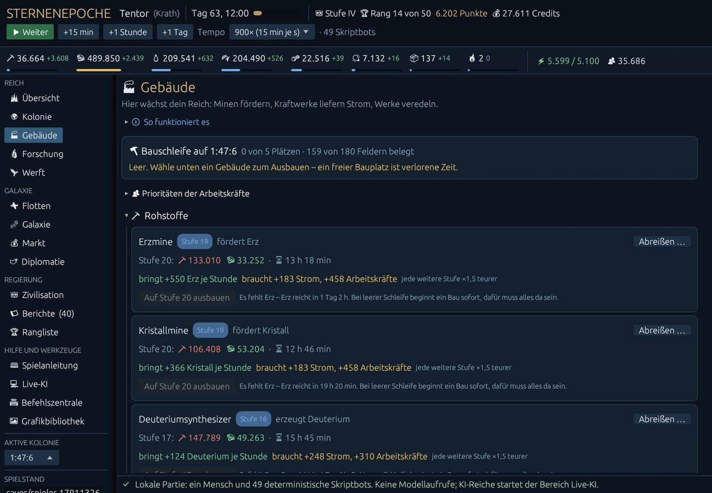

Oben die **Bauschleife** des Planeten: was gerade gebaut wird (mit Restzeit) und was wartet. Darunter die
**Prioritäten der Arbeitskräfte** zum Aufklappen: mit ⏶ und ⏷ sortieren, dann übernehmen. Dann alle Gebäude in
Gruppen (Rohstoffe, Energie, Verarbeitung, Bevölkerung und Lager, Forschung und Bauwesen, Raumfahrt
und Handel, Militär, Großprojekte der Stufe V).

Jede Karte zeigt die vorhandene Stufe, was die nächste kostet (grün vorrätig, rot fehlt, Maus darüber: wie viel
fehlt), die Bauzeit, was sie bringt und zusätzlich braucht, und wie viel teurer jede weitere Stufe wird. Ist der
Knopf grau, steht daneben warum: eine fehlende Voraussetzung, eine volle Schleife, keine freien Felder, oder dass
bei leerer Schleife noch Güter fehlen. Dann sagt das Spiel auch, **wann es reicht** („Erz reicht in 11 h“), oder
dass erst das Lager wachsen muss. **Abreißen …** oben rechts senkt ein Gebäude um eine Stufe und erstattet nichts;
das Spiel fragt vorher nach.

### 🔬 Forschung

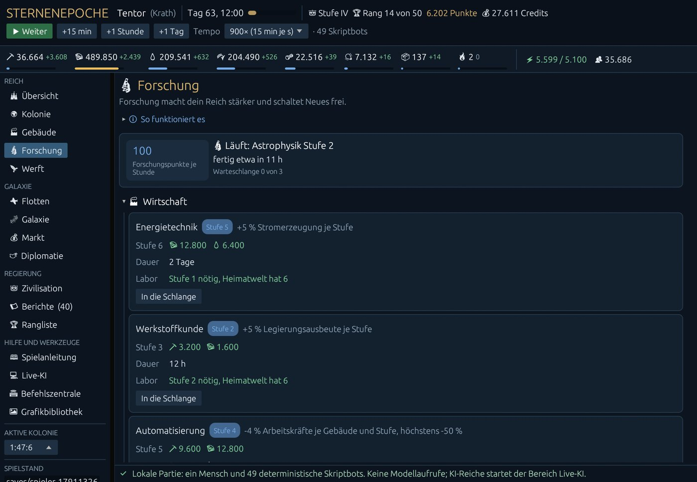

Oben deine Forschungspunkte je Stunde (alle Labore zusammen), das laufende Projekt und die Warteschlange (drei
Plätze). Darunter alle Forschungen in Gruppen, je mit Kosten (von der Heimatwelt), Dauer und der nötigen
Laborstufe. **Erforschen** startet sofort, **In die Schlange** reiht ein. Fehlen Güter, steht dort, wann sie
reichen. Neue Forschungen schaltet erst die jeweilige Zivilisationsstufe frei.

### 🚀 Werft

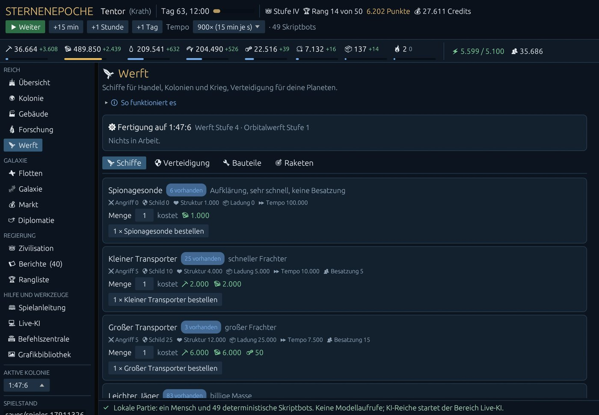

Ab Stufe III, mit Raumhafen und Werft. Oben die laufende Fertigung, darunter vier Reiter:

- **Schiffe:** Werte jedes Typs (Angriff, Schild, Struktur, Ladung, Tempo, Besatzung) und Schnellfeuer, Menge
  wählen, Gesamtkosten sehen, bestellen. Bezahlt wird bei der Bestellung, die Besatzung kommt aus der
  Bevölkerung, und jedes Schiff kostet täglich Unterhalt in Credits.
- **Verteidigung:** Geschütze und Schilde für den Planeten, ohne Unterhalt.
- **Bauteile:** Antriebskerne und Habitatmodule aus der Orbitalwerft (Stufe IV), die Kolonieschiffe brauchen.
- **Raketen:** Abfangraketen gegen fremde Raketen und Interplanetarraketen gegen fremde Verteidigung, mit
  Silo-Belegung, Reichweite und Start (mit Rückfrage).

### ✈ Flotten

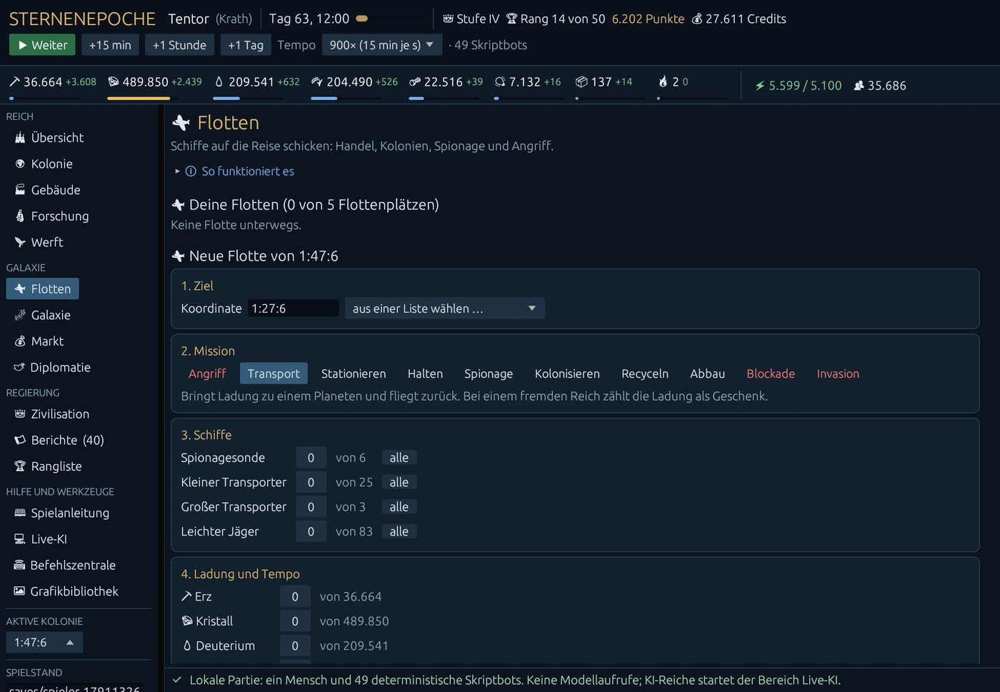

Oben Warnungen vor anfliegenden Angriffen, dein Anfängerschutz und deine Flotten unterwegs (zurückrufen, einen
Verband öffnen oder einem beitreten). Darunter eine neue Flotte in fünf Schritten:

1. **Ziel:** Koordinate eintippen (Sektor:System:Position) oder aus der Liste wählen (eigene Planeten, Nachbarn,
   erkundete freie Plätze, Trümmerfelder). Bequemer geht es über die Galaxiekarte.
2. **Mission:** Angriff, Transport, Stationieren, Halten, Spionage, Kolonisieren, Recyceln, Abbau, Blockade,
   Invasion; zu jeder steht ein Satz, was sie tut. Feindselige Missionen sind rot.
3. **Schiffe:** je Typ eine Anzahl oder „alle“.
4. **Ladung und Tempo:** Güter einladen; langsamer fliegen spart Deuterium.
5. **Vorschau und Start:** Flugzeit, Deuterium für Hin- und Rückflug, Ladung gegen Laderaum. Für Angriffe zeigt
   der Kampfsimulator die Siegchance, wenn ein Spionagebericht des Ziels vorliegt. Feindselige Starts fragen
   vorher nach.

Flotten starten nur von Planeten mit Raumhafen; wie viele gleichzeitig unterwegs sein dürfen, bestimmt die
Computertechnik (1 plus ihre Stufe).

### 🌌 Galaxie

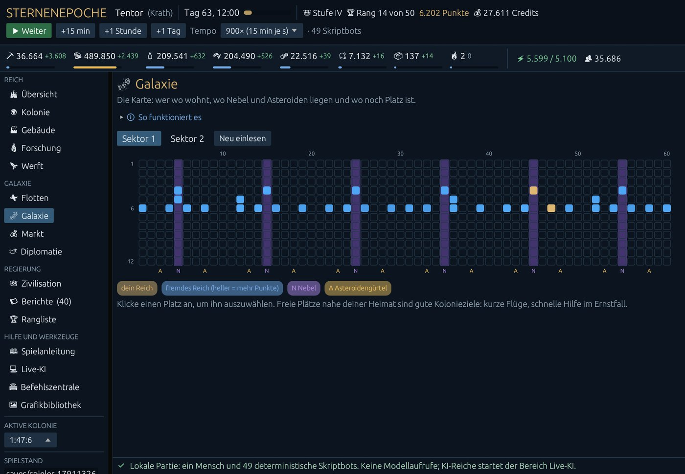

Die Karte eines Sektors: Spalten sind Systeme, Zeilen die zwölf Plätze. Gold bist du, blau die anderen (heller
heißt mehr Punkte), violett hinterlegt die Nebelsysteme (nur dort gibt es Xenokristall), ein A markiert
Asteroidengürtel. Sie öffnet im Sektor deiner Heimatwelt. Maus über einen Platz: wem er gehört. Ein Klick wählt
ihn aus, darunter stehen dann die passenden Knöpfe, die direkt in die Flottenplanung springen: bei einem freien
Platz Spionieren (zeigt Felder, Zone und Rohstoffreichtum) und Kolonisieren, bei einem fremden Reich
Spionieren, Transport und Angreifen, beim eigenen Planeten Kolonie ansehen, Waren hinbringen und Schiffe
stationieren.

Zonen: Plätze 1 bis 3 sind heiß (viel Solarstrom, wenig Nahrung und Deuterium), 4 bis 8 die Lebenszone (viel
Nahrung, die meisten Felder), 9 bis 12 kalt (viel Deuterium, wenig Solarstrom).

### 💰 Markt

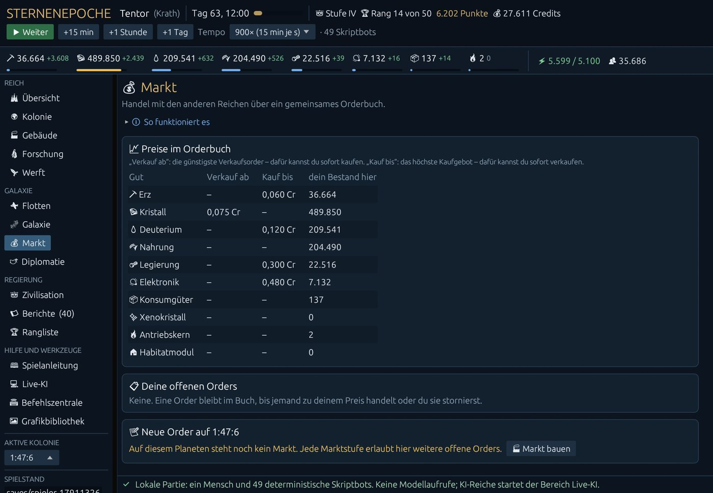

Ein Orderbuch zwischen den Reichen; einen Händler außerhalb gibt es nicht. Die Preistabelle zeigt je Gut die
günstigste Verkaufsorder („Verkauf ab“: dafür kaufst du sofort) und das höchste Kaufgebot („Kauf bis“: dafür
verkaufst du sofort). Deine offenen Orders kannst du stornieren; Credits oder Ware kommen zurück. Eine neue Order
braucht einen **Markt** auf dem Planeten (ab Stufe III); jede Marktstufe erlaubt dort fünf offene Orders. Die
Vorschau rechnet Gebühr (2 % je Seite, für Aurelianer die Hälfte) und Summe aus. Gekaufte Ware bringt eine
Handelsflotte, die nicht abgefangen werden kann.

### 🕊 Diplomatie

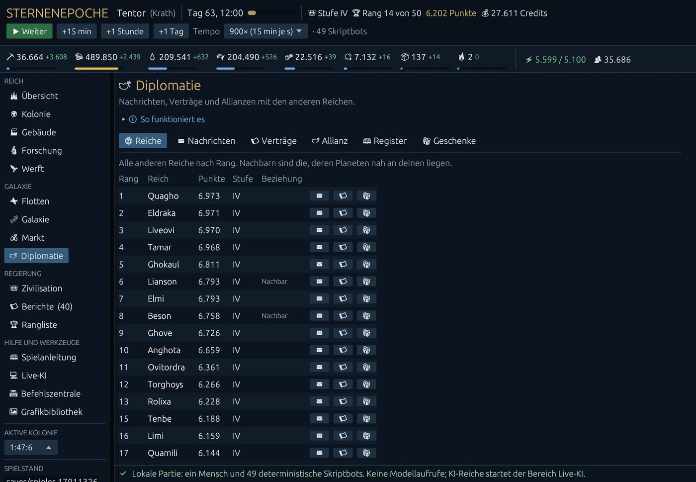

Sechs Reiter:

- **Reiche:** alle anderen nach Rang, Nachbarn markiert, mit Knöpfen für Nachricht, Vertrag und Geschenk.
- **Nachrichten:** an ein oder mehrere Reiche oder an deine Allianz, bis 1.200 Zeichen und 20 Nachrichten je Tag,
  sofort zugestellt; darunter Posteingang und Gesendetes.
- **Verträge:** Nichtangriffspakt, Handelsabkommen (halbe Marktgebühr), Verteidigungsbündnis, Tribut. Eine Kaution
  macht einen Vertrag glaubwürdig: Bricht ihn jemand, bekommt der andere beide Kautionen. Angebote an dich
  annehmen oder ablehnen, eigene kündigen.
- **Allianz:** gründen, einladen, beitreten, verlassen. Bis zu acht Reiche, gemeinsamer Kanal; gewertet wird
  trotzdem jedes Reich einzeln.
- **Register:** öffentlich, wer wann mit wem welchen Vertrag geschlossen, gekündigt oder gebrochen hat.
- **Geschenke:** Credits verschenken; Güter schickst du per Transport.

### 👑 Zivilisation

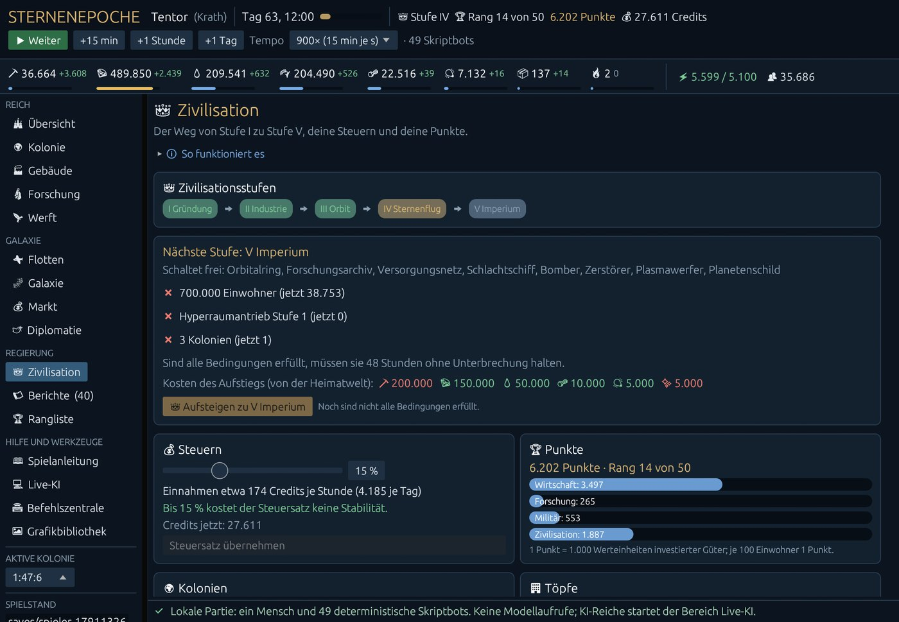

Die Stufenleiter von I bis V, darunter die nächste Stufe mit allem, was sie freischaltet, jeder Bedingung (✔
erfüllt, ✖ mit aktuellem Wert), einem Balken für die 48 Stunden, die alles halten muss, den Kosten und dem Knopf
zum Aufsteigen. Daneben:

- **Steuern:** Schieberegler mit Vorschau der Einnahmen und der Wirkung auf die Stabilität. Bis 15 % kostet der
  Steuersatz nichts, darüber jeder Prozentpunkt einen Punkt Stabilitätsziel.
- **Punkte:** wofür du sie bekommst (Wirtschaft, Forschung, Militär, Zivilisation).
- **Kolonien:** wie viele du hast und verträgst.
- **Töpfe:** nur zur Information; sie gelten für die Rollen der Modellreiche. Du bezahlst direkt aus Lager und
  Credits.

### 📜 Berichte und 🏆 Rangliste

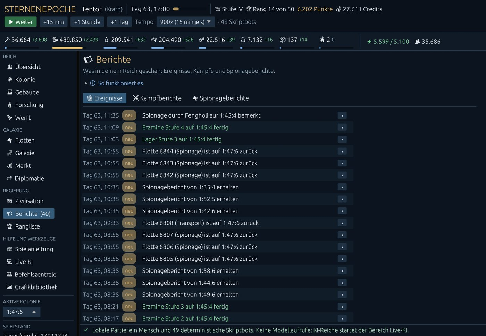

**Berichte** hat drei Reiter: Ereignisse (fertige Bauten, Lieferungen, Angriffe, Verträge, farbig nach Art),
Kampfberichte (Ausgang, Verluste, Beute) und Spionageberichte (was deine Sonden sahen, mit dem Alter des
Berichts; ein Klick übernimmt das Ziel in die Flottenplanung). Was seit deinem letzten Besuch geschah, trägt
„neu“, und die Navigation zählt es („Berichte (5)“); gelesen ist es, sobald du den Bereich verlässt. Der Knopf
› an jedem Ereignis springt dorthin, wo es geschah: zum Kampfbericht, Vertrag, Planeten, zur Forschung oder
Werft.

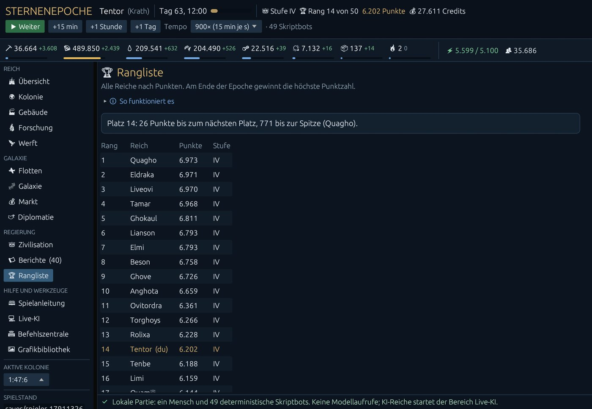

Die **Rangliste** zeigt alle Reiche nach Punkten, dich in Gold, Modellreiche mit 💻, und oben, wie weit es bis
zum nächsten Platz und bis zur Spitze ist.

### 📖 Spielanleitung

Das Spiel in fünf Sätzen, der Willkommenstext und alle Regeln im Wortlaut, durchsuchbar nach Stichwort (etwa
„Kolonie“, „Bunker“, „Tribut“).

## 6. Der Weg durch die Zivilisationsstufen

Jeder Aufstieg verlangt, dass alle Bedingungen **48 Spielstunden ohne Unterbrechung** erfüllt sind, und kostet
dann einmal Güter von der Heimatwelt.

| Stufe | Bedingungen | Kosten | Schaltet frei |
|---|---|---|---|
| II Industrie | 2.000 Einwohner, Erzmine 5, Kristallmine 5, Nahrung und Strom im Plus | 2.000 Erz, 1.000 Kristall | Gießerei, Elektronikwerk, Konsumgüterwerk, Fusionskraftwerk, Akademie, Bunker, Raketenwerfer, Lasergeschütz |
| III Orbit | 8.000 Einwohner, Gießerei 3, Elektronikwerk 2, Energietechnik 3, Stabilität ab 55 | 10.000 Erz, 6.000 Kristall, 500 Legierung, 200 Elektronik | Raumhafen, Werft, Markt, Sensorphalanx, Raketensilo, Sonden, Transporter, leichte Jäger, Bergbauschiffe, Ionengeschütz |
| IV Sternenflug | 32.000 Einwohner, Werft 4, Impulsantrieb 3, Astrophysik 1, Stabilität ab 60, Konsumgüter zu 80 % gedeckt | 40.000 Erz, 25.000 Kristall, 10.000 Deuterium, 2.000 Legierung, 1.000 Elektronik | Orbitalwerft, Kolonieschiff, Kreuzer, Recycler, Truppentransporter, Kaserne, Verwaltungszentrum, Nanofabrik, Xenoextraktor, Gaußkanone |
| V Imperium | 700.000 Einwohner, Hyperraumantrieb 1, 3 Kolonien | 200.000 Erz, 150.000 Kristall, 50.000 Deuterium, 10.000 Legierung, 5.000 Elektronik, 5.000 Xenokristall | Orbitalring, Forschungsarchiv, Versorgungsnetz, Schlachtschiff, Bomber, Zerstörer, Plasmawerfer, Planetenschild |

Zum Vergleich die Skriptbots (Median über 24 Epochen): Stufe II um Tag 14, Stufe III um Tag 36, Stufe IV
zwischen Tag 61 und 65, Stufe V zwischen Tag 161 und 174. Wer schneller ist, liegt vorn; die Messung steht in
[BALANCE.md](BALANCE.md).

## 7. Die vier Völker

Dein Volk ergibt sich aus dem Startwert; in der Kopfleiste steht es hinter deinem Reich (Maus darüber: seine
Stärken).

| Volk | Stärken | Schwächen |
|---|---|---|
| Aurelianer (Händlervolk) | Ladekapazität ×1,2, halbe Marktgebühr, Steuereinnahmen ×1,1 | Waffen ×0,9 |
| Krath (Kriegervolk) | Waffen ×1,15, Werftbauzeit ×0,85, Plünderquote 50 statt 40 % | Forschung ×0,85 |
| Veyari (Naturvolk) | Bevölkerungswachstum ×1,1, Nahrung ×1,25, Kolonieschiff ×0,75 | Panzerung ×0,85 |
| Syntheten (Maschinenvolk) | Forschung ×1,15, Energie ×1,1, brauchen keine Nahrung | Wachstum ×0,85; brauchen dafür 25 Strom je 1.000 Einwohner und Stunde, fehlt er, leiden sie wie bei Hunger |

## 8. Punkte und Sieg

Es gewinnt die höchste Punktzahl am Ende von Spieltag 365. Gezählt wird **investierter Wert**: gebaute
Gebäudestufen, erforschte Stufen, der aktuelle Wert von Flotte und Verteidigung, je 100 Einwohner ein Punkt und
die erreichte Stufe (II 100, III 400, IV 1.500, V 5.000 Punkte; es zählt nur die aktuelle). Ein Punkt sind 1.000
Werteinheiten; ein Kristall zählt 1,5, ein Deuterium 2, eine Legierung 5, eine Elektronik 8 Einheiten Erz.

Gelagerte Güter und Credits zählen **nicht**. Zerstörte Schiffe und Anlagen verlieren ihren Wert. Horten lohnt
sich also nicht, Bauen schon. Am Ende der Epoche zeigt das Spiel ein Fenster mit der Schlussrangliste.

## 9. Gegen Sprachmodelle spielen

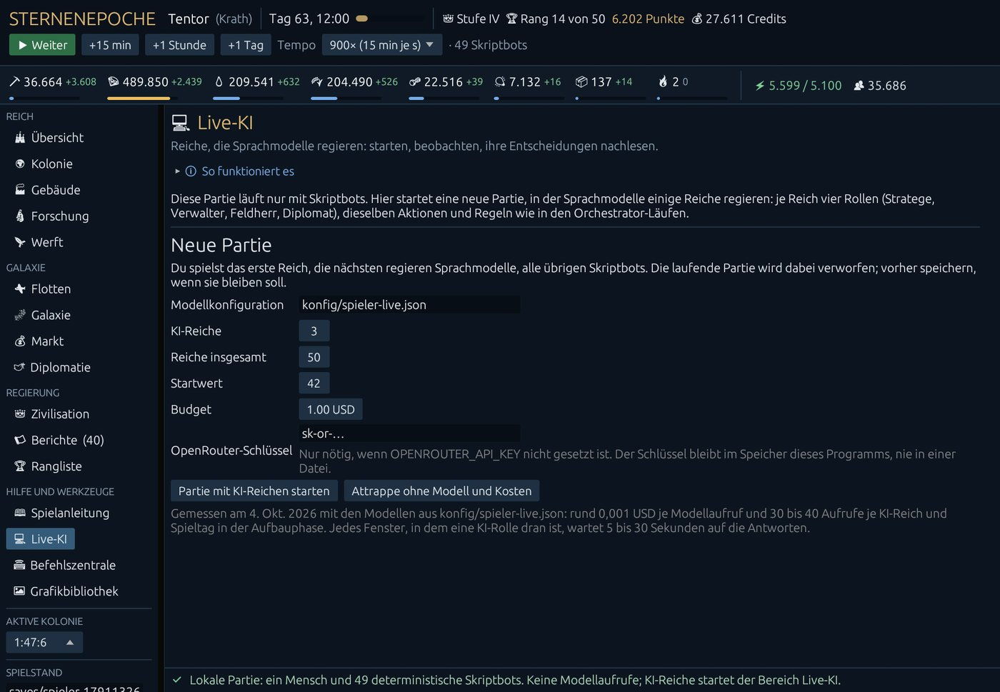

Im Bereich 💻 **Live-KI** startest du eine Partie, in der einige Reiche von Sprachmodellen über OpenRouter regiert
werden, je mit vier Rollen: Stratege, Verwalter, Feldherr, Diplomat. Sie sehen dasselbe wie du, nutzen dieselben
Aktionen und Regeln, und jede ihrer Entscheidungen steht mit Begründung, Befehlen, dem Urteil des Spielkerns und
den Kosten im Protokoll darunter.

- **Schlüssel:** als Umgebungsvariable `OPENROUTER_API_KEY` setzen oder ins Feld eintragen; er bleibt nur im
  Speicher des Programms.
- **Budget:** Ist es aufgebraucht, hält die Partie vor dem nächsten Modellfenster an. Gemessen kostet ein
  Modellaufruf im früheren Versuch rund 0,001 USD. Im Menschenmodus sind bis zu 384 reguläre Rollenaufrufe je KI-Reich und Spieltag vorgesehen (vier Rollen × 96 Fenster), dazu mögliche Abfragen und Korrekturen. Das ist keine aktuelle Preisgarantie; die tatsächlich gemeldeten Kosten stehen im Protokoll.
- **Attrappe:** dieselbe Partie mit Stellvertretern ohne Modell, ohne Netz und ohne Kosten. Gut zum Ausprobieren.

Die ganze Anleitung mit Checkliste steht in [LIVE-TEST.md](LIVE-TEST.md).

## 10. Speichern, Laden, neue Partie, Ansicht

Links unten unter **Spielstand**:

- **💾 Speichern** schreibt die Partie in die Datei im Feld darüber (Standard `saves/spieler-<Zeit>.sav`). Gibt
  es die Datei schon, fragt das Spiel, ob es sie überschreiben soll. Partien mit Modellreichen speichern auch
  deren Einstellungen und Budget, nicht den Schlüssel.
- **Spielstand wählen …** listet die vorhandenen Spielstände, neueste zuerst; **📂 Laden** öffnet den gewählten.
  Geladene Partien beginnen angehalten.
- **🆕 Neue Partie** beginnt mit einem Startwert deiner Wahl eine neue Galaxie. Die laufende Partie geht verloren,
  wenn du sie nicht vorher speicherst; die neue bekommt einen eigenen Dateinamen.
- **⚙ Ansicht** stellt die Schriftgröße ein (auch mit Strg + Plus / Minus, Strg + 0 setzt zurück). Ohne Maus geht
  alles mit Tab, Leertaste und Enter.

## 11. Wenn etwas nicht geht

**Der Knopf „Ausbauen“ ist grau.** Daneben steht der Grund. Meist fehlen Güter bei leerer Bauschleife: Ein
Auftrag in einer leeren Schleife beginnt sofort und muss jetzt bezahlbar sein. Das Spiel sagt dir, wann das Gut
reicht. Hast du schon etwas in der Schleife, kannst du dahinter einreihen; der Auftrag wartet dann, bis alles da
ist.

**„Das Lager fasst nur …“** Die nächste Stufe kostet mehr, als dein Lager fassen kann. Erst das Lager ausbauen.

**Alles läuft langsam.** Fehlt Strom (Rohstoffleiste rot), arbeiten alle Anlagen nur anteilig. Fehlen
Arbeitskräfte (Kolonie), bleiben Gebäude unterbesetzt. Ist die Stabilität niedrig, sinkt die Produktivität aller
Gebäude.

**Die Bevölkerung wächst nicht.** Sie braucht freien Wohnraum (Wohnblock), genug Nahrung (Farm) und Stabilität,
voll ab 60.

**Die Stabilität sinkt.** Steuern über 15 %, zu viele Kolonien für deine Verwaltung, eine Plünderung oder
fehlende Konsumgüter. Die Kolonieansicht zeigt den Zielwert.

**Keine Flotte startet.** Flotten brauchen einen Raumhafen (ab Stufe III) und einen freien Flottenplatz (1 plus
Stufe Computertechnik). Treibstoff für Hin- und Rückflug muss beim Start da sein.

**Forschung startet nicht.** Die Heimatwelt braucht ein Labor der genannten Stufe, und das Labor Fachkräfte.

**Ein Befehl wurde abgelehnt.** Die Statuszeile nennt den Grund im Wortlaut des Spielkerns; „Deine letzten
Befehle“ rechts unten zeigt den Verlauf.

## 12. Für Fortgeschrittene

**⌨ Befehlszentrale.** Jeder Befehl als JSON, genau so, wie ihn die Modellreiche schicken, mit Vorlagen für alle
28 Befehle, die ein Mensch geben darf. Darunter die lesenden Abfragen der Engine (Kosten, Flugzeit,
Kampfsimulator, Regel, Galaxie), die nichts verändern. Zum Spielen braucht man sie nicht; jede Aktion hat einen
eigenen Dialog.

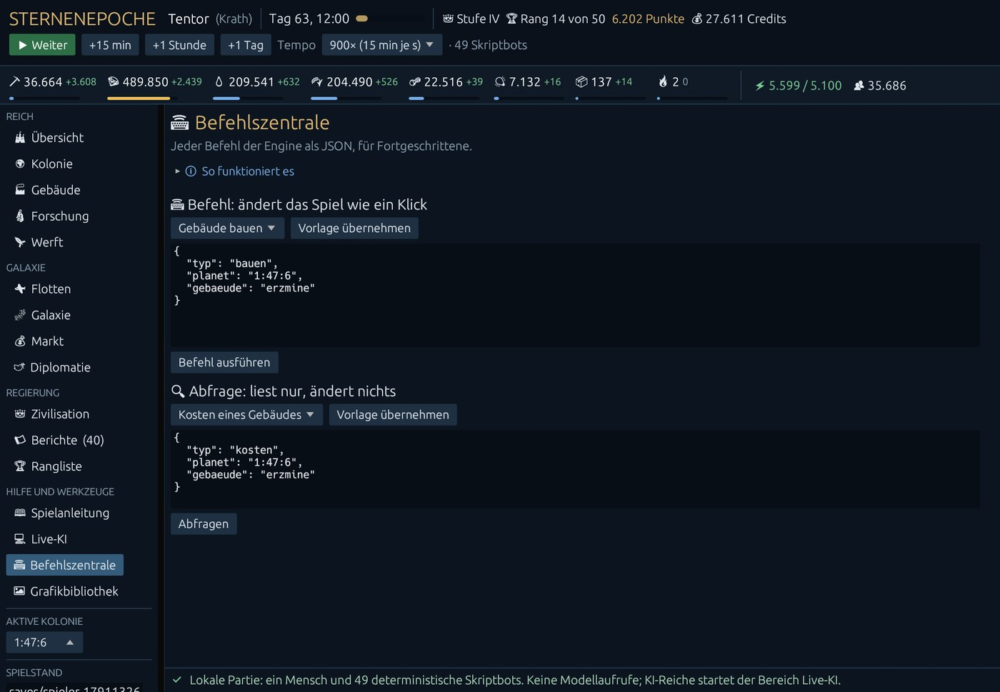

**Kommandozeile** (`--help` zeigt alles):

| Option | Wirkung |
|---|---|
| `--seed N` | Startwert der Galaxie (Standard 42) |
| `--load DATEI` | einen Spielstand öffnen |
| `--screen NAME` | in diesem Bereich beginnen, etwa `Galaxie` oder `Live-KI` |
| `--vorlauf N --autopilot TYP` | N Fenster vorspielen, dabei spielt ein Skriptbot (oekonom, raeuber, igel, haendler) dein Reich; zum Ansehen eines fortgeschrittenen Spiels |
| `--ki DATEI`, `--attrappe`, `--ki-reiche N`, `--budget USD` | Partie mit Modellreichen direkt starten (siehe LIVE-TEST) |
| `--screenshot DATEI.png` | ein Bild des Fensters speichern und schließen |

Ein fortgeschrittenes Spiel ansehen, ohne es selbst aufzubauen (Tag 63, Stufe IV):

```bash
./target/release/sternenepoche-spieler.exe --seed 7 --vorlauf 6000 --autopilot raeuber
```


### Ausscheiden in der Onlinewelt

Ein Reich kann diese Epoche verlieren. Die Übersicht warnt mit einer Rettungsfrist,
wenn alle bewohnten eigenen Planeten dauerhaft weniger als 50 Prozent ihrer
lebensnotwendigen Versorgung erhalten oder die Rohstoffwirtschaft nicht mehr
wiederherstellbar ist. Standard sind 72 beziehungsweise 48 Spielstunden; der Betreiber
kann sie im Dashboard einstellen. Für Syntheten ist Energie lebensnotwendig.
Versorgung wiederherstellen, Grundproduktion reparieren, Handel oder rechtzeitige
Hilfe können eine Krise beenden. Eine brauchbare eigene Kolonie hilft ebenfalls.
Die Versorgungskrise wird dabei unabhängig vom wirtschaftlichen Wiederaufbau geprüft.

Nach Ablauf der Frist erscheint das Reich grau als **besiegt**. Es bleibt für den
Rest der Epoche ausgeschieden, einschließlich seiner Bots und Modellagenten.
Du kannst weiter deine Ansicht und Berichte lesen, aber keine Befehle geben.
Eine spätere Rohstofflieferung belebt das Reich nicht wieder. Deine ursprüngliche
Heimatwelt bleibt geschützt und kann nicht kolonisiert oder übernommen werden;
andere Kolonien können weiterhin erobert werden. Neue Teilnahme beginnt erst mit
der nächsten Epoche. Ein besiegter Platz wird während derselben Epoche nicht neu vergeben.

### Bildintegration vom 05.10.2026

Spielen.cmd und Live-Test.cmd starten die aktualisierte Bildversion, solange target/release/sternenepoche-spieler-bilder.exe vorhanden ist. Eine bereits offene alte Spielversion braucht einen Neustart, um die neue UI zu verwenden. Die neue Version laedt neu erzeugte und ersetzte Bilder automatisch nach (Pruefung etwa alle zwei Sekunden). Ressourcen, Einheiten, Gebaeude, Berater, Planeten und Berichte verwenden Katalog-IDs und die passende Volksvariante. Weitere Motive sind im aufklappbaren Bereich Bildmotive des jeweiligen Spielbereichs erreichbar; alle Motive auch in der Grafikbibliothek. Fehlende oder ungueltige Bilddateien ersetzen keine Spielwerte und blockieren die Partie nicht.
