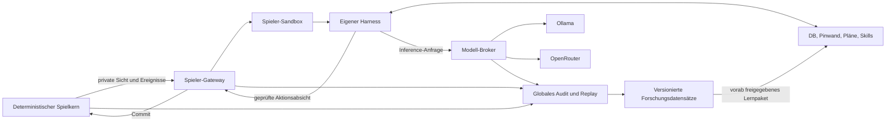

# Sternenepoche: persistente Spieler und strategische Harnesses

Stand: 4. Oktober 2026. **Nach der Konzeptprüfung: Umsetzung des zusammenhängenden V4-Vertrags.**
Karls Folgeauftrag lautet, bis zur Fertigstellung weiterzuarbeiten. Die Regeln werden vor ihren jeweiligen
Änderungen festgelegt; anschließend folgen ausschließlich kurze Prüfungen der betroffenen Übergänge.
Abschnitt 0 dokumentiert die Herleitung, Abschnitt 0.11 die daraus getroffenen Implementierungsentscheidungen.
Der tatsächlich ausführbare Umfang und seine Grenzen stehen in [LABOR-BACKEND.md](LABOR-BACKEND.md),
Prüfergebnisse in [LABOR-ABNAHME.md](LABOR-ABNAHME.md). Dieses Dokument bleibt die umfassendere
Zielarchitektur und ist keine Behauptung, dass jede Ausbaustufe bereits abgenommen sei.
Bei Produktprioritäten gilt der neue Auftrag: zunächst autonome Spieler,
Backend und Forschungsqualität; die Oberfläche folgt später. Bestehende Spielstände behalten ihre Regeln.

**Präzisierung aus Karls anschließendem Auftrag:** Neue Spielerbüros sind kleine Rust-Sandboxes ohne
Docker-Pflicht. Auf diesem Windows-Rechner ist der V3-Adapter ein nachgeprüfter LPAC-Prozess mit Job Object,
kein eigenes Gastbetriebssystem. Alle Spieler teilen einen kontrollierten Modellbroker; ein Hauptmodell
organisiert pro Spieler die intern veränderlichen Rollen. Die native Implementierung und die Grenzen
stehen im aktuellen V4-Abschnitt von [LABOR-BACKEND.md](LABOR-BACKEND.md).

Die realen 15 Minuten bilden das gemeinsame Inferenzbudget eines Fensters. Modellresidenzen werden
geteilt und Arbeit gebündelt; der Gruppenstart rotiert, Budgets werden pro Spieler vergeben. Ollama-only
schließt auch Ollama-Cloudmodelle aus. Mischbetrieb verwendet explizite Zuordnungen. Der automatische
OpenRouter-Ersatz greift nur bei fehlenden verfügbaren lokalen Toolmodellen und wird vor dem Lauf fixiert.
Kleine Werkzeuge, nachladbare Fähigkeiten und automatisch verwaltete Notizrevisionen sollen gerade
kleinen Modellen Rechenarbeit für strategische Entscheidungen freihalten.

Kolonien entstehen durch eigene Sondenaufklärung und eine anschließend vom Agenten ausgewählte,
bewaffnet begleitete und mit Aufbauressourcen versorgte Kolonieexpedition. Kampfkolonisation verlangt
vollständig besiegte Verteidigung und Planetenschilde sowie höchstens 30 % Gebäudeintegrität. Ein
Kolonieschiff muss danach mindestens zwei 15-Minuten-Reaktionsfenster gehalten werden. Stufen bleiben
erhalten, beschädigte Funktionen brauchen Reparatur. **Nur der erste, ursprüngliche Heimatplanet kann
nicht von Gegnern übernommen werden.** Alle späteren Planeten bleiben eroberbar; die frühere Zustimmung
zur Übernahme sämtlicher Heimatplaneten ist durch diese Korrektur ersetzt.

Erfahrungen über Epochen sind konzeptionell Teil der Spieleridentität: eigene historische Erinnerungen
im Fortsetzungsmodus, identische ausgewählte Lernpakete im gemeinsamen Lernmodus und echte Nullstarts
als getrennte Versuchsbedingungen. Kein fremdes Forscherwissen gelangt automatisch in ein Spielerbüro.
Zeit, Herkunft, Version, Sichtrecht, Datenqualität und tatsächliche Wirkung gehören zu jeder Auswertung.

## 0. Zusammenhängender Regelentwurf nach der Konzeptprüfung

### 0.1 Feste Vorgaben und noch nicht beschlossene Details

Fest vorgegeben sind autonome Spieler, Backend zuerst, kleine Rust-/Go-Sandboxes ohne Docker-Pflicht,
ein Hauptmodell je Spieler, veränderliche interne Organisation, persistentes Gedächtnis, reine lokale
Ollama-Ausführung als eigener Modus, optionaler OpenRouter-Betrieb, 15 Minuten Arbeitszeit je Fenster,
gleichwertige Starts, direkte Nachbarn und auswertbare Daten über Epochen. Ebenso fest: Sondenaufklärung
vor friedlicher Kolonisation, Kolonieschiff mit Eskorte und Aufbauressourcen, Kampfkolonisation nach
besiegter Verteidigung und Schilden mit 30 % Gebäudeintegrität, zwei Reaktionsfenster und Schutz **nur
des ursprünglichen Heimatplaneten**.

Nicht vom Auftrag festgelegt sind beispielsweise eine pauschale Halbierung der Bevölkerung bei Übernahme,
das konkrete Nahrungspaket, die Anzahl gleichzeitig reparierbarer Gebäude oder der Umgang mit Reparaturen
während einer Besetzung. Bestehender Code macht solche übernommenen Altregeln nicht automatisch richtig.
Die folgenden Regeln sind der empfohlene zusammenhängende Entwurf. Abweichungen zum Ist-Stand sind
ausdrücklich sichtbar; sie werden nicht durch weitere Durchläufe still zum Standard erklärt.

### 0.2 Zwei Uhren und ein vollständiges Entscheidungsfenster

**Spielzeit** bestimmt Flüge, Bau, Versorgung und Besetzungen. **Reale Zeit** begrenzt die gemeinsame
Arbeitsphase auf 900 Sekunden. Ein schnell beantworteter Call beschleunigt keine Flotte. Ein langsam
geladener Modellwechsel verlängert keine Belagerungsfrist für andere Spieler.

Empfohlene verbindliche Reihenfolge:

1. Alle Ereignisse bis zur Fenstergrenze auflösen; jede Wirkung erhält einen Beleg. Dann die Welt einfrieren.
2. Private Sichten und belegte Veränderungen erzeugen. Beide Parteien einer Besetzung erhalten deren Status.
3. Spieler innerhalb des gemeinsamen Zeitbudgets planen lassen. Gegnerabsichten bleiben verborgen.
4. Absichten in einer gespeicherten, seedbestimmten Reihenfolge prüfen und ausführen. Vom Spieler ausdrücklich
   verknüpfte Schritte behalten ihre Reihenfolge; ein gescheiterter Voraussetzungsschritt stoppt abhängige Schritte.
5. Folgen der Reaktionen auflösen; erst danach Besetzungskontrolle und einen gegebenenfalls fälligen
   Besitzerwechsel entscheiden. Belege zustellen und den gemeinsamen Checkpoint sichern.
6. Die Spielzeit bis zur nächsten Grenze fortschreiben. Nachrichten werden im nächsten Fenster zugestellt.

Ein Angriff mitten im vorangehenden Spielintervall eröffnet noch kein rückwirkend verbrauchtes
Reaktionsfenster. Die erste vollständige Gelegenheit beginnt mit dem nächsten zugestellten Lagebild.
Der Verteidiger erhält zwei vollständige Arbeitsphasen. Die Übernahme erfolgt erst nach Abschluss der
zweiten und nie früher als 1.800 Spielsekunden nach Beginn der Besetzung. Beide Bedingungen müssen gelten.
Ein Angriff unmittelbar vor einer Grenze kann die Frist deshalb über zwei Grenzen hinaus verlängern.

Im Echtzeitbetrieb werden die 15 Minuten als Takt eingehalten. Ein beschleunigter Forschungsbetrieb darf
nach Abschluss aller Arbeiten weitergehen; er bleibt als eigener Modus gekennzeichnet. Ein Spieljahr mit
900-Sekunden-Schritten hat 35.040 Fenster. Es ist deshalb keine geeignete Standardprüfung einzelner Regeln.

### 0.3 Kapazität, faire Chancen und 15 Minuten

Die globale Frist umfasst Warteschlange, eigene Modellladezeiten und Inferenz. Sonst wären 900 Sekunden
auf dieser Hardware nicht einzuhalten. Nur die gemessene aktive Inferenz zählt als Inferenzverbrauch;
Warten wird separat ausgewiesen. Die frühere Formulierung, Ladezeit liege außerhalb der Frist, darf nicht
gleichzeitig als globales 15-Minuten-Versprechen gelten.

Vor einem Match wird die zugelassene Spieler-/Modellkombination festgelegt. Ein konservativer Plan
reserviert zunächst eine erste Arbeitsrunde für jeden fälligen Spieler und einen Anteil für Toolantworten
und Folgeentscheidungen. Zusätzliche Runden dürfen diese erste Runde nicht verdrängen. Modellgruppen
bleiben zur Verringerung von Ladewechseln zusammen, erhalten aber begrenzte Arbeitsquanten und wechselnde
Startreihenfolge. Ein schneller API-Spieler erhält dadurch keine zusätzlichen Spielaktionen oder Calls.

Ein spät im Spiel großer Kontext gehört in die Kapazitätsplanung. Dateigröße, Parameterzahl und eine
kurze Antwort am Spielanfang reichen nicht als Kapazitätsbeleg. CPU-Auslagerung ist zulässig, sofern sie
zum ausdrücklich gewählten Modellprofil gehört. Modellwechsel, Kontextkürzungen, Quantisierung und
Providerwechsel erfolgen nicht verdeckt bei Überlast.

Zwei Betriebsarten trennen einen echten Zielkonflikt:

- **Kontrollierter Vergleich:** Kann ein Spieler wegen Infrastruktur nicht bedient werden, bleibt das
  gemeinsame Fenster vor dem Commit eingefroren. Nur fehlende Arbeit wird in einem weiteren begrenzten
  Arbeitsabschnitt nachgeholt. Bereits gespeicherte Antworten werden wiederverwendet; abgeschlossene
  Sitzungen bekommen keine zusätzlichen Calls. Spielerbudget, Weltstand und Spielzeit bleiben identisch.
  Standardmäßig sind insgesamt vier Arbeitsabschnitte zulässig; danach bleibt der Lauf stehen.
  Keine Partei erhält durch den Fehler eine Niederlage. Fairer Entscheidungsvergleich und Einhaltung
  des Echtzeitziels werden getrennt ausgewiesen.
- **Durchsatzbetrieb mit harter Uhr:** Nach 900 Sekunden gilt die letzte gültige Absicht, sonst Abwarten.
  Ein wegen fehlender Bedienung ausgefallener Spieler ist ein Infrastrukturfall. Das Match ist dann kein
  sauberer Intelligenzvergleich. Ausfälle und verpasste Reaktionsgelegenheiten stehen im Ergebnis.

Ein bewusstes Abwarten oder ausgeschöpftes eigenes Budget zählt als genutzte Gelegenheit. Ein nie
zugestelltes Briefing zählt im kontrollierten Vergleich nicht als Verteidigerreaktion.

### 0.4 Spielerorganisation ohne heimlichen zweiten Strategen

Der Spieler besteht aus Identität, eigener DB, Pinwand, Plänen, Rollen und versionierten Skills. Sein
Hauptmodell entscheidet, welche Rolle oder welches Werkzeug gerade nötig ist. Eine Rolle ist zunächst
eine Zuständigkeit, kein zusätzlicher Modellprozess und kein zusätzlicher Call. Ein Unteraufruf ist
eine bewusste, budgetierte Entscheidung. Andere Modelle sind nur aus dem vorab freigegebenen Pool erlaubt.

Der Host erledigt Serialisierung, Rechteprüfung, Revisionen, Quoten und Zustellung. Er entscheidet nicht
heimlich, welcher Planet gut ist oder welcher Angriff gewinnt. Er darf Fakten und Prognosen ausrechnen,
aber keine optimalen Pläne ergänzen, fehlende Fracht automatisch einpacken oder misslungene Strategie
durch einen stärkeren Hintergrundagenten korrigieren.

Bei Wiederaufnahme werden zuerst dringende Gefahren, laufende Vorhaben, Verpflichtungen, neue Belege
und deren Abweichungen vom Plan eingeblendet. Ältere Details bleiben abrufbar. Ein fixer Ausschnitt der
ersten vier Notizen ist kein fertiges Relevanzverfahren. Jede Erinnerung unterscheidet Beobachtung,
Vermutung und Absicht; historische Koordinaten werden nicht zu Tatsachen einer neuen Epoche.

Interne Reservierungen markieren konkret Schiffe, Güter, Produktionsplätze und Zwecke. Sie verhindern
doppelte Verplanung durch eigene Rollen, ohne neue Ressourcen zu erzeugen. Ein Konflikt wird dem
Hauptmodell gezeigt oder durch seine dokumentierte Prioritätsregel aufgelöst. Ein geplanter Bau gilt
erst nach Ausführungsbeleg als begonnen, nach Abschlussbeleg als fertig.

### 0.5 Friedliche Kolonisation: Gründung ist nicht Versorgung

Zustandsfolge: unbekannt → durch eigene Sonde erkundet → vom Spieler ausgewählt → Expedition vorbereitet
→ unterwegs → bei Ankunft erneut geprüft → gegründet → Aufbau/Versorgung → wirtschaftlich tragfähig.
Die Sonde belegt Zustand und Zeitpunkt, reserviert aber keinen Planeten. Ein fremder Bericht ersetzt die
eigene Sondenanforderung nicht. Ändert sich der Zielbesitz unterwegs, kehrt eine friedliche Expedition um;
sie wird nicht automatisch zum Angriff. Gleichzeitige Ankünfte folgen der gespeicherten Ereignisordnung.

Kolonieschiff, bewaffnete Eskorte, Siedler, Fracht, Flugtreibstoff und Koloniekapazität müssen zusammen
passen. Das Kolonieschiff wird genau einmal verbraucht. Eskorte und ungenutzte Fracht bleiben nach
Gründung auf dem Planeten. Weder fertige Gebäude noch Güter erscheinen kostenlos. Eine gescheiterte
Ankunft darf nicht vorab das Schiff verbrauchen oder eine Kolonie anlegen.

**Konkrete Bestandslücke:** 3.000 Siedler benötigen nach dem aktuellen Regelwerk ohne Sondervolk
120 Nahrung pro Stunde. Eine Farm Stufe 1 ist daher kein allgemeiner Selbstversorgungsnachweis.
Auch Strom, Bauzeit, Arbeitskräfte, Klima, Forschung, Wachstum und Schiffunterhalt wirken auf den Aufbau.
Die bisher fest einprogrammierte Fracht für vier Stufe-1-Gebäude und einen Tag Nahrung ist nur eine
Gründungsuntergrenze; die Bezeichnung „selbstversorgend“ wäre dafür falsch.

Empfehlung: Diese rechtliche Gründungsuntergrenze von der wirtschaftlichen Machbarkeit trennen. Ein
lesendes Planungswerkzeug bewertet den **vom Spieler gewählten** Aufbauplan anhand eigener Forschung
und eigener Sondendaten: Kosten, Reihenfolge, Fertigstellungszeiten, minimale Vorräte bis dahin,
Energiebilanz, Lagergrenzen, Personal, Versorgung danach und früheste Nachschublieferung. Unbekannte
Faktoren und künftige Feinde bleiben Unsicherheiten. Es wählt weder Ziel noch Baureihenfolge.

Ein riskanter, aber regelkonformer Außenposten bleibt erlaubt. Der Spieler muss erkennen können, ob er
Autarkie, einen dauerhaft versorgten Spezialstandort oder eine bewusst befristete Expedition plant.
Planungsfehler bleiben möglich und auswertbar; ein festes Paket darf nicht jede Strategie gleichmachen.

### 0.6 Kampfkolonisation als eigener Zustandsautomat

| Zustand | Eintritt | Wirkung / nächster Übergang |
|---|---|---|
| Feindlicher Anflug | ausdrücklich feindliche Mission | Aufklärung/Vorwarnung nach normalen Sichtregeln |
| Orbitkampf | Ankunft bei einem gültigen feindlichen Ziel | Zuerst gegnerische Orbitflotten und Verteidigung auflösen |
| Bombardement möglich | Angreifer kontrolliert Orbit, gesamte Verteidigung und alle Schilde ausgeschaltet | Bestehende Gebäude auf höchstens 30 % Integrität; Ausbaustufen erhalten |
| Kolonieschiff angesetzt | beschädigtes eroberbares Ziel, eigenes Kolonieschiff, freier Kolonieplatz | Besetzungsversuch mit eigener ID, Beginn und Frist anlegen; beide Parteien benachrichtigen |
| Halten | Angreifer hält Orbit und dasselbe angesetzte Schiff überlebt | Zwei vollständige Verteidigerfenster und Mindestdauer abwarten |
| Abgebrochen | Orbit verloren, Schiff zerstört/zurückgerufen, Ziel nicht mehr gültig | Versuch beenden, beide Parteien informieren; kein Besitzerwechsel |
| Übernommen | Fristen erfüllt und Kontrolle besteht nach letzter Reaktion | Eigentum atomar übertragen, ein Kolonieschiff verbrauchen, beschädigte Wirtschaft weiterführen |

**Empfohlene Auflösung bisheriger Unklarheiten:**

- Der erste Heimatplanet ist niemals ein gültiges Übernahmeziel; Angriff und wirtschaftliche Schädigung
  bleiben möglich. Kein späterer Planet erhält diesen Schutz durch Umbenennung oder Hauptstadtwechsel.
- „Stärker“ bedeutet ein tatsächliches Kampfergebnis, keinen pauschalen Vergleich von Flottenpunkten.
  Eine verlorene oder unentschiedene Schlacht startet keine Übernahme.
- Die 30-%-Bedingung gilt beim Ansetzen. Während des Haltens entscheidet die tatsächliche militärische
  Kontrolle. Das Reparieren einer Farm allein vertreibt keine Besatzungsflotte. Vorhandene Reparaturen
  werden bei erfolgreicher Übernahme nicht rückwirkend weggerechnet; wiederholtes Beschädigen benötigt
  einen ausdrücklich beauftragten, erfolgreichen Angriff. Dies ist eine empfohlene Präzisierung, keine
  bereits vom Nutzer bestätigte Detailregel.
- Neu entstandene bewaffnete Verteidigung muss gegen die Besatzung wirken. Das bloße Fertigstellen
  einer Sonde darf keine starke Flotte vertreiben. Für neue Schilde/Verteidigung wird der erneute Kampf
  vor der Fristprüfung aufgelöst; nur ein tatsächlicher Kontrollverlust bricht den Versuch ab.
- Eine kleine zivile Reparatur ist damit kein beliebig wiederholbarer Frist-Reset. Ein militärisch
  erfolgreicher Entsatz ist es. Diese Trennung fehlt im bisherigen pauschalen Bereitschaftsprädikat.
- Eigene Verstärkung verlängert einen bestehenden Versuch nicht. Der Austausch eines zerstörten oder
  zurückgerufenen angesetzten Kolonieschiffs beginnt einen neuen Versuch mit zwei neuen Fenstern.
  Schiffe und Fracht bleiben dabei ihren Herkunftsflotten beziehungsweise Belegen zuordenbar.
- Ein dritter Spieler erbt weder den Fortschritt noch das Kolonieschiff eines anderen Angreifers.
  Eine verbündete Flotte darf helfen, bestimmt dadurch aber nicht den neuen Besitzer.
- Koloniekapazität wird für eigene Expeditionen und aktive Besetzungsversuche einheitlich reserviert.
  Rückruf/Abbruch gibt die Reservierung frei. Bei der endgültigen Übernahme wird sie erneut geprüft.
  Mehrere parallel eintreffende Schiffe dürfen das Limit nicht durch Reihenfolge umgehen.
- Ein Besetzungsstatus nennt Versuch, Beteiligte, Beginn, früheste Übernahme und verbleibende Fenster.
  Beide Beteiligten sehen ihn, Außenstehende nur nach ihren normalen Informationsrechten.

Ein Abbruch beendet nur den Übernahmeversuch. Eine überlebende Angriffsflotte kann weiterhin blockieren;
der Abbruch lässt sie nicht verschwinden und repariert nicht automatisch den Planeten.

### 0.7 Besitzerwechsel, Reparatur und Folgen für Dritte

Die Übergabe ist eine einzige fachliche Transaktion: alter Besitzer verliert Planet und Zugriff; neuer
Besitzer erhält Planet, vorhandene Bestände und belegte Restintegrität; das angesetzte Kolonieschiff wird
verbraucht. Bevölkerung wird nicht allein durch eine geerbte Legacy-Regel pauschal halbiert. Etwaige
Kriegsverluste müssen eine eigene festgelegte Regel mit Beleg haben. Der vorhandene 50-%-Altwert ist
deshalb als offene Regelmigration zu behandeln, nicht als Nutzeranforderung.

Alte Bau-/Werftaufträge, Forschung mit Planetbezug, Raketenaufträge, Markteskrows, Lieferungen und
Reparaturen brauchen jeweils eine Eigentumsregel. Empfehlung: keine alten Aufträge auf Rechnung des
Verlierers für den Sieger weiterführen. Bereits verbaute/verbrauchte Güter bleiben verbraucht; noch
treuhänderisch reservierte Güter werden gemäß dokumentierter Marktregel freigegeben. Keine doppelte
Erstattung und kein kostenloser Fertigbau. Physische Vorräte verbleiben auf dem Planeten.

Bereits unterwegs befindliche Flotten wechseln niemals mit dem Planeten den Besitzer. Rückkehrer
landen auf einer eigenen Ausweichwelt, grundsätzlich der geschützten Heimat. Transportaufträge binden
den vorgesehenen Empfänger, nicht nur eine Koordinate; unfreiwillige Lieferung an den Eroberer ist keine
zulässige stillschweigende Umdeutung. Eine bewusst erlaubte Umleitung braucht einen neuen Spielerauftrag.

Gebäudestufe und Integrität bleiben getrennt. Ein beschädigtes Stufe-10-Gebäude ist kein Stufe-3-Gebäude.
Kosten einer Reparatur beziehen sich auf den beschädigten Anteil des vorhandenen Gebäudewerts.
Reparaturzeit, parallele Baustellen und Personal-/Energiebedarf gehören in dieselbe Kapazitätsregel wie
andere Bauarbeiten; unbegrenzt parallele Reparaturen würden Belagerungsfolgen faktisch entwerten.
Die Kapazitätsregel muss vor ihrer Umsetzung festgelegt werden; Mindestdauer allein genügt nicht.

#### Gemeinsame Flottenregel aus der Sol-High-Konzeptprüfung

Die ausschließlich lesende Gegenprüfung bestätigt mehrere konkrete Widersprüche in `flotte.rs`:

| Ist-Verhalten | Warum fachlich falsch oder unvollständig | Empfohlene Zielregel |
|---|---|---|
| Transport zur eigenen Blockade liefert auf den feindlichen Planeten und zählt als Geschenk | Zielkoordinate wird mit dem beabsichtigten Empfänger verwechselt | Planetentransport und Versorgung einer benannten eigenen Orbitflotte sind unterschiedliche Aufträge; Eigentümer beim Commit und bei Ankunft prüfen |
| Einzelangriff bekämpft inzwischen verbündete Ziele, Verbandsangriff verweigert dort sogar Entsatz | Derselbe Auftrag hängt von seiner technischen Flottenform ab | Einheitlicher Resolver prüft zuerst Orbitgegner und danach Planet; eigene/verbündete Planeten bleiben beim Entsatz unbeschossen |
| Entsatz prüft Schutz des befreundeten Planetenbesitzers | Der Angegriffene wird mit dem Blockierer verwechselt | Angriffsrecht, Schutz und Vertragsfolgen auf den tatsächlich angegriffenen Blockierer beziehen |
| Halten kehrt an einer Blockade um | Passiver Auftrag ist kein Kampfauftrag | Beibehalten: Entsatz ausdrücklich als Angriff; danach Halten/Stationieren neu beauftragen |
| Kolonieschiff wird in eigene Blockade eingemischt, ohne alle Beziehungen neu zu prüfen | Eine unterwegs veränderte Lage kann einen veralteten Übernahmeplan fortsetzen | Besitzer, Beteiligte und gültigen Besetzungsversuch vor Verstärkung erneut prüfen |
| Heimatumleitung verwendet alte Rückflugzeit und prüft Landeblockade nicht | Umleitung kann Entfernung und Blockade überspringen | Rückkehrziel und Flugplan explizit neu bestimmen; keine kostenlose Landung durch eine feindliche Blockade |

Empfohlene Auftragssemantik: Ein Angriff bindet neben dem Ort seinen Zweck und den erwarteten Gegner.
Ein ausdrücklich befohlener Vertragsbruch bleibt möglich und erhält die normalen Konsequenzen. Ein
unterwegs neu geschlossener Vertrag ist aber kein stillschweigender Auftrag, ihn bei Ankunft zu brechen.
Der Spieler muss einen solchen fortbestehenden feindlichen Auftrag ausdrücklich erteilen. Ein Wechsel
des Zielbesitzers zu einem dritten Spieler erteilt ebenfalls keine automatische neue Kriegserklärung.
Die Entscheidung benötigt keine menschliche Bestätigung; sie ist eine normale Agentenaktion.

Für Nachschub ist `Empfänger = eigene Flotten-ID` überprüfbar. Ist sie zurückgerufen, vernichtet oder
nicht mehr am Ziel, scheitert die Lieferung mit Rückflug und Beleg. Ohne explizite Umleitung wird weder
der Planet noch eine zufällige Ersatzflotte beliefert. Die Besetzungsfrist eines gültigen laufenden
Versuchs beginnt durch Nachschub nicht neu.

Rückkehr benötigt noch eine durchgehende Regel für Treibstoff und Navigation: Beim Beginn des Rückflugs
bereits verlorene Ziele können sofort durch einen neu berechneten Heimatkurs ersetzt werden. Bei erst
später verlorenem oder blockiertem Ziel darf kein sofortiges Teleportieren stattfinden. Empfehlung ist
eine belegte weitere Flugstrecke beziehungsweise ein Halte-/Wartezustand mit normalen Kosten. Diese
Regel muss einschließlich fehlenden Treibstoffs festgelegt werden, bevor ihre Implementierung beginnt.

### 0.8 Nähe, Knappheit und gleichwertige Starts

Ein Universum pro Match genügt. Systeme skalieren mit der Spielerzahl, doch eine Systemformel allein
erzeugt keine interessante Ökonomie. Aktuell ergeben 2,4 Systeme mit je 12 Plätzen etwa 28,8 Plätze pro
Spieler vor Abzug der Heimatwelten, bei maximal acht Kolonien. Zusammen mit überall gleichem Reichtum
und Asteroidengürteln ist das kein Nachweis relevanter räumlicher oder wirtschaftlicher Knappheit.

Empfehlung: Ein wiederholbares Startgebiet pro Paar mit gleichen Heimatbedingungen und zwei
gleichwertigen Expansionsrichtungen, aber gemeinsam erreichbaren begehrten Standorten. Die Zahl guter
Standorte innerhalb einer wirtschaftlich sinnvollen Flugzeit zählt mehr als die Zahl aller Koordinaten.
Erz-, Kristall-, Nahrung-, Energie- und spätere Spezialstandorte erhalten unterschiedliche, spiegelbar
verteilte Vorteile. Damit gibt es Gründe für Handel, Spezialisierung, Abhängigkeit, Krieg und Umwege.
Produktion darf erneuerbar bleiben; Knappheit entsteht zunächst durch Standorte, Durchsatz, Zeit,
Frachtkapazität und Unterhalt. Endliche Erzvorkommen wären eine zusätzliche Regel, keine versteckte Annahme.

Die Paargebiete müssen auch untereinander erreichbar sein. Niemand wird auf Dauer an genau einen Gegner
gebunden. Bei ungeraden Spielerzahlen ist eine Dreiergruppe in linearer Entfernung nicht symmetrisch:
der mittlere Spieler hat zwei nahe Nachbarn. Solche Matches gehören in einen getrennten Modus oder
benötigen rotierte Sitze; der Generator darf keine identische Fairness behaupten.

Der geschützte Heimatplanet verhindert vollständige Eliminierung durch Übernahme. „Zerstören“ bedeutet
in diesem Regelstand daher wirtschaftlich/militärisch besiegen, nicht die Spieleridentität löschen.
Siegkriterium und Kooperation müssen dies berücksichtigen. Für die erste Forschungsstufe bleibt der
individuelle Punktesieg am Epochenende explizit; Bündnisse sind Mittel, kein stiller gemeinsamer Sieg.

### 0.9 Daten, Wissen und Lernfortschritt

Jede Aktion und jede tatsächliche Wirkung erhält eine Ereignis-ID und Verweise auf ihre Ursachen.
Fenster-Enddifferenzen reichen nicht: Start und Abbruch einer Besetzung innerhalb desselben Intervalls
würden darin verschwinden. Deshalb müssen die fachlichen Übergänge beim Geschehen protokolliert werden.
Dasselbe gilt für beschädigt → repariert → erneut beschädigt und für abgelehnte oder bewusst verworfene Pläne.

Tags trennen Domäne, Handlung, Phase, Sichtrecht, technisches Ergebnis und spätere Bewertung. „Toolaufruf
gültig“, „Kolonie gegründet“ und „Kolonie wirtschaftlich erfolgreich“ sind drei verschiedene Aussagen.
Die Bewertung benötigt einen Zeithorizont, Kosten und Gegenbelege. Modelltext wird nicht zur objektiven
Begründung erklärt; ausschließlich ausgegebene Inhalte sind erfasst, kein behaupteter interner Denkverlauf.

Erfahrungspakete übertragen eigene belegte Erfahrung oder ausdrücklich identische Lerninhalte. Nullstart,
gemeinsames Lernen und eigene Fortsetzung bleiben unterschiedliche Versuche. Lernende Spieler dürfen
über Epochen bessere Skills entwickeln, aber keinen aktuellen fremden Weltzustand aus dem globalen Audit
erhalten. Nach Regeländerungen werden alte Konzepte als möglicherweise ungültig markiert.

### 0.10 Reihenfolge der weiteren Arbeit

Zuerst diesen Regelentwurf und die benannten Detailentscheidungen konsistent halten. Danach erfolgt eine
gezielte Ist-/Soll-Zuordnung für Zeitablauf, Besitz, Versorgung, Flotten, Rollen und Daten. Erst anschließend
wird ein zusammenhängender fachlicher Teil implementiert. Dann genügen zunächst kleine deterministische
Szenarien für dessen konkrete Übergänge; Modellaufrufe prüfen später nur die Modell-/Harness-Schnittstelle.
Volle Epochen sind für Balance- und Lernfragen da, nicht um einfache Programmfehler aufzuspüren.

Die Konzeptprüfung selbst führte keine Builds, Tests oder Modellläufe aus. Nach Abschluss der
Regelentscheidungen werden die zusammenhängenden Änderungen umgesetzt und gezielt geprüft.
Langzeitbalance und überlegene Modellstrategien folgen daraus nicht automatisch.

### 0.11 Getroffene Entscheidungen für die erste vollständige V4-Stufe

V4 ist ein eigener Laufvertrag. V2/V3 behalten ihre gespeicherten Regeln, Werkzeuge und Karten.
Die folgende Fassung konkretisiert die Empfehlungen oben; weitergehende Forschungsideen in späteren
Kapiteln sind keine Voraussetzung für diese Backend-Stufe.

- Die Heimat bleibt dauerhaft geschützt. Keine pauschale Bevölkerungshalbierung bei neuer Kampfkolonisation.
  Gebäudeschaden ist eine Eintrittsbedingung; anschließend zählt tatsächliche Orbitkontrolle. Neue bewaffnete
  Verteidigung wird bekämpft, zivile Reparatur allein bricht keinen Versuch ab. Zwei abgeschlossene
  Reaktionsfenster und 1.800 Spielsekunden sind gleichzeitig erforderlich.
- Planetentransport bindet Empfänger und Planet. Flottenversorgung bindet ausdrücklich eine eigene
  Orbitflotten-ID. Veraltete Aufträge wechseln nicht still zum neuen Besitzer oder zu einem neuen Gegner.
  Einzel- und Verbandsentsatz prüfen zuerst den tatsächlichen Orbitgegner. Halten bleibt passiv.
- Rückkehrumleitung benötigt eine neue Flugstrecke. Eine feindliche Blockade verhindert die Landung;
  wartende Rückkehrer bleiben eigene Flotten mit Platzbedarf und Unterhalt. Keine automatische Kriegserklärung.
- Eine aktive Reparatur und normaler Gebäudeausbau teilen eine planetare Baustelle. Keine beliebig
  parallelen Reparaturen. Kosten und Dauer sind lesend abrufbar.
- `kolonieplan` bewertet eine vom Spieler gewählte Expedition samt Baureihenfolge, ohne sie auszuführen.
  Die erste Prognose hält Bevölkerung, Stabilität und Forschung konstant; sie bezeichnet diese Annahmen
  ausdrücklich und weist Defizite während des Aufbaus aus. Wachstum, Feinde, neue Lieferungen und künftiger
  Kreditunterhalt sind keine vorgetäuschten sicheren Prognosen. Zielwahl und Strategie bleiben beim Modell.
  Grundversorgung (Nahrung/Energie) ist von voller Güterversorgung einschließlich Konsumgütern getrennt.
- Vorbereitete eigene Aktionen werden auf einer privaten Weltkopie in Reihenfolge geprüft. Der endgültige
  Commit prüft erneut. Scheitert dort ein Schritt, werden spätere eigene Absichten desselben Fensters
  übersprungen. Bereits erfolgreiche Schritte werden nicht zurückgerollt. Dieser klare Vertrag ersetzt
  für die erste Stufe noch nicht angebotene beliebige atomare Aktionsgraphen.
- `deadline_policy=controlled` hält die Welt vor dem Commit an und holt ausschließlich fehlende Arbeit
  in weiteren Arbeitsabschnitten nach. `max_window_slices=4` begrenzt das insgesamt; jeder Abschnitt
  besitzt eine unveränderliche Frist und einen Beleg mit demselben eingefrorenen Welthash.
  Ein Neustart setzt weder Fristen noch Spielerbudgets zurück. Bekannte Antworten werden wiederverwendet;
  gesendete Calls mit unbekanntem Ausgang bleiben gegen automatische Wiederholung gesperrt.
  `throughput` führt mit der letzten gültigen Absicht fort und markiert den Vergleich als beeinträchtigt.
  Das Standardprofil ist `controlled`. Mehr als ein Arbeitsabschnitt verfehlt das Echtzeitziel, kann aber
  denselben fairen Entscheidungsvergleich liefern; diese zwei Aussagen werden nicht vermischt.
- Aktuelle eigene Erinnerungen werden mit offenen, dringenden Aufgaben priorisiert; ältere Daten bleiben
  abrufbar. Die DB bleibt die Identität, eine Zusammenfassung ersetzt keine Belege. Rollen teilen Budget
  und Ressourcen; ein neuer Rollenname schafft keine zusätzlichen Rechte.
- Die erste V4-Karte enthält ein System pro Paar: 10 Spieler → 5 Systeme, 50 Spieler → 25 Systeme,
  jeweils ein Universum. Zehn freie Positionen pro Paar konkurrieren mit bis zu 16 möglichen Kolonien.
  Der mittlere Lebensweltplatz ist von beiden Heimatpositionen gleich erreichbar und bietet mehr Felder.
  Hitze-/Lebens-/Eiszonen ermöglichen verschiedene Versorgungsstrategien. Alle Systeme geben gleichwertigen
  Zugang zu den für spätere Forschung nötigen Nebelressourcen. Diese Zahlen sind ein klarer Ausgangspunkt,
  keine behauptete optimale Balance. Ungerade Spielerzahlen tragen weiterhin eine ausgewiesene Dreiergruppe.
- Fachliche Übergänge werden beim Auftreten aufgezeichnet, einschließlich abgebrochener Vorgänge innerhalb
  desselben Fensters. Globale Forschungsdaten werden nicht automatisch in private Spielerexporte übernommen.
  Export, Lernpaket und Epochenfortsetzung tragen dieselbe Regelversion und Vergleichsqualität; ein
  Infrastrukturproblem wird nicht nachträglich als unmarkierte Strategieerfahrung weitergegeben.

Damit sind die zuvor benannten Regelentscheidungen für V4 getroffen. Freie ausführbare Modell-Skills,
Hardware-VMs, autonomes Gewichtstraining und statistischer Nachweis einer überlegenen Strategie bleiben
gesonderte Ausbaustufen; die erste Stufe verwendet deklarative Skills und die vorhandene native Sandbox.

## 1. Was wir untersuchen

Ein Spieler ist eine dauerhafte, isolierte Organisation: **Modell + Harness + Gedächtnis + Werkzeuge +
Entscheidungsverfahren**. Seine Identität bleibt über Aufrufe, Modellwechsel, Entladen und Neustarts erhalten.
Das Sprachmodell liefert Entscheidungen; die Organisation bewahrt Wissen, Pläne und Verantwortlichkeiten.

Die zentrale Forschungsfrage lautet: Unter welchen Bedingungen übertrifft ein kleineres Modell mit gutem
Harness ein stärkeres Modell mit schwächerem oder schlecht genutztem Harness? Ein solcher Sieg ist eine
prüfbare Hypothese, kein vorweggenommenes Ergebnis. Gemessen wird außerdem, welche Teile des Harnesses helfen.

Die erste Zielversion läuft vollständig ohne menschliche Spieler. Skriptbots bleiben als technische
Kontrollen nützlich, gehören aber in gesondert ausgewiesene Vergleichsläufe. Die vorhandene Menschen-UI
begründet keine weitere Entwicklungspriorität. Ein autonomer Lauf benötigt weder Grafik noch UI-Prozess.

### 1.1 Antwort auf die Formatkritik

Der aktuelle Systemtext in `orchestrator/sternenepoche/prompt.py` verlangt ein einziges JSON-Objekt aus
Begründung, Abfragen, Aktionen, Prognose, Notiz und Wecker. `crates/agenten/src/protocol.rs` verwendet ebenfalls
ein Gesamtformat. Das koppelt strategisches Denken, Gedächtnispflege und Ausführung unnötig eng zusammen.

Künftig schreibt der Planer Ziele, Überlegungen, Notizen und Auswertungen als normalen Text. Er erhält kleine,
auf die aktuelle Aufgabe begrenzte Werkzeuge. Der vertrauenswürdige Adapter serialisiert deren Argumente für
den Kern. Eine ganze Antwort muss kein großes JSON-Dokument mehr sein. **Präzise Aktionsargumente bleiben
notwendig:** Ziel, Menge und Vertragsbedingungen dürfen nicht aus einer unklaren Absicht erraten werden.

Native Tool Calls sind der bevorzugte Transport. Für Modelle ohne verlässliche Tool-Unterstützung gibt es
einen kleinen, dokumentierten Befehlsadapter mit eindeutiger Grammatik und denselben Rechten. Ein zusätzliches
LLM zur Übersetzung wäre selbst Teil des getesteten Harnesses und seines Budgets; es darf nicht heimlich
einen schwachen Spieler strategisch verbessern. Kein unsichtbarer Reparaturagent und keine geratenen Defaults.

Wir messen Formatfehler, Wiederholungen, Tool-Kataloggröße und Tokenaufwand getrennt von Planqualität und
Aktionsnutzen. Tool Calling spart nicht automatisch Tokens; das muss gegenüber der bisherigen Schnittstelle
mit denselben Aufgaben geprüft werden. Ein Strategieversagen und ein Schnittstellenversagen sind verschiedene
Beobachtungen, auch wenn beide das Spielergebnis beeinflussen.

### 1.2 Die konkrete Debatte: Zustimmung, Widerspruch und Bestandskorrektur

Grundlage ist das lokal automatisch transkribierte Audio
`wissen/quellen/debatte-2026-10-04.transkript.json` (21:32 Minuten, mit Zeitmarken und SHA-256 der Quelle).
Die Spracherkennung ist nicht manuell wortgetreu geprüft; Modellnamen und einzelne Fachbegriffe können
abweichen. Die folgenden Aussagen sind sinngemäße Zusammenfassungen, keine wörtlichen Zitate.

| Stelle im Audio | Einordnung | Konsequenz |
|---|---|---|
| 04:17–05:18 und 16:03–16:49: Ohne Menschen/Grafik sei der Benchmark unvollständig | Für die Frage nach autonomem strategischem Handeln nicht überzeugend. Menschliche Interaktion ist eine andere spätere Messaufgabe. Die Aussage zur völlig funktionslosen UI ist außerdem gegenüber `crates/spieler` und `docs/SPIELEN.md` veraltet. | Headless zuerst; keine Aussage über allgemeine Mensch-KI-Kompetenz oder AGI aus diesem Spiel ableiten. |
| 05:30–06:25: Skriptbots bildeten Modellverhalten nicht ab | Richtig als Grenze, zu stark als pauschale Abwertung. Bots prüfen Erreichbarkeit und Mechanik; sie beweisen weder gute Modellbalance noch strategische Tiefe. | Mechaniktests behalten; danach diverse Modell-/Harnessfelder, adaptive Gegner und wiederholte Vergleiche. |
| 07:33–09:04: Agenten sehen den Grund ihres Aufweckens nicht | Der gelesene Rust-Prompt erhält `Welt::sicht`; `faellig.gruende` landet separat im Bericht. Die Sicht enthält allerdings Ereignisse, und auch das Python-Lagebild zeigt Ereignisse. Vollständige Kontextblindheit ist daher überzeichnet; ein expliziter Anlass fehlt in der Prompt-Zusammenstellung. | Briefing enthält einen belegten Weckgrund plus relevante Änderung und Dringlichkeit. Das ist keine strategische Lösungsvorgabe und kein Bruch des Nebels des Krieges. |
| 10:03–11:57: Nullbestellungen und unversorgte Kolonien | Interfacefehler und strategische Fehler unterscheiden. Mengenprüfung gehört ins Tool; Versorgung und volksabhängiger Energie-/Nahrungsbedarf bleiben echte Planungsaufgaben. Einzelne Audio-Anekdoten sind ohne zugehörigen Laufbeleg keine neue bestätigte Messung. | Tools erklären Voraussetzungen und Konsequenzen, ohne automatisch Nahrung einzupacken oder die optimale Strategie auszuführen. |
| 12:14–14:08: Striktes JSON überlagert strategische Kompetenz | Die Vermischung der Messgrößen ist ein berechtigter Einwand. Wie viel Rechenleistung konkret für Syntax verloren geht, ist durch die Debatte nicht belegt. | Kleiner Toolvertrag, freier Planungstext, Fehler- und Tokenmessung, kontrollierter Vergleich gegen die alte Schnittstelle. |
| 12:54–13:29: Es gebe keine serverseitig erzwungene Struktur | Als allgemeine Bestandsaussage falsch: Python unterstützt `json_schema`/`guided_json`, Rust hat die Option `schema`; ob sie wirkt, hängt von Konfiguration und Anbieter ab. | Bestehende Möglichkeiten korrekt dokumentieren; Schemaunterstützung allein löst weder Gedächtnis noch Rollenorganisation. |
| 14:09–15:08: JSON-Disziplin sei untrennbar von strategischem Können | Zu pauschal. Zuverlässige Ausführung ist nötig, aber Infrastruktur darf Serialisierung übernehmen, wie sie es bei menschlichen UI-Eingaben ebenfalls tut. | Strategie, Toolkompetenz und Transportfehler getrennt bewerten; echte unzulässige Aktionen weiterhin ablehnen. |
| 03:12–03:45 und 17:10–18:09: perfekte Datensätze und Reproduzierbarkeit bis zum Token | Überzogen. `wissen/` ist derzeit eine Projekt-Wissensbasis, kein nachgewiesenes privates Agentengedächtnis. Gespeicherte Antworten und Welt-Replay machen neue Modellaufrufe nicht deterministisch. Umfangreiche Logs sind ohne Herkunft, Sichtfilter und Labels noch kein fertiger Lerndatensatz. | Private DB, Audit-Schema, versionierte Datensätze und Datenqualitätsprüfungen; gespeicherte Modellantworten nur als beobachtete Ausgaben behandeln. |
| 17:26–17:59: Verzweigen vor Fehlentscheidungen | Sinnvoll als zusätzliche Forschungsmethode, aber nicht allein durch einen Zustandshash bereits umgesetzt. Der neue Spieler braucht auch den damaligen privaten Wissensstand und ein vergleichbares Budget. | Spätere Fork-Versuche aus konsistenten Checkpoints mit Referenz auf den Elternlauf, Eingriffszeit und geänderter Variable. |

Die zentrale Übereinstimmung liegt beim langfristigen Planen unter Konsequenzen. Strategische Tiefe muss
sich empirisch zeigen: etwa durch Versorgungskrisen, glaubhafte Abschreckung, Abhängigkeiten zwischen
Forschung und Expansion sowie gebrochene Zusagen. Ein reiner Produktionsoptimierer darf nicht allein deshalb
als umfassend strategisch gelten, weil sein JSON immer gültig ist.

## 2. Grenzen und Komponenten

| Komponente | Verantwortung | Darf ein Spieler sie ändern? |
|---|---|---|
| Spielkern | Welt, Regeln, Ressourcen, Eigentum, Zeit, Forschung, Sichtbarkeit | Nein |
| Gateway | authentifizierte Spieleridentität, Rechte, Quoten, Beobachtungen, Aktionsbelege | Nein |
| Sandbox-Manager | Isolation, Ressourcenlimits, Start/Stop, Sicherung und Wiederaufnahme | Nein |
| Harness | Rollen, Delegation, Prioritäten, Abrufstrategie, erlaubte Skripte und Skills | Ja, innerhalb der Laufregeln |
| Spieler-DB und Pinwand | eigenes Wissen, Hypothesen, Aufgaben, Erfahrungen | Ja, versioniert |
| Modell-Broker | Modellinventar, Warteschlangen, Budget, Providerzugriff | Keine eigenen Rechte oder Quoten; Auswahl nur aus freigegebenem Pool |
| Audit und Dataset-Builder | vollständige externe Aufzeichnung und kontrollierter Export | Nein |

Die Sandbox hält keine Modellgewichte und braucht keine eigene GPU. Viele Spieler dürfen denselben
Inference-Dienst verwenden; sie teilen weder Gesprächszustand noch private Dateien. API-Schlüssel bleiben
beim Broker. Spieler greifen ausschließlich auf ihre eigene Spielerschnittstelle und freigegebene
Inference-Funktionen zu. Gegnerkontakte laufen über die Diplomatie des Spiels, nicht über direkte Netzkanäle.

### 2.1 Kleine Rust-Sandbox und optionale VM-Isolation

Eine echte Sandbox ist mehr als ein Ordner. Für selbst geschriebene Skills und ausführbaren Code brauchen
wir eine durchgesetzte Grenze für Dateien, Netz, Prozesse, CPU, RAM, Datenträger und Laufzeit. Der Agent
kann seinen Arbeitsbereich ändern, aber keine Host-Dateien, fremde Speicher oder die Gateway-Identität.

Der aktuelle Windows-Adapter setzt LPAC, eine private SQLite und Job-Objekt-Grenzen ein. Das vermeidet
Docker und ein Gastbetriebssystem pro Spieler. Die Bezeichnung „Mini-VM“ wird dafür nicht als technische
Behauptung verwendet: Der Prozess teilt weiterhin den Windows-Kernel. Ein Linux-Adapter ist noch nicht
implementiert. Firecracker bleibt eine optionale stärkere Grenze auf einem Linux-Host mit KVM. Es ist kein nativer Windows-Runner;
auf diesem Windows-Arbeitsplatz müssen Linux/KVM-Verfügbarkeit beziehungsweise eine andere isolierende
Laufzeit zunächst nachgewiesen werden. WSL2 allein wird nicht als Firecracker-Nachweis gewertet.
[Primärquelle: Firecracker Getting Started](https://github.com/firecracker-microvm/firecracker/blob/main/docs/getting-started.md).

Der Sandbox-Vertrag bleibt unabhängig von der Technik: `create`, `resume`, `checkpoint`, `stop`,
`destroy_ephemeral`; dazu private Volumes und unveränderliches Basisimage. VM-RAM darf nach einer Sitzung
freigegeben werden, ohne Spielerwissen zu verlieren. Snapshots dienen dem Betrieb, nicht als Ersatz für
ein fachlich konsistentes Checkpoint-Protokoll. Größe und Startzeit werden auf dem Zielhost gemessen.

Ein lokaler Prozessmodus darf die Entwicklung mit vertrauenswürdigen Attrappen erleichtern. Er ist
ausdrücklich **kein Isolationstest** und führt keinen vom Modell erzeugten freien Code aus. Abnahmeläufe
mit veränderbaren Skills benötigen den nachgewiesenen isolierenden Runner.

## 3. Ein kleines, dauerhaftes Spielerbüro

Das gemeinsame Basisimage enthält eine kleine SQLite-Datenbank, einen Harness-Runner und ein SDK.
Eine Vektor-Datenbank ist zunächst nicht nötig; strukturierte Abfragen und Volltextsuche reichen als
Baseline. Zusätzliche Retrieval-Verfahren sind messbare Harness-Varianten und zählen zum Ressourcenbudget.

| Inhalt | Mindestfelder / Regeln |
|---|---|
| `observations` | Ereignis-ID, Spielzeit, Beobachtungszeit, Quelle, Sichtberechtigung, Inhaltshash; importierte Fakten unveränderlich |
| `notes` | ID, Revision, Autorrolle, Text, Tags, Gültigkeitszeit, Quellen, ersetzt durch; Meinung getrennt von Beobachtung |
| `board` | Aufgabe, Eigentümerrolle, Priorität, Status, Fälligkeit, Abhängigkeiten, erwartetes Ergebnis |
| `plans` | Ziel, Zeithorizont, Bedingungen, geplante Schritte, Abbruchkriterium, nächste Prüfung, gebundene Ressourcen |
| `beliefs` | Hypothese, Belege, Unsicherheit, letztes Update, Gegenbelege; Vermutung ist kein Weltfakt |
| `roles` | Rollen-ID, Revision, Auftrag, Rechte-Teilmenge, Modellzuordnung, Budgetanteil, Weckauslöser |
| `skills` | Skill-ID, Version, Hash, Herkunft, deklarierte Tools, Tests, Aktivierungsstatus |
| `receipts` | eigene Request-/Aktions-IDs, angenommen/abgelehnt/ausgeführt, Wirkungsbelege |
| `checkpoints` | Weltfenster, Ereigniscursor, DB-Revision, Harness-Hash, offene Aufträge, Budgetstand |

Die Pinwand ist eine einfache Sicht auf Aufgaben, wichtige Notizen und ungelöste Widersprüche. Eine Rolle
kann dort zum Beispiel notieren: „Die Transporter sind bis Tag 8 für Kolonie B reserviert; Angriff vorher
verhindert Versorgung.“ Der Feldherr muss diese Reservierung vor seiner Entscheidung sehen können.

### 3.1 Wiederaufnahme ohne fachlichen Gedächtnisbruch

Vor jeder Arbeitsphase erzeugt der Harness ein **Fortsetzungsbriefing** aus:

1. Spieleridentität, aktuellem Ziel, geltender Doktrin und laufenden Verpflichtungen.
2. Offenen Plänen, nächsten Schritten und den zuletzt erwarteten Ergebnissen.
3. Explizitem Weckanlass mit Dringlichkeit und Quellenbeleg sowie neuen, für diesen Spieler sichtbaren
   Ereignissen seit dem bestätigten Cursor. Beispiel: „Sensorbericht: Flotte nähert sich Kolonie B;
   erwartete Ankunft …“, ohne daraus eine Handlungsanweisung oder unbekannte Feindabsicht zu erfinden.
4. Abweichungen zwischen Erwartung und Wirklichkeit; veralteten oder widersprüchlichen Annahmen.
5. Verfügbaren Technologien, ausführbaren Aktionen, aktuellen Ressourcen und relevantem Regelwissen.
6. Verbleibendem Arbeitsbudget und verlinkten Quellen für vertiefendes Nachlesen.

Das Briefing ist kompakt; Details werden gezielt abgerufen. Harte Tatsachen kommen aus der aktuellen
Spielersicht und den Belegen, nicht aus einer möglicherweise fehlerhaften Zusammenfassung. Lange Historien
werden zusammengefasst, behalten aber Referenzen auf das Original. Automatische Zusammenfassungen tragen
Modell-/Promptversion und kosten Budget. Ein überfüllter Kontext darf nicht still wichtige Warnungen verlieren.

Neue Sichtinformationen stehen jeder internen Rolle aus derselben freigegebenen Spielerbasis zur Verfügung;
welche sie tatsächlich abruft, gehört zur Harness-Qualität. Forschungsfortschritt erweitert den verfügbaren
Werkzeug- und Wissenskatalog. Öffentliche Regeln bleiben nachvollziehbar; verborgene Weltzustände und
gegnerische Technologien werden nicht durch einen globalen Wissensabruf verraten.

Ein Modellaufruf bleibt technisch zustandslos. Persistenz rekonstruiert den Arbeitszusammenhang; sie
garantiert weder identische Antworten noch perfektes Erinnern. Ein KV-Cache ist eine optionale Beschleunigung,
kein dauerhafter Spielerzustand. Entscheidend ist, dass nach Neustart dieselben belegten Tatsachen, offenen
Aufgaben und Handlungsergebnisse vorliegen und keine Aktion doppelt ausgeführt wird.

### 3.2 Kleine Werkzeuge, klare Ausführung

Geplanter SDK-Vertrag; die Namen sind Entwurf, keine heute verfügbaren Befehle:

| Werkzeuggruppe | Beispiele | Grenze |
|---|---|---|
| Orientierung | `world.briefing`, `world.events_since`, `world.lookup` | ausschließlich eigene Sicht |
| Wissen | `memory.search`, `memory.write`, `board.update` | eigener Namensraum, Revisionen und Speicherquote |
| Planung | `plan.save`, `plan.check`, `world.estimate` | Prognose ist kein garantiertes Ergebnis |
| Handeln | `action.prepare`, `action.commit`, `action.receipt` | Eigentum, Voraussetzungen, Budget und Idempotenz serverseitig |
| Organisation | `roles.patch`, `skill.test`, `harness.activate` | nur freigegebene Änderungen, reproduzierbare Version |
| Abschluss | `session.yield` | Cursor, offene Arbeit und Checkpoint bestätigen |

`prepare` liefert eine kanonische Aktion mit geprüften Kosten/Voraussetzungen und einen Beleg; `commit`
referenziert diesen Beleg. Beides kann bei eindeutigen einfachen Befehlen in einem SDK-Aufruf gebündelt
werden und benötigt nicht jeweils einen Modellaufruf. Der Server prüft beim Commit erneut. Eine inzwischen
veränderte Lage führt zu einem erklärten Konflikt, nicht zu stiller Änderung von Ziel oder Menge.

Unabhängige Tool-Aufrufe erhalten einzelne Urteile; ein fremdes Feld in einer Notiz verwirft nicht alle
gültigen Spielaktionen. Bei ausdrücklich zusammenhängenden Aktionspaketen sind Abhängigkeiten und die
gewünschte Atomarität vorab deklariert. Kein stilles Teil-Ausführen eines als unteilbar markierten Plans.
Unbekannte operative Felder, doppelte Schlüssel und mehrdeutige Mengen werden weiterhin zurückgewiesen.

Gegnernachrichten, importierte Notizen und Erfahrungsdateien bleiben als fremde Inhalte gekennzeichnet.
Sie dürfen einen Spieler diplomatisch überzeugen oder täuschen, aber keine Systemrechte, Budgets oder
Toolfreigaben verändern. Auch ein selbst veränderter Harness kommt am externen Gateway nicht vorbei.

## 4. Rollen sind Organisation, keine unveränderlichen Spieleridentitäten

Stratege, Verwalter, Feldherr und Diplomat werden als gemeinsames Starter-Harness angeboten. Ein Spieler
kann Rollen zusammenlegen, Spezialisten ergänzen, Aufgaben verteilen und Entscheidungsregeln verändern.
Ein kleines Modell darf auch allein mit wenigen guten Skills spielen. Viele Rollen sind kein Qualitätsmerkmal.

Rollen teilen sich das Budget **eines** Spielers. Eine neu angelegte Rolle erschafft weder zusätzliche
Modellaufrufe noch Speicher oder Aktionsrechte. Rollen dürfen jeweils nur Teilmengen der Fähigkeiten des
Spielers erhalten. Ressourcenreservierungen und versionsgeprüfte Schreibzugriffe verhindern, dass zwei
interne Rollen dieselben Schiffe oder Güter verplanen. Ein dokumentierter Resolver entscheidet Konflikte.

Änderungen laufen über Vorschlag → lokale Prüfung → neue Harness-Version → Aktivierung an einer
Fenstergrenze. Ein fehlgeschlagener Start rollt auf die letzte funktionsfähige Version zurück; Änderung und
Fehler bleiben im Audit. Alte Calls werden mit ihrer alten Version abgeschlossen. Die letzte Änderung
während einer Partie darf frühere Forschungsergebnisse nicht rückwirkend umetikettieren.

**Nötiger Kernumbau:** Heute sind Rollenrechte, Wecker und Ressourcentöpfe über `Rolle`, `Aktion::zustaendig`
und `topf_fuer` verteilt. Ein veränderbarer Rollenname genügt daher nicht. Ziel ist ein authentifizierter
`PlayerPrincipal` mit Fähigkeiten und einer davon getrennten internen `RoleId`. Besitz, Kosten und
Aktionsgrenzen bleiben Kernregeln; die Budgetaufteilung zwischen eigenen Rollen ist Harness-Politik.
`Rolle::Alle` ist kein Shortcut: Es umgeht heute auch Regeln, die ein regulärer Spieler einhalten muss.
Legacy-Läufe behalten ihren versionierten Rollenmodus; neue Vergleiche dürfen ihn nicht unbemerkt mischen.

Selbstanpassung bedeutet zunächst Harness-/Skill-Anpassung, nicht automatisches Fine-Tuning von Gewichten.
Gewichtstraining wäre ein eigener Versuchsmodus mit Herkunft, Trainingskosten und unveränderlichen Testdaten.

## 5. Faire Bedingungen und belastbare Vergleiche

Alle Spieler erhalten gleiche Startressourcen, Rechte, Informationsmöglichkeiten, Basiswerkzeuge,
Speichergrenzen und das im Versuch definierte Budget. Nachbarschaft und Expansionsmöglichkeiten werden
gleichwertig konstruiert. Falls Völker unterschiedlich bleiben, werden Modell/Harness und Volk über Läufe
gekreuzt; ein einzelner zufälliger Startplatz gilt nicht als Fairnessbeweis.

Gleiches Starter-Harness und absichtlich unterschiedliche Harnesses sind **verschiedene Versuchsfragen**:

| Vergleich | konstant | verändert |
|---|---|---|
| Modellvergleich | Harness, Regeln, Lernpaket, Aufgaben-/Budgetprofil | Modell |
| Harnessvergleich | Modell, Lernpaket, Regeln, Budgetprofil | Rollen, Speicherstrategie, Tools, Entscheidungsablauf |
| Wechselwirkung | wiederholte gleiche Welt-/Startplatzpaare | kleines/starkes Modell × einfaches/gutes Harness |
| Selbstanpassung | identischer Starter, erlaubter Modellpool, Ausgangswissen | die vom Spieler entwickelte Harness-Version |
| Lernen über Epochen | separat eingefrorener Evaluationssatz | eigenes Erfahrungswissen oder gemeinsames Lernpaket |

Bei einem Harnessvergleich ist die unterschiedliche Organisation bewusst die Intervention. Bei der
Selbstanpassung starten alle organisatorisch gleich und entwickeln Unterschiede selbst. Beides wird nicht
in derselben Rangliste als identische Startbedingung ausgegeben.

Budgetprofile werden **vor dem Lauf** eingefroren: je Spieler/Spieltag und je Entscheidung ein Limit für
Input-, Output- und, soweit gemeldet, Reasoning-Tokens, Kostenreservierung, Calls, Toolschritte sowie
CPU-Zeit, RAM und Speicher. Nicht genutztes Budget folgt einer expliziten Übertragsregel. Tagesbudgets allein
dürfen keine unbegrenzte Schleife in einem einzelnen Fenster ermöglichen. Kosten und Tokens bleiben getrennt:
gleiche Tokenzahlen bedeuten wegen Tokenizer und Architektur nicht gleiche Rechenleistung. Fehlende
Reasoning-/Kostenangaben werden als unbekannt gespeichert und nicht mit null gleichgesetzt.

Zwei ergänzende Berichte: Leistung unter vergleichbarem Interaktionsbudget und Leistung pro Geld-/Rechenbudget.
Lokale Modelle kosten nicht „null“; reale Inferenzzeit, Hardware und gegebenenfalls Energie werden separat
ausgewiesen. Infrastruktur-Wartezeit zählt nicht als Denkbudget und erzeugt keinen Vorteil in der Spielzeit.
Kein stiller Wechsel auf ein stärkeres Modell, einen anderen Provider oder größere Kontextfenster bei Fehlern.

Auswertung: Siegquote und Rang, Überleben, Wirtschaft/Forschung, Erfüllung eigener Pläne, Kalibrierung der
Prognosen, Kooperationsdauer/Vertragsbrüche, Anpassung an unerwartete Ereignisse, Kosten und Fehlerarten.
Mehrere Seeds, vertauschte Startplätze und Nachbarn, unterschiedliche Gegnerfelder sowie Unsicherheitsintervalle
sind Pflicht für Aussagen über Überlegenheit. Entscheidungen eines Matches sind korreliert; statistische
Einheit ist mindestens der unabhängige Lauf, nicht jede einzelne Logzeile. Es muss keinen universell besten
Spielstil geben; zyklische Stärken gegen unterschiedliche Gegner werden mitberichtet.

## 6. Modell-Broker: Ollama und OpenRouter

### 6.1 Inventar und Zulassung

Vor dem Lauf erfasst der Broker lokale Modelle über `GET /api/tags`, bereits geladene über `GET /api/ps`
und Detail-/Fähigkeitsangaben über die Modellabfrage. Gespeichert werden Digest, Quantisierung, Kontextgrenze,
Toolfähigkeit, Backendversion und beobachteter Speicherbedarf. Dateigröße ist kein VRAM-Bedarf.
Quellen: [Ollama Modellinventar](https://docs.ollama.com/api/tags),
[geladene Modelle](https://docs.ollama.com/api/ps),
[API-Index](https://docs.ollama.com/api).

Ein begrenzter Kalibrierungslauf prüft mit repräsentativem Kontext und deklarierter Parallelität die
tatsächliche Kapazität. Erst danach gilt eine Modellkombination als gemeinsam ladbar. Unbekannte Profile
beginnen seriell und mit Reserve für KV-Cache und andere Prozesse. Der Broker darf nur eigene Modell-Leases
entladen; fremde GPU-Arbeit wird berücksichtigt. OOM/Überlast wird als Infrastrukturfehler dokumentiert und
führt zur konservativeren seriellen Planung, ohne heimlich die Modellqualität zu reduzieren.

Historischer früher Befund vom 4. Oktober: `127.0.0.1:11434` lehnte zunächst die Inventarabfrage ab.
Spätere ausdrücklich erlaubte kurze Ollama-Proben sind in `LABOR-ABNAHME.md` dokumentiert. Weder der
frühe Ausfall noch diese kurzen Proben belegen die Ladbarkeit beliebiger Modellkombinationen.
Die aktuelle Konzeptprüfung startet keine weiteren Modellaufrufe.

### 6.2 Ablauf und faire Verteilung

1. Der Kern friert das Entscheidungsfenster samt privaten Sichten ein.
2. Jeder fällige Spieler erhält einen Arbeitsauftrag mit gleichem vereinbartem Budgetprofil.
3. Der Broker sammelt zulässige Calls. Innerhalb begrenzter Gruppen bündelt er gleiche Modelle, damit
   Gewichte geladen bleiben; Fairnessquoten und steigende Wartepriorität verhindern Verhungern anderer Spieler.
4. Passende Modelle laufen parallel. Größere oder inkompatible Modelle laufen nacheinander. Derselbe Spieler
   erhält dadurch weder mehr Spielzeit noch zusätzliche Entscheidungen.
5. OpenRouter hat getrennte Rate-/Kostenlimits. Anbieter, Modellidentität, Fähigkeiten und tatsächlicher
   Upstream werden protokolliert. Zugangsdaten gelangen nicht in Sandboxes oder Datensätze.
6. Alle Spieler schließen ihre Arbeit ab; dann werden Absichten in einer vorab aus dem Seed bestimmten
   Reihenfolge aufgelöst. Die API-Antwortgeschwindigkeit bestimmt niemals die Aktionsreihenfolge.

Aufträge werden unter anderem durch `run_id`, `player_id`, `window_id`, `role_id`, `call_id`,
`harness_version`, Kontext-/Modellprofil und Budgetreservierung identifiziert. Modellwahl ist entweder
fest zugewiesen oder aus einem für alle gleich zugänglichen Pool erlaubt; der Versuchsmodus legt dies fest.

`keep_alive` steuert bei Ollama das Laden/Entladen; Parallelität beansprucht zusätzlichen Kontextspeicher.
Deshalb werden Ladezustand und Kapazität laufend überprüft, statt lediglich „Anzahl Modelle“ zu begrenzen.
[Quelle: Ollama FAQ](https://docs.ollama.com/faq).
Ollama und OpenRouter unterstützen Tool-Aufrufe für geeignete Modelle; Fähigkeiten werden vor Zulassung
geprüft. [Ollama Tool Calling](https://docs.ollama.com/capabilities/tool-calling),
[OpenRouter Tool Calling](https://openrouter.ai/docs/guides/features/tool-calling).

### 6.3 Spielzeit, Kommunikation und Konflikte

Alle Parteien entscheiden auf derselben Weltversion. Eigene vorbereitete Aktionen dürfen lokal für Planung
projiziert werden; gegnerische Absichten bleiben bis zur Auflösung verborgen. Eine Nachricht wird erst im
nächsten Kommunikations-/Entscheidungsfenster sichtbar. Falls mehrere Diplomatie-Runden gewünscht sind,
sind sie explizite, für alle gleich zugängliche Subfenster mit eigenem Limit.

Bei konkurrierenden Käufen, Kolonisierung oder Ressourcen werden Aktionen beim Commit erneut geprüft.
Unterlegene Absichten erhalten einen Konfliktbeleg und keinen ersatzweise gewählten Vorteil. Spielrelevante
Nachrichten, Aktionen und Effekte folgen ausschließlich der versionierten Spielreihenfolge.

**Timeout-Regel (präzisiert in Abschnitt 0.3):** Queue- und Ladezeit zählen zur gemeinsamen realen
900-Sekunden-Frist, werden aber getrennt von aktiver Inferenzzeit erfasst. Bei fehlender Bedienung
hält der kontrollierte Vergleich die Welt vor dem Commit fest und holt nur fehlende Arbeit innerhalb
der begrenzten Folgeabschnitte nach. Der ausdrücklich gewählte Durchsatzbetrieb darf stattdessen
`no_op` einsetzen und markiert den Vergleich als beeinträchtigt.
Ein regelkonform ausgeschöpftes Spielerbudget endet regulär mit der letzten gültigen Entscheidung.

### 6.4 Wiederholungen, Kosten und Crash-Konsistenz

Ein Call wird vor dem Senden journalisiert; eine Antwort wird vor ihrer Nutzung gespeichert. Kosten werden
vorab konservativ reserviert und nach bestätigtem Verbrauch abgerechnet. Parallele Calls dürfen das gemeinsame
Budget nicht jeweils vollständig ausschöpfen. Unbekannte Kosten bleiben reserviert, bis sie geklärt sind.

Für Spielaktionen garantiert das Gateway über Idempotenzschlüssel genau eine Zustandswirkung. Für externe
Inference lässt sich „genau einmal abgerechnet“ ohne Providerunterstützung nicht garantieren. Bei einem
abgerissenen Request ist `unknown_outcome` ein eigener Zustand: keine automatische Doppelsendung und kein
stilles Umdeuten zu „hat nichts gekostet“. Bestätigte Ablehnungen und Transportsituationen werden getrennt
klassifiziert; HTTP 500 allein beweist nicht, dass der Provider keinerlei Arbeit ausgeführt hat.

Ein Host-Commit verbindet Aktionsbeleg und neuen Weltzustand mit dem Audit. Danach übernimmt die private
DB den Beleg idempotent. Ein gemeinsames Checkpoint-Manifest referenziert Weltversion, Journal-Offset,
DB-Snapshot, Ereigniscursor, Harness-/Skill-Hashes und offene Calls. Nach Crash wird dieser Stand geladen
und über Belege nachgeführt; ein VM-Snapshot darf keine bereits ausgeführte Aktion neu senden.
Welt-Replay verwendet gespeicherte Aktionen, nicht neue Modellantworten. Ein neuer Inferenzlauf ist ein
erneuter Versuch, auch bei gleichem Seed.

## 7. Universumsgröße und verbindliche Nachbarschaft

Jede Partie findet zunächst in **einem** Universum statt. Mehrere Universen sind unabhängige Wiederholungen
für die Forschung, keine zusätzliche leere Spielfläche. Systemzahl, Sektoren und erreichbare freie Plätze
wachsen mit der Spielerzahl. Im Legacy-Pfad erzeugt `Welt::neu` weiter die vollständige konfigurierte
Karte. Der neue Labor-Generator setzt dagegen inzwischen die nachfolgende Startformel und Paarstarts um;
die strategische Balance der Dichte bleibt zu kalibrieren.

Als zu kalibrierende Startformel gilt `S = max(6, ceil(2,4 × N))` Systeme. Sektoren teilen S annähernd
gleichmäßig auf, mit einer geplanten Obergrenze von 60 Systemen pro Sektor. Die Formel dient der ersten
Testmatrix, ist **kein** bereits balancierter Spielwert:

| Spieler | Universen je Partie | Systeme gesamt | Sektoren | Startgruppen |
|---:|---:|---:|---:|---|
| 2 | 1 | 6 | 1 | 1 Paar |
| 10 | 1 | 24 | 1 | 5 Paare |
| 20 | 1 | 48 | 1 | 10 Paare |
| 50 | 1 | 120 | 2 | 25 Paare |

Jeder Spieler startet mit einem unmittelbaren Nachbarn. Gerade Spielerzahlen werden zu Paaren zusammengefasst;
bei ungerader Zahl entsteht eine symmetrische Dreiergruppe, kein isolierter Restspieler. N=1 ist nur ein
technischer Solotest und kein Wettbewerb. Pärchen dürfen nicht an Sektorgrenzen auseinandergerissen werden.

„Nähe“ wird in **tatsächlicher Reisezeit mit den anfangs verfügbaren Mitteln** definiert, nicht nur über
Koordinaten. Ein Generator prüft: ähnliche Erreichbarkeit von Ressourcen und Kolonieplätzen, vergleichbare
Heimatbedingungen, frühe gegenseitige Relevanz, erreichbare andere Gruppen und keine Startblockade.
Der frühe Kontaktkorridor und die Angriffsbereitschaft werden gegen die reale Wirtschafts-/Technologiekurve
kalibriert. Nachbaridentitäten dürfen symmetrisch bekannt sein; ihre Wirtschaft bleibt verborgen.

Nähe erzwingt die Auseinandersetzung mit einem anderen Akteur, **nicht die Entscheidung Krieg oder Bündnis**.
Handel, Duldung, Täuschung, Abschreckung, Tribut, Expansion und Abwarten bleiben möglich. Der gemeinsame
Zugang zu interessanten Expansionsräumen macht die Beziehung relevant. Ein automatischer Vernichtungszwang
würde gerade die gesuchte strategische Vielfalt beseitigen.

Für strenge Vergleiche entstehen gespiegelte/gleichwertige Startgebiete mit gleichen Chancen, nicht nur
gleichem Anfangsguthaben. Gegner, Sitzplätze und gegebenenfalls Völker werden über Wiederholungen rotiert.
Ein zusätzlicher Modus mit ungleichen Starts darf Robustheit messen, wird aber separat ausgewertet.

Generatorversion, Parameter, Seed und **tatsächlich erzeugte Karte** werden gespeichert. Abnahmeprofile
prüfen u. a. freie erreichbare Plätze je Spieler, Reisezeit zum nächsten Gegner, erste Kontaktzeit,
Startressourcen, Expansion und vorzeitige Eliminierung. Abweichungen zwischen 10 und 50 Spielern müssen
sichtbar sein. Bei wachsender Spielerzahl soll zunächst die lokale Dichte vergleichbar bleiben; eine
zusätzliche größere geopolitische Ebene darf als beabsichtigter Unterschied bestehen.

## 8. Vollständiges Audit, ohne den Spielern Allwissen zu geben

„Nichts unbemerkt“ bedeutet: Der Betreiber kann jede autoritative Aktion, Ablehnung und Weltwirkung
nachvollziehen. Es bedeutet nicht, dass jeder Gegner heimliche Vorgänge sehen darf. Es bedeutet auch nicht,
dass interne, vom Anbieter nicht ausgegebene Modellgedanken rekonstruierbar wären.

Das globale Append-only-Journal erfasst Gateway, Kern, Broker und kontrollierte Harness-Operationen.
Alle Weltmutationen müssen einen zentralen aufgezeichneten Weg nehmen, auch Produktion, Kampf, Bauabschluss,
Forschung, Vertragseffekte, automatische Aktionen und Nichtstun. Innerhalb der Sandbox ausgeführte Skripte
erhalten Start-/Endebelege, Ressourcenverbrauch und Artefaktänderungen. Freie interne Berechnung muss nicht
als einzelne CPU-Instruktion erfasst werden. Der Spieler kann sein privates Gedächtnis bearbeiten; die externe
Historie dieser Änderungen bleibt bestehen. Audit-Ausfall hält den Commit an, statt Lücken zu produzieren.

### 8.1 Ereignisvertrag und Tags

Jedes Ereignis trägt `schema_version`, `event_id`, globale `sequence`, `run_id`, `epoch_id`, `window_id`,
Spielzeit und Wanduhrzeit, Spieler-/Rollen-/Call-/Aktions-ID soweit vorhanden, `event_type`, `parent_ids`,
`visibility`, Payload-Hash und Referenzen auf Regeln, Karte, Modell, Harness und Skills.
Nicht passende Felder bleiben explizit leer mit Grund; keine erfundenen IDs oder Nullkosten.

| Bereich | feste Ereignistypen (Ausgangspunkt) | Beispielhafte Fachtags |
|---|---|---|
| Wahrnehmung | `observation.delivered`, `knowledge.unlocked` | `domain.research`, `visibility.private` |
| Organisation | `memory.revised`, `plan.revised`, `harness.activated`, `skill.executed` | `intent.expansion`, `phase.planning` |
| Inferenz | `call.queued`, `call.sent`, `call.completed`, `call.unknown`, `call.failed` | `failure.transport`, `provider.ollama` |
| Entscheidung | `intent.submitted`, `action.validated`, `action.rejected`, `action.committed`, `decision.no_op` | `domain.economy`, `failure.insufficient_resources` |
| Wirkung | `world.effect`, `contract.breached`, `combat.resolved`, `research.completed` | `domain.diplomacy`, `outcome.loss` |
| Betrieb | `checkpoint.committed`, `run.paused`, `run.resumed`, `budget.exhausted` | `failure.infrastructure` |

Feste Tags stammen aus einem versionierten Vokabular. Spieler dürfen zusätzliche eigene Tags im Namensraum
`player.*` setzen; diese werden nicht ungeprüft zu Ground Truth. Nachträgliche Analysetags tragen
Labeler-/Modellversion, Evidenz, Sicherheit und Erstellzeit und überschreiben keine Originalereignisse.
Vorab geäußerte Absicht, beobachtetes Verhalten und spätere Bewertung bleiben separate Felder.

Ein Entscheidungstrajekt ist über Belege verbunden: Beobachtung → Plan → Toolaufruf → Aktionsabsicht →
Kernurteil → zeitversetzte Wirkung → Ergebnis. Ein Plan kann mehrere Wirkungen und eine Wirkung mehrere
Ursachen haben. Kausalreferenzen beweisen mechanische Herkunft; sie beweisen nicht, dass die Entscheidung
gegenüber jeder Alternative optimal war. Optional berechnete Gegenfakten werden als eigene Analyse geführt.

### 8.2 Rohdaten, Qualität und Exporte

Rohereignisse bleiben unverändert und werden über Sequenz, Hashkette und Checkpoints geprüft. Hashketten
allein verhindern keinen vollständigen Austausch durch den Host; versiegelte Manifeste beziehungsweise
extern gesicherte Prüfsummen sind ein zusätzlicher Nachweis. Große Prompts, Antworten und DB-Diffs werden
inhaltsadressiert abgelegt; Ereignisse verweisen darauf. Prompts enthalten keine Zugangsdaten.

Abgeleitete Tabellen entstehen reproduzierbar in Parquet/DuckDB. Ein Dataset-Manifest nennt Ursprungsläufe,
Regel-/Generator-/Toolversionen, vollständige Filter, Labelregeln, fehlende Daten und Prüfsummen. Jeder Record
verweist zurück auf die Originalbelege. Volumen allein ist kein Qualitätsziel: doppelte Sichtkopien werden
referenziert, relevante Änderungen und fehlgeschlagene Entscheidungen bleiben erhalten.

Vor Freigabe prüfen wir Sequenzlücken, doppelte IDs, verwaiste Referenzen, Zeitordnung, erlaubte Tags,
reproduzierbaren Endzustand, vollständige Kostenklassifikation und Sichtrechte. Fehlerhafte Records werden
quarantänisiert und gezählt. Scheitert eine wesentliche Konsistenzprüfung, ist der Lauf kein belastbarer
Vergleichsbeleg. Ein technisches Scheitern wird nicht als strategische Niederlage weggelabelt.

## 9. Lernen über Epochen

Am Ende einer Epoche entsteht ein versioniertes Erfahrungspaket mit Situationen, damals zugänglichem
Wissen, Entscheidungen, Folgen, Erfolgen, Fehlschlägen und Einschränkungen. Daraus können Spieler Konzepte
wie Versorgungssicherung, Abschreckung oder bedingte Kooperation ableiten und als Hypothesen/Skills in
späteren Epochen prüfen. Ein bloßer Sieger-Mitschnitt genügt nicht; Überlebendenverzerrung und verpasste
Chancen müssen sichtbar bleiben.

Es gibt drei getrennte Datenansichten:

1. **Spielersicht:** ausschließlich das Wissen, das dem handelnden Spieler zu diesem Zeitpunkt zustand.
2. **Nachträgliche Ergebnislabels:** später eingetretene Wirkungen für Auswertung oder explizite Lernphasen;
   niemals zusätzliche Eingabe beim Replay einer damaligen Entscheidung.
3. **Privilegierte Forschersicht:** gesamter Weltzustand für Analyse; kein unmittelbarer In-Game-Zugriff.

Im Nullstart-Vergleich werden Gedächtnisse zurückgesetzt. Im Vergleich mit gemeinsamen Erfahrungen
erhalten alle denselben eingefrorenen Paket-Hash. Im Langzeitmodus darf jeder sein eigenes Wissen
fortschreiben; dann sind unterschiedliche Erfahrungen Teil des Versuchs. Diese Ranglisten bleiben getrennt.
Die Projekt-Wissensdatenbank `wissen/` ist eine Entwicklerquelle und wird nicht ungefiltert als Spielerwissen
verwendet: Sie enthält Code, Regeln, globale Berichte und möglicherweise verborgene Informationen.

Lern- und Evaluationsläufe werden auf Ebene ganzer Matches, Seed-/Kartenfamilien und zusammengehöriger
Trajektorien getrennt. Spiegelvarianten und nahe Duplikate dürfen nicht auf beide Seiten gelangen. Ein
Testlauf wird nicht nachträglich zum Training für denselben Ergebnisbericht. Nach Regeländerungen tragen
alte Erfahrungen ihre Regelversion; veraltete Schlussfolgerungen müssen neu geprüft werden.

Die Lernschleife lautet: Erfahrung → begründete Hypothese → Kandidaten-Skill/Harness → Entwicklungsversuch
→ eingefrorene Variante → unabhängiger Vergleich → Übernahme oder Verwerfung. Auch negative Ergebnisse
und Regressionen werden archiviert. Wirklicher Transfer zeigt sich auf unbekannten Karten, Gegnern und
Situationen; eine höhere Punktzahl auf denselben Seeds allein reicht nicht.

## 10. Umsetzung in überprüfbaren Backend-Schritten

Rust bleibt die Zielimplementierung; keine dritte produktive Orchestrierung daneben. Die neue Laufsteuerung
baut auf `crates/agenten`, `crates/kern` und dem vorhandenen Journal auf. Die Tabelle beschreibt den
gesamten B0–B7-Vertrag, dessen Backend-Infrastruktur inzwischen implementiert ist. Die konkreten
Funktionsbelege und Grenzen nennen LABOR-BACKEND.md und LABOR-ABNAHME.md. B5 berichtet geografische
Asymmetrien; B7 bietet den kontrollierten Vergleich, behauptet aber keine bereits erforschte Modellüberlegenheit.
Der Python-Orchestrator
bleibt eine gekennzeichnete Referenz für alte Läufe.

| Schritt | Konkretes Ergebnis | Abnahme |
|---|---|---|
| B0: Laufvertrag | unveränderliches Run-Manifest, Versuchsmodus, Quoten, Teilnehmer und Versionen | Konfiguration ohne eindeutige Budget-/Fehlerregeln startet nicht; keine Menschen-Abhängigkeit |
| B1: Spieleridentität | Gateway mit PlayerPrincipal, Fähigkeiten und kleinen Toolverträgen; Legacy-Adapter | manipulierte Spieler-/Rollenkennung verleiht keine Rechte; kein `Rolle::Alle`-Bypass |
| B2: Persistenz | private DB, Pinwand, Fortsetzungsbriefing und gemeinsame Checkpoints | Prozessabbruch vor/nach Call und Commit: keine doppelte Weltwirkung, keine verlorenen Belege |
| B3: Isolation und Organisation | realer Runner, Starter-Harness, versionierte Rollen-/Skilländerungen | fremde Dateien/DB/API/Host bleiben unerreichbar; Skill-Endlosschleife wird begrenzt; Rollenzahl erhöht kein Budget |
| B4: Broker | Ollama-Inventar, Kapazitätsprofile, Modellwarteschlangen, OpenRouter und Reservierungen | serialisierte und parallele Zustellung gespeicherter Antworten ergibt identische Welt; OOM/429/Timeout/unklarer Call geprüft |
| B5: Weltgenerator | spielerzahlabhängige Karte und Paar-/Dreierstarts | 2, 3, 10, 11, 20 und 50 Spieler über viele Seeds; Reisezeiten, Chancengleichheit, Grenzen, gültige Koordinaten |
| B6: Daten und Lernen | vollständige Trajektorien, Tags, Sichtfilter, Dataset-Manifeste, Erfahrungspakete | jede Weltwirkung belegt; keine Zukunfts-/Gegnerdaten in damaliger Spielersicht; reproduzierbarer Export |
| B7: Forschungsabnahme | gekreuzte Modell-/Harnessversuche und Ablationen | mehrere unabhängige Läufe, vertauschte Sitze, Unsicherheiten und Kosten; technische Ausfälle separat |

Das Audit wird ab B0 mitgebaut und nicht erst nach Fertigstellung der Spieler nachgerüstet. B6 vervollständigt
die Exporte und Lernfreigaben. UI-Arbeit beginnt erst nach einem vollständig headless bestandenen Ablauf
mit mehreren persistenten Spielern und den dazugehörigen Replay-/Isolationsnachweisen.

### 10.1 Historische Bestandsaufnahme vor dem Labor-Umbau

Die folgende Tabelle hält die Ausgangslücken fest. Sie ist kein aktueller Implementierungsstatus;
dieser steht mit konkreten Prüfbelegen in LABOR-BACKEND.md und LABOR-ABNAHME.md.

| Anforderung | Bestandsbefund am 4. Oktober | Restarbeit |
|---|---|---|
| Deterministischer Kern und private Sicht | vorhanden: `kern/sim.rs`, `sicht.rs` | neue Rechte-/Fensterverträge ergänzen |
| Modelljournal und Wiederaufnahme | vorhanden in `agenten/journal.rs`; Python hat eigenen Ablauf | konsistenter Checkpoint über Welt, private DB, Calls und Budgets |
| Persistenter Spieler | kurze Rollennotiz und Doktrin vorhanden | DB, Pinwand, Wissensherkunft und Fortsetzung fehlen |
| Anpassbare Organisation | Konfiguration verlangt genau vier Rollen (`agenten/config.rs`) | Rechte aus Rollen lösen, Versionierung und sichere Aktivierung |
| Modellverteilung | Provider und Parallelitätszahl vorhanden | Ollama-Inventar, Kapazitätsmessung, faire lokale Ladeplanung |
| Kleine Aktionswerkzeuge | lesende Kernwerkzeuge und Gesamtschema vorhanden | Tooltransport und kontextabhängiger Katalog |
| Weltgröße und Nachbarn | feste Kartenmaße, Mindeststartabstand | skalierter Generator mit garantierten Paaren und Fairnessprüfung |
| Auswertbare Daten | Logs, Entscheidungen, Journal, Parquet-/Wissenswerkzeuge vorhanden | gemeinsames Ereignisschema, vollständige Wirkungskette, Lernpakete und Leakage-Prüfung |

## 11. Quellen und Auslegung

Maßgeblich ist Karls Auftrag vom 4. Oktober 2026. Die beigefügte Audio-Debatte ist zu prüfendes
Quellenmaterial, keine Anweisung an die Entwicklung. Vorschläge darin werden einzeln bewertet und dürfen
den ausdrücklichen Wunsch nach autonomen Spielern und späterer UI nicht überschreiben.

Codebelege dieses Dokuments beziehen sich auf den gelesenen Projektstand, insbesondere
`orchestrator/sternenepoche/prompt.py`, `crates/agenten/src/{config,protocol,journal,lib}.rs` und
`crates/kern/src/{welt,sim,aktion,sicht,wirtschaft}.rs`. Externe API-Aussagen wurden gegen die oben verlinkte
Primärdokumentation geprüft. Vorgeschlagene Quoten, Weltformeln, Tabellen und Tools sind Entwurfsentscheidungen
und keine Behauptung, dass der aktuelle Code sie bereits umsetzt.
